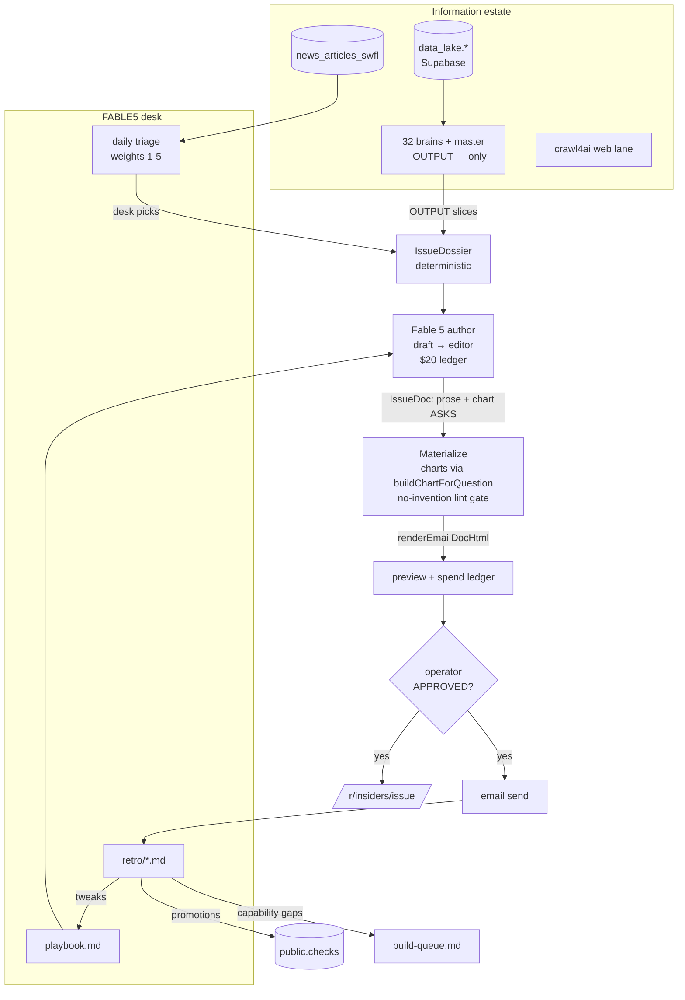

# MINDMAP — the information estate + how the Insiders Edition moves through it

One document, two audiences: a human wanting the systems map, and an agent booting
cold. Prose first, diagram at the end. When reality diverges from this file, fix the
file in the same commit (every retro asks "did MINDMAP.md lie this month?").

## 1. Boot sequence (what fires before you type)

1. **SessionStart hooks** print, in order: SESSION_LOG tail (`print-session-log.mjs`),
   the kickoff block — last ship + open `checks` + build queue (`print-kickoff.mjs`),
   tripwire scan, Serena activation, and the desk status line
   (`print-desk-status.mjs`: last visit + unreviewed news count).
2. **SESSION_LOG.md** — the diary. Trust it over memory; append before every push
   (hook-enforced).
3. **`checks` ledger** (Supabase `public.checks`, `node scripts/check.mjs list`) —
   the ONLY surface for open obligations. A parked finding without a check is a
   silent deferral (RULE 2.4 — forbidden).
4. **`_ASSISTANT/TODAY.md`** — what's in flight today.
5. **Memory** (`~/.claude/projects/.../memory/MEMORY.md`) — operator rules + landmines.
6. **This desk**: `FABLE5.md` (routine) → `desk/<month>.md` (the month's picks) →
   `playbook.md` (craft) → `retro/` (what we learned per issue).

## 2. The information estate

- **The lake (tier 2)** — `data_lake.*` in Supabase Postgres, written by Python dlt
  pipelines under `ingest/pipelines/*` on GHA crons (`ingest/cadence_registry.yaml`
  is the cadence truth). Read from TS via `db.schema("data_lake").from(...)`
  (service-role; PostgREST needs the grant + `NOTIFY pgrst` once per new table).
- **The brains (tier 1 output)** — 32 leaf reporters + one synthesizer, built by the
  refinery (`refinery/stages/1-4`, packs in `refinery/packs/`). Each brain's
  markdown carries a `--- OUTPUT ---` section — the ONLY part downstream may read
  (thin pipe). TS readers: `lib/fetch-brain.ts` (`fetchBrain`, `readBrainMarkdown`,
  `loadParsedBrain`). Live API: `/api/b/<slug>?view=speak&tier=2`.
- **The news pipeline** — capture (crawl4ai, free) → `data_lake.news_articles_swfl`
  (columns: `headline, article_url, body_text, source_name, published_date,
  swfl_relevance`) → pulse/event extraction (`ingest/lib/pulse_lake.py`,
  city_pulse pipelines). The desk consumes this; it never builds its own capture.
- **Web lanes** — crawl4ai is the ONLY crawl tool (never Firecrawl). Paid
  `web_search` never rides scheduled ingest.
- **User surfaces** — Email Lab (grid builder, `lib/email/`), zip reports
  (`app/r/zip-report/[zip]`), guides, the MCP server (`/api/mcp`), briefcase chat
  (`lib/assistant/`). Ops dashboard lives in the separate `swfldatagulf-ops` repo.

## 3. Four-lane sourcing + where each guardrail bites

Every figure a user sees comes from one of four lanes, tried in order: **our lake →
the user's upload → a named web source → a figure the user stated.** The only
forbidden thing is an INVENTED number. Enforcement points:

- **Authoring moat** (`lib/email/author-doc.ts`): models select figure IDs from a
  menu; the engine writes the verbatim value. A model never types a number into a
  number-bearing field.
- **Prose lint** (`lib/deliverable/narrative-lint.ts`, ONE tokenizer): every numeric
  token in authored prose must anchor to the data feed. The insiders composer reuses
  it via `lib/email/insiders/lint.ts`.
- **Deliverable gate** (`lib/deliverable/build.ts` `gateNarrative`): lint +
  freshness verdicts; failure strips or blocks.
- **Chart moat** (`lib/assistant/chart-for-question.ts` `buildChartForQuestion`):
  charts are computed from brain series in code; the model picks WHICH series, never
  a value. Nothing chartable → null → the surface drops the chart, never fakes one.
- **URL/citation roots**: `lib/deliverable/url-lint.ts`,
  `lib/citations/clean-url.ts` + `CitationList` — one root each.
- **Spend guards**: every Anthropic call goes through `refinery/agents/anthropic.mts`
  (TS) or `ingest/lib/api_usage.py` (Python) — logged to `public.api_usage_log`,
  daily/monthly caps, Gate 6 blocks new unmetered surfaces at push.

## 4. The Insiders pipeline (this desk's product)

Deterministic sandwich; the model only ever authors structured prose + chart asks.

1. **Desk (daily)** — triage news into `desk/<month>.md` with weights 1–5, areas,
   series pairing, one-line why. Weight 5 → propose a mini.
2. **Dossier (code)** — `lib/email/insiders/dossier.ts`: master + per-brain OUTPUTs,
   desk picks (raw scored news as backstop when the desk file is malformed), anchor
   set (every stateable number), chart menu.
3. **Author (model, metered)** — `lib/email/insiders/author.ts`: `claude-fable-5`,
   draft pass then editor pass, streaming, structured output (`IssueDoc`), refusal
   fallback to `claude-opus-4-8`, `IssueBudget` ledger hard-capped at
   `INSIDERS_MAX_SPEND_USD` (default $20/issue).
4. **Materialize (code)** — `lib/email/insiders/materialize.ts`: chart requests →
   `buildChartForQuestion` (real series or dropped with warning) → EmailDoc → prose
   lint gate (block on violation) → `renderEmailDocHtml` → email HTML + the
   canonical page at `/r/insiders/[issue]`.
5. **Approve + send (operator)** — `scripts/email/insiders-run.mts`: DRY_RUN default,
   preview + ledger written before any live branch, live send needs
   `INSIDERS_APPROVED=1` + postal + verified From. The agent NEVER sends.
6. **Retro (after every send)** — `retro/<issue>.md`: tweaks → playbook; promotions →
   `checks`; capability gaps → build queue.

## 5. Promotion paths (how the desk improves the product)

- **Tweaks** stay here: playbook.md + the authoring charge.
- **Promotions** leave here: a section format, chart pairing, or voice finding that
  generalizes to user builds gets a `checks` entry the same session and lands in the
  user-facing templates/registries (the distiller path) on its own build.
- **Capability gaps** become `_AUDIT_AND_ROADMAP/build-queue.md` entries — the
  month-over-month expansion engine for the lake itself.

## Diagram

