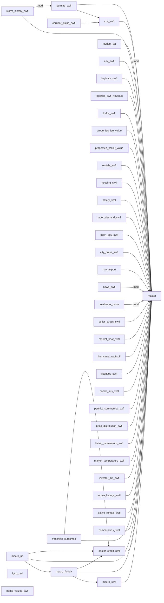

# BRAIN CATALOG — what every brain already holds

**GENERATED — do not hand-edit.** Regenerate with `bun run brain-catalog` after any rebuild that changes `brains/*.md`. `bun run check:brain-catalog` exits non-zero when this file has drifted. NOT yet wired into CI or the pre-push gate — a rebuild lands new `brains/*.md` without regenerating this, so treat a stale as-of date here as drift, not as brain state.

Read this BEFORE writing a raw `.from("…")` query in a page or loader. A brain is a local disk read (`lib/fetch-brain.ts` → `brains/{slug}.md`, memoized in-process): it costs no egress, needs no database round-trip, and stays up when PostgREST does not — on 07/21/2026 every brain served fine while every page that re-derived from raw tables went blank.

If the number you need is in the metric index below, read the brain. Query the lake only for data that is genuinely NEW — that is what the lake is for.

Brains: **41** · generated from committed artifacts only (no rebuild).

## Metric index — slug → brain

Every metric every brain publishes, alphabetical. This is the lookup table.

| Metric slug | Brain | Label | Units |
|---|---|---|---|
| `aadt_5yr_cagr` | `traffic-swfl` | SWFL AADT 5-year CAGR (2021 → 2025, %) | percent/year |
| `aadt_swfl_avg` | `traffic-swfl` | SWFL length-weighted average AADT, year 2025 (vehicles/day) | vehicles/day |
| `aadt_yoy_pct` | `traffic-swfl` | SWFL AADT YoY change 2024→2025, cohort-matched (%) | percent |
| `absorption_sqft_marketbeat_bonita_springs_industrial` | `cre-swfl` | MarketBeat Bonita Springs industrial net absorption (2026-Q1) | sqft |
| `absorption_sqft_marketbeat_bonita_springs_medical_office` | `cre-swfl` | MarketBeat Bonita Springs medical_office net absorption (2026-Q1) | sqft |
| `absorption_sqft_marketbeat_bonita_springs_office` | `cre-swfl` | MarketBeat Bonita Springs office net absorption (2026-Q1) | sqft |
| `absorption_sqft_marketbeat_bonita_springs` | `cre-swfl` | MarketBeat Bonita Springs net absorption (2026-Q1) | sqft |
| `absorption_sqft_marketbeat_cape_coral_industrial` | `cre-swfl` | MarketBeat Cape Coral industrial net absorption (2026-Q1) | sqft |
| `absorption_sqft_marketbeat_cape_coral_medical_office` | `cre-swfl` | MarketBeat Cape Coral medical_office net absorption (2026-Q1) | sqft |
| `absorption_sqft_marketbeat_cape_coral_office` | `cre-swfl` | MarketBeat Cape Coral office net absorption (2026-Q1) | sqft |
| `absorption_sqft_marketbeat_cape_coral` | `cre-swfl` | MarketBeat Cape Coral net absorption (2026-Q1) | sqft |
| `absorption_sqft_marketbeat_collier_county_industrial` | `cre-swfl` | MarketBeat Collier County industrial net absorption (2026-Q1) | sqft |
| `absorption_sqft_marketbeat_collier_county_office` | `cre-swfl` | MarketBeat Collier County office net absorption (2026-Q1) | sqft |
| `absorption_sqft_marketbeat_collier_county` | `cre-swfl` | MarketBeat Collier County net absorption (2026-Q1) | sqft |
| `absorption_sqft_marketbeat_east_naples_industrial` | `cre-swfl` | MarketBeat East Naples industrial net absorption (2026-Q1) | sqft |
| `absorption_sqft_marketbeat_east_naples_medical_office` | `cre-swfl` | MarketBeat East Naples medical_office net absorption (2026-Q1) | sqft |
| `absorption_sqft_marketbeat_east_naples_office` | `cre-swfl` | MarketBeat East Naples office net absorption (2026-Q1) | sqft |
| `absorption_sqft_marketbeat_east_naples` | `cre-swfl` | MarketBeat East Naples net absorption (2026-Q1) | sqft |
| `absorption_sqft_marketbeat_estero_industrial` | `cre-swfl` | MarketBeat Estero industrial net absorption (2026-Q1) | sqft |
| `absorption_sqft_marketbeat_estero_medical_office` | `cre-swfl` | MarketBeat Estero medical_office net absorption (2026-Q1) | sqft |
| `absorption_sqft_marketbeat_estero_office` | `cre-swfl` | MarketBeat Estero office net absorption (2026-Q1) | sqft |
| `absorption_sqft_marketbeat_estero` | `cre-swfl` | MarketBeat Estero net absorption (2026-Q1) | sqft |
| `absorption_sqft_marketbeat_fort_myers_area_industrial` | `cre-swfl` | MarketBeat Fort Myers area industrial net absorption — median across 5 sub-areas | sqft |
| `absorption_sqft_marketbeat_fort_myers_area_medical_office` | `cre-swfl` | MarketBeat Fort Myers area medical_office net absorption — median across 2 sub-areas | sqft |
| `absorption_sqft_marketbeat_fort_myers_area_office` | `cre-swfl` | MarketBeat Fort Myers area office net absorption — median across 4 sub-areas | sqft |
| `absorption_sqft_marketbeat_fort_myers_area` | `cre-swfl` | MarketBeat Fort Myers area net absorption — median across 4 sub-areas | sqft |
| `absorption_sqft_marketbeat_fort_myers_industrial` | `cre-swfl` | MarketBeat Fort Myers industrial net absorption (2026-Q1) | sqft |
| `absorption_sqft_marketbeat_fort_myers_industrial` | `cre-swfl` | MarketBeat Fort Myers industrial net absorption (2026-Q1) | sqft |
| `absorption_sqft_marketbeat_fort_myers_medical_office` | `cre-swfl` | MarketBeat Fort Myers medical_office net absorption (2026-Q1) | sqft |
| `absorption_sqft_marketbeat_fort_myers_office` | `cre-swfl` | MarketBeat Fort Myers office net absorption (2026-Q1) | sqft |
| `absorption_sqft_marketbeat_fort_myers` | `cre-swfl` | MarketBeat Fort Myers net absorption (2026-Q1) | sqft |
| `absorption_sqft_marketbeat_golden_gate_industrial` | `cre-swfl` | MarketBeat Golden Gate industrial net absorption (2026-Q1) | sqft |
| `absorption_sqft_marketbeat_golden_gate_office` | `cre-swfl` | MarketBeat Golden Gate office net absorption (2026-Q1) | sqft |
| `absorption_sqft_marketbeat_golden_gate` | `cre-swfl` | MarketBeat Golden Gate net absorption (2026-Q1) | sqft |
| `absorption_sqft_marketbeat_lehigh_acres_area_industrial` | `cre-swfl` | MarketBeat Lehigh Acres area industrial net absorption — median across 2 sub-areas | sqft |
| `absorption_sqft_marketbeat_lehigh_acres_area_medical_office` | `cre-swfl` | MarketBeat Lehigh Acres area medical_office net absorption — median across 2 sub-areas | sqft |
| `absorption_sqft_marketbeat_lehigh_acres_industrial` | `cre-swfl` | MarketBeat Lehigh Acres industrial net absorption (2026-Q1) | sqft |
| `absorption_sqft_marketbeat_lehigh_acres_industrial` | `cre-swfl` | MarketBeat Lehigh Acres industrial net absorption (2026-Q1) | sqft |
| `absorption_sqft_marketbeat_lehigh_acres_medical_office` | `cre-swfl` | MarketBeat Lehigh Acres medical_office net absorption (2024-Q3) | sqft |
| `absorption_sqft_marketbeat_lehigh_acres_medical_office` | `cre-swfl` | MarketBeat Lehigh Acres medical_office net absorption (2026-Q1) | sqft |
| `absorption_sqft_marketbeat_lehigh_acres_office` | `cre-swfl` | MarketBeat Lehigh Acres office net absorption (2026-Q1) | sqft |
| `absorption_sqft_marketbeat_lehigh_acres` | `cre-swfl` | MarketBeat Lehigh Acres net absorption (2026-Q1) | sqft |
| `absorption_sqft_marketbeat_lely_industrial` | `cre-swfl` | MarketBeat Lely industrial net absorption (2026-Q1) | sqft |
| `absorption_sqft_marketbeat_lely_medical_office` | `cre-swfl` | MarketBeat Lely medical_office net absorption (2026-Q1) | sqft |
| `absorption_sqft_marketbeat_lely_office` | `cre-swfl` | MarketBeat Lely office net absorption (2026-Q1) | sqft |
| `absorption_sqft_marketbeat_lely` | `cre-swfl` | MarketBeat Lely net absorption (2026-Q1) | sqft |
| `absorption_sqft_marketbeat_marco_island_industrial` | `cre-swfl` | MarketBeat Marco Island industrial net absorption (2026-Q1) | sqft |
| `absorption_sqft_marketbeat_marco_island_medical_office` | `cre-swfl` | MarketBeat Marco Island medical_office net absorption (2026-Q1) | sqft |
| `absorption_sqft_marketbeat_marco_island_office` | `cre-swfl` | MarketBeat Marco Island office net absorption (2026-Q1) | sqft |
| `absorption_sqft_marketbeat_marco_island` | `cre-swfl` | MarketBeat Marco Island net absorption (2026-Q1) | sqft |
| `absorption_sqft_marketbeat_naples_area_industrial` | `cre-swfl` | MarketBeat Naples area industrial net absorption — median across 5 sub-areas | sqft |
| `absorption_sqft_marketbeat_naples_area_medical_office` | `cre-swfl` | MarketBeat Naples area medical_office net absorption — median across 4 sub-areas | sqft |
| `absorption_sqft_marketbeat_naples_area_office` | `cre-swfl` | MarketBeat Naples area office net absorption — median across 5 sub-areas | sqft |
| `absorption_sqft_marketbeat_naples_area` | `cre-swfl` | MarketBeat Naples area net absorption — median across 5 sub-areas | sqft |
| `absorption_sqft_marketbeat_naples_industrial` | `cre-swfl` | MarketBeat Naples industrial net absorption (2026-Q1) | sqft |
| `absorption_sqft_marketbeat_naples_medical_office` | `cre-swfl` | MarketBeat Naples medical_office net absorption (2026-Q1) | sqft |
| `absorption_sqft_marketbeat_naples_office` | `cre-swfl` | MarketBeat Naples office net absorption (2026-Q1) | sqft |
| `absorption_sqft_marketbeat_naples` | `cre-swfl` | MarketBeat Naples net absorption (2026-Q1) | sqft |
| `absorption_sqft_marketbeat_north_fort_myers_industrial` | `cre-swfl` | MarketBeat North Fort Myers industrial net absorption (2026-Q1) | sqft |
| `absorption_sqft_marketbeat_north_fort_myers_office` | `cre-swfl` | MarketBeat North Fort Myers office net absorption (2026-Q1) | sqft |
| `absorption_sqft_marketbeat_north_fort_myers` | `cre-swfl` | MarketBeat North Fort Myers net absorption (2026-Q1) | sqft |
| `absorption_sqft_marketbeat_north_naples_industrial` | `cre-swfl` | MarketBeat North Naples industrial net absorption (2026-Q1) | sqft |
| `absorption_sqft_marketbeat_north_naples_medical_office` | `cre-swfl` | MarketBeat North Naples medical_office net absorption (2026-Q1) | sqft |
| `absorption_sqft_marketbeat_north_naples_office` | `cre-swfl` | MarketBeat North Naples office net absorption (2026-Q1) | sqft |
| `absorption_sqft_marketbeat_north_naples` | `cre-swfl` | MarketBeat North Naples net absorption (2026-Q1) | sqft |
| `absorption_sqft_marketbeat_san_carlos_park_industrial` | `cre-swfl` | MarketBeat San Carlos Park industrial net absorption (2026-Q1) | sqft |
| `absorption_sqft_marketbeat_san_carlos_park_office` | `cre-swfl` | MarketBeat San Carlos Park office net absorption (2026-Q1) | sqft |
| `absorption_sqft_marketbeat_san_carlos_park` | `cre-swfl` | MarketBeat San Carlos Park net absorption (2026-Q1) | sqft |
| `absorption_sqft_marketbeat_south_fort_myers_industrial` | `cre-swfl` | MarketBeat South Fort Myers industrial net absorption (2026-Q1) | sqft |
| `absorption_sqft_marketbeat_south_fort_myers_medical_office` | `cre-swfl` | MarketBeat South Fort Myers medical_office net absorption (2026-Q1) | sqft |
| `absorption_sqft_marketbeat_the_islands_industrial` | `cre-swfl` | MarketBeat The Islands industrial net absorption (2026-Q1) | sqft |
| `absorption_sqft_marketbeat_the_islands_medical_office` | `cre-swfl` | MarketBeat The Islands medical_office net absorption (2026-Q1) | sqft |
| `absorption_sqft_marketbeat_the_islands_office` | `cre-swfl` | MarketBeat The Islands office net absorption (2026-Q1) | sqft |
| `absorption_sqft_marketbeat_the_islands` | `cre-swfl` | MarketBeat The Islands net absorption (2026-Q1) | sqft |
| `absorption_sqft_median_collier` | `cre-swfl` | Median Collier County CRE net absorption (7 of 9 Collier corridors) | sqft |
| `absorption_sqft_median_lee` | `cre-swfl` | Median Lee County CRE net absorption (16 of 18 Lee corridors) | sqft |
| `absorption_sqft_median` | `cre-swfl` | Median SWFL CRE net absorption (23 of 27 corridors) | sqft |
| `active_listings_count_swfl` | `active-listings-swfl` | SWFL active residential listings (count) | listings |
| `active_rental_listings_count_swfl` | `active-rentals-swfl` | SWFL active rental listings (count) | listings |
| `asking_rent_full_service_marketbeat_bonita_springs_medical_office` | `cre-swfl` | MarketBeat Bonita Springs medical_office asking rent full service (2026-Q1) | USD/sqft |
| `asking_rent_full_service_marketbeat_cape_coral_medical_office` | `cre-swfl` | MarketBeat Cape Coral medical_office asking rent full service (2026-Q1) | USD/sqft |
| `asking_rent_full_service_marketbeat_east_naples_medical_office` | `cre-swfl` | MarketBeat East Naples medical_office asking rent full service (2026-Q1) | USD/sqft |
| `asking_rent_full_service_marketbeat_estero_medical_office` | `cre-swfl` | MarketBeat Estero medical_office asking rent full service (2026-Q1) | USD/sqft |
| `asking_rent_full_service_marketbeat_fort_myers_area_medical_office` | `cre-swfl` | MarketBeat Fort Myers area medical_office asking rent full service — median across 3 sub-a | USD/sqft |
| `asking_rent_full_service_marketbeat_fort_myers_medical_office` | `cre-swfl` | MarketBeat Fort Myers medical_office asking rent full service (2026-Q1) | USD/sqft |
| `asking_rent_full_service_marketbeat_golden_gate_medical_office` | `cre-swfl` | MarketBeat Golden Gate medical_office asking rent full service (2026-Q1) | USD/sqft |
| `asking_rent_full_service_marketbeat_lehigh_acres_medical_office` | `cre-swfl` | MarketBeat Lehigh Acres medical_office asking rent full service (2026-Q1) | USD/sqft |
| `asking_rent_full_service_marketbeat_lely_medical_office` | `cre-swfl` | MarketBeat Lely medical_office asking rent full service (2026-Q1) | USD/sqft |
| `asking_rent_full_service_marketbeat_marco_island_medical_office` | `cre-swfl` | MarketBeat Marco Island medical_office asking rent full service (2026-Q1) | USD/sqft |
| `asking_rent_full_service_marketbeat_naples_area_medical_office` | `cre-swfl` | MarketBeat Naples area medical_office asking rent full service — median across 5 sub-areas | USD/sqft |
| `asking_rent_full_service_marketbeat_naples_medical_office` | `cre-swfl` | MarketBeat Naples medical_office asking rent full service (2026-Q1) | USD/sqft |
| `asking_rent_full_service_marketbeat_north_fort_myers_medical_office` | `cre-swfl` | MarketBeat North Fort Myers medical_office asking rent full service (2026-Q1) | USD/sqft |
| `asking_rent_full_service_marketbeat_north_naples_medical_office` | `cre-swfl` | MarketBeat North Naples medical_office asking rent full service (2026-Q1) | USD/sqft |
| `asking_rent_full_service_marketbeat_south_fort_myers_medical_office` | `cre-swfl` | MarketBeat South Fort Myers medical_office asking rent full service (2026-Q1) | USD/sqft |
| `asking_rent_full_service_marketbeat_the_islands_medical_office` | `cre-swfl` | MarketBeat The Islands medical_office asking rent full service (2026-Q1) | USD/sqft |
| `asking_rent_nnn_marketbeat_bonita_springs_industrial` | `cre-swfl` | MarketBeat Bonita Springs industrial asking rent NNN (2026-Q1) | USD/sqft |
| `asking_rent_nnn_marketbeat_bonita_springs_office` | `cre-swfl` | MarketBeat Bonita Springs office asking rent NNN (2026-Q1) | USD/sqft |
| `asking_rent_nnn_marketbeat_bonita_springs` | `cre-swfl` | MarketBeat Bonita Springs asking rent NNN (2026-Q1) | USD/sqft |
| `asking_rent_nnn_marketbeat_cape_coral_industrial` | `cre-swfl` | MarketBeat Cape Coral industrial asking rent NNN (2026-Q1) | USD/sqft |
| `asking_rent_nnn_marketbeat_cape_coral_office` | `cre-swfl` | MarketBeat Cape Coral office asking rent NNN (2026-Q1) | USD/sqft |
| `asking_rent_nnn_marketbeat_cape_coral` | `cre-swfl` | MarketBeat Cape Coral asking rent NNN (2026-Q1) | USD/sqft |
| `asking_rent_nnn_marketbeat_collier_county_industrial` | `cre-swfl` | MarketBeat Collier County industrial asking rent NNN (2026-Q1) | USD/sqft |
| `asking_rent_nnn_marketbeat_collier_county_office` | `cre-swfl` | MarketBeat Collier County office asking rent NNN (2026-Q1) | USD/sqft |
| `asking_rent_nnn_marketbeat_collier_county` | `cre-swfl` | MarketBeat Collier County asking rent NNN (2026-Q1) | USD/sqft |
| `asking_rent_nnn_marketbeat_east_naples_industrial` | `cre-swfl` | MarketBeat East Naples industrial asking rent NNN (2026-Q1) | USD/sqft |
| `asking_rent_nnn_marketbeat_east_naples_office` | `cre-swfl` | MarketBeat East Naples office asking rent NNN (2026-Q1) | USD/sqft |
| `asking_rent_nnn_marketbeat_east_naples` | `cre-swfl` | MarketBeat East Naples asking rent NNN (2026-Q1) | USD/sqft |
| `asking_rent_nnn_marketbeat_estero_industrial` | `cre-swfl` | MarketBeat Estero industrial asking rent NNN (2026-Q1) | USD/sqft |
| `asking_rent_nnn_marketbeat_estero_office` | `cre-swfl` | MarketBeat Estero office asking rent NNN (2026-Q1) | USD/sqft |
| `asking_rent_nnn_marketbeat_estero` | `cre-swfl` | MarketBeat Estero asking rent NNN (2026-Q1) | USD/sqft |
| `asking_rent_nnn_marketbeat_fort_myers_area_industrial` | `cre-swfl` | MarketBeat Fort Myers area industrial asking rent NNN — median across 5 sub-areas | USD/sqft |
| `asking_rent_nnn_marketbeat_fort_myers_area_office` | `cre-swfl` | MarketBeat Fort Myers area office asking rent NNN — median across 4 sub-areas | USD/sqft |
| `asking_rent_nnn_marketbeat_fort_myers_area` | `cre-swfl` | MarketBeat Fort Myers area asking rent NNN — median across 4 sub-areas | USD/sqft |
| `asking_rent_nnn_marketbeat_fort_myers_industrial` | `cre-swfl` | MarketBeat Fort Myers industrial asking rent NNN (2026-Q1) | USD/sqft |
| `asking_rent_nnn_marketbeat_fort_myers_industrial` | `cre-swfl` | MarketBeat Fort Myers industrial asking rent NNN (2026-Q1) | USD/sqft |
| `asking_rent_nnn_marketbeat_fort_myers_office` | `cre-swfl` | MarketBeat Fort Myers office asking rent NNN (2026-Q1) | USD/sqft |
| `asking_rent_nnn_marketbeat_fort_myers` | `cre-swfl` | MarketBeat Fort Myers asking rent NNN (2026-Q1) | USD/sqft |
| `asking_rent_nnn_marketbeat_golden_gate_industrial` | `cre-swfl` | MarketBeat Golden Gate industrial asking rent NNN (2026-Q1) | USD/sqft |
| `asking_rent_nnn_marketbeat_golden_gate_office` | `cre-swfl` | MarketBeat Golden Gate office asking rent NNN (2026-Q1) | USD/sqft |
| `asking_rent_nnn_marketbeat_golden_gate` | `cre-swfl` | MarketBeat Golden Gate asking rent NNN (2026-Q1) | USD/sqft |
| `asking_rent_nnn_marketbeat_lehigh_acres_area_industrial` | `cre-swfl` | MarketBeat Lehigh Acres area industrial asking rent NNN — median across 2 sub-areas | USD/sqft |
| `asking_rent_nnn_marketbeat_lehigh_acres_industrial` | `cre-swfl` | MarketBeat Lehigh Acres industrial asking rent NNN (2026-Q1) | USD/sqft |
| `asking_rent_nnn_marketbeat_lehigh_acres_industrial` | `cre-swfl` | MarketBeat Lehigh Acres industrial asking rent NNN (2026-Q1) | USD/sqft |
| `asking_rent_nnn_marketbeat_lehigh_acres_office` | `cre-swfl` | MarketBeat Lehigh Acres office asking rent NNN (2026-Q1) | USD/sqft |
| `asking_rent_nnn_marketbeat_lehigh_acres` | `cre-swfl` | MarketBeat Lehigh Acres asking rent NNN (2026-Q1) | USD/sqft |
| `asking_rent_nnn_marketbeat_lely_industrial` | `cre-swfl` | MarketBeat Lely industrial asking rent NNN (2026-Q1) | USD/sqft |
| `asking_rent_nnn_marketbeat_lely_office` | `cre-swfl` | MarketBeat Lely office asking rent NNN (2026-Q1) | USD/sqft |
| `asking_rent_nnn_marketbeat_lely` | `cre-swfl` | MarketBeat Lely asking rent NNN (2026-Q1) | USD/sqft |
| `asking_rent_nnn_marketbeat_marco_island_industrial` | `cre-swfl` | MarketBeat Marco Island industrial asking rent NNN (2026-Q1) | USD/sqft |
| `asking_rent_nnn_marketbeat_marco_island_office` | `cre-swfl` | MarketBeat Marco Island office asking rent NNN (2026-Q1) | USD/sqft |
| `asking_rent_nnn_marketbeat_marco_island` | `cre-swfl` | MarketBeat Marco Island asking rent NNN (2026-Q1) | USD/sqft |
| `asking_rent_nnn_marketbeat_naples_area_industrial` | `cre-swfl` | MarketBeat Naples area industrial asking rent NNN — median across 5 sub-areas | USD/sqft |
| `asking_rent_nnn_marketbeat_naples_area_office` | `cre-swfl` | MarketBeat Naples area office asking rent NNN — median across 5 sub-areas | USD/sqft |
| `asking_rent_nnn_marketbeat_naples_area` | `cre-swfl` | MarketBeat Naples area asking rent NNN — median across 5 sub-areas | USD/sqft |
| `asking_rent_nnn_marketbeat_naples_industrial` | `cre-swfl` | MarketBeat Naples industrial asking rent NNN (2026-Q1) | USD/sqft |
| `asking_rent_nnn_marketbeat_naples_office` | `cre-swfl` | MarketBeat Naples office asking rent NNN (2026-Q1) | USD/sqft |
| `asking_rent_nnn_marketbeat_naples` | `cre-swfl` | MarketBeat Naples asking rent NNN (2026-Q1) | USD/sqft |
| `asking_rent_nnn_marketbeat_north_fort_myers_industrial` | `cre-swfl` | MarketBeat North Fort Myers industrial asking rent NNN (2026-Q1) | USD/sqft |
| `asking_rent_nnn_marketbeat_north_fort_myers_office` | `cre-swfl` | MarketBeat North Fort Myers office asking rent NNN (2026-Q1) | USD/sqft |
| `asking_rent_nnn_marketbeat_north_fort_myers` | `cre-swfl` | MarketBeat North Fort Myers asking rent NNN (2026-Q1) | USD/sqft |
| `asking_rent_nnn_marketbeat_north_naples_industrial` | `cre-swfl` | MarketBeat North Naples industrial asking rent NNN (2026-Q1) | USD/sqft |
| `asking_rent_nnn_marketbeat_north_naples_office` | `cre-swfl` | MarketBeat North Naples office asking rent NNN (2026-Q1) | USD/sqft |
| `asking_rent_nnn_marketbeat_north_naples` | `cre-swfl` | MarketBeat North Naples asking rent NNN (2026-Q1) | USD/sqft |
| `asking_rent_nnn_marketbeat_san_carlos_park_industrial` | `cre-swfl` | MarketBeat San Carlos Park industrial asking rent NNN (2026-Q1) | USD/sqft |
| `asking_rent_nnn_marketbeat_san_carlos_park_office` | `cre-swfl` | MarketBeat San Carlos Park office asking rent NNN (2026-Q1) | USD/sqft |
| `asking_rent_nnn_marketbeat_san_carlos_park` | `cre-swfl` | MarketBeat San Carlos Park asking rent NNN (2026-Q1) | USD/sqft |
| `asking_rent_nnn_marketbeat_south_fort_myers_industrial` | `cre-swfl` | MarketBeat South Fort Myers industrial asking rent NNN (2026-Q1) | USD/sqft |
| `asking_rent_nnn_marketbeat_swfl` | `cre-swfl` | MarketBeat SWFL asking rent NNN — median across 15 submarkets (latest: 2026-Q1) | USD/sqft |
| `asking_rent_nnn_marketbeat_the_islands_industrial` | `cre-swfl` | MarketBeat The Islands industrial asking rent NNN (2026-Q1) | USD/sqft |
| `asking_rent_nnn_marketbeat_the_islands_office` | `cre-swfl` | MarketBeat The Islands office asking rent NNN (2026-Q1) | USD/sqft |
| `asking_rent_nnn_marketbeat_the_islands` | `cre-swfl` | MarketBeat The Islands asking rent NNN (2026-Q1) | USD/sqft |
| `asking_rent_psf_median_collier` | `cre-swfl` | Median Collier County CRE asking rent PSF NNN (3 of 3 Collier submarkets) | USD/sqft |
| `asking_rent_psf_median_lee` | `cre-swfl` | Median Lee County CRE asking rent PSF NNN (7 of 7 Lee submarkets) | USD/sqft |
| `asking_rent_psf_median` | `cre-swfl` | Median SWFL CRE asking rent PSF NNN (10 of 10 submarkets) | USD/sqft |
| `avg_payload_tons_per_truck` | `logistics-swfl-nowcast` | Assumed combination-truck average payload — FHWA Highway Statistics 2023, Table VM-1 | tons/truck |
| `baseline_validity_flag` | `logistics-swfl-nowcast` | Baseline-validity flag (valid \| stale-structural, sticky once stale) | — |
| `best_naics_survival` | `master` | Arts, Entertainment & Recreation (NAICS 71) — best SWFL SBA survival rate [thin sample: on | percent |
| `best_naics_survival` | `sector-credit-swfl` | Arts, Entertainment & Recreation (NAICS 71) — best SWFL SBA survival rate [thin sample: on | percent |
| `cap_rate_median_collier` | `cre-swfl` | Median Collier County CRE cap rate (3 of 3 Collier submarkets) | percent |
| `cap_rate_median_lee` | `cre-swfl` | Median Lee County CRE cap rate (6 of 7 Lee submarkets) | percent |
| `cap_rate_median` | `cre-swfl` | Median SWFL CRE cap rate (9 of 10 submarkets) | percent |
| `cap_rate_median` | `master` | Median SWFL CRE cap rate (9 of 10 submarkets) | percent |
| `collier_construction_loc_quotient` | `labor-demand-swfl` | Collier (Naples) Construction Concentration (LOC_Q) | x |
| `collier_construction_median_hourly_wage` | `labor-demand-swfl` | Collier (Naples) Construction Median Hourly Wage | $/hr |
| `collier_county_sfha_pct_area_weighted` | `env-swfl` | Collier County area-weighted SFHA coverage (Naples / Marco Island context) | ratio |
| `collier_county_ve_zone_pct_area_weighted` | `env-swfl` | Collier County area-weighted coastal high-hazard (V/VE) coverage | ratio |
| `collier_healthcare_employment` | `labor-demand-swfl` | Collier (Naples) Healthcare Workforce | workers |
| `collier_homes_sold_per_year` | `properties-collier-value` | Collier residential homes sold, year 2025 (Redfin closed sales, All Residential) | home sales |
| `collier_homes_sold_zscore` | `properties-collier-value` | Collier homes-sold z-score, year 2025 vs trailing 3yr (2022-2024) | z-score |
| `collier_latest_monthly_collections_usd` | `tourism-tdt` | Collier County latest monthly TDT collections (2026-04) | USD/month |
| `collier_median_sale_price_yoy` | `properties-collier-value` | Collier median sale price YoY (2026-05-31, Redfin All Residential) | percent |
| `collier_months_of_supply` | `properties-collier-value` | Collier months of supply (2026-05-31, Redfin All Residential) | months |
| `collier_soh_gap_median_pct` | `properties-collier-value` | Collier Save-Our-Homes gap median (% of homestead just value suppressed by the SOH cap) ac | percent |
| `collier_sold_median_homes_only` | `properties-collier-value` | Collier homes-only sold median (single-family + condo, recorded deeds, as of 07/19/2026) | USD |
| `collier_top_occupation_employment` | `labor-demand-swfl` | Collier (Naples) Largest Workforce Sector | workers |
| `collier_total_employment_yoy_pct` | `labor-demand-swfl` | Collier (Naples) Total Employment YoY Δ | % |
| `collier_total_parcels` | `properties-collier-value` | Collier County parcels in FDOR cadastral snapshot (data_lake.collier_parcels) | parcels |
| `collier_trailing_12mo_collections_usd` | `tourism-tdt` | Collier County trailing 12-month TDT collections | USD |
| `commercial_permits_count` | `master` | SWFL commercial permits issued (2025) | permits |
| `commercial_permits_count` | `permits-commercial-swfl` | SWFL commercial permits issued (2025) | permits |
| `commercial_permits_sf` | `permits-commercial-swfl` | SWFL commercial permit building area (2025) | sf |
| `commercial_permits_value_usd` | `permits-commercial-swfl` | SWFL commercial permit value (2025) | USD |
| `consecutive_breach_days` | `logistics-swfl-nowcast` | Consecutive prior refines (incl. this one) where \|z\| > 3 with matching sign — cold-start | days |
| `construction_cost_ppi_industrial` | `cre-swfl` | Construction cost — new industrial building (PPI) | PPI index (not seasonally adjusted; base period varies by series) |
| `construction_cost_ppi_medical_office` | `cre-swfl` | Construction cost — new health care building (PPI) | PPI index (not seasonally adjusted; base period varies by series) |
| `construction_cost_ppi_office` | `cre-swfl` | Construction cost — new office building (PPI) | PPI index (not seasonally adjusted; base period varies by series) |
| `construction_cost_ppi_trade_concrete` | `cre-swfl` | Construction cost — concrete contractors, nonres. building work (PPI) | PPI index (not seasonally adjusted; base period varies by series) |
| `construction_cost_ppi_trade_electrical` | `cre-swfl` | Construction cost — electrical contractors, nonres. building work (PPI) | PPI index (not seasonally adjusted; base period varies by series) |
| `construction_cost_ppi_trade_plumbing_hvac` | `cre-swfl` | Construction cost — plumbing/HVAC contractors, nonres. building work (PPI) | PPI index (not seasonally adjusted; base period varies by series) |
| `construction_cost_ppi_trade_roofing` | `cre-swfl` | Construction cost — roofing contractors, nonres. building work (PPI) | PPI index (not seasonally adjusted; base period varies by series) |
| `construction_cost_ppi_warehouse` | `cre-swfl` | Construction cost — new warehouse building (PPI) | PPI index (not seasonally adjusted; base period varies by series) |
| `corridor_factor` | `cre-swfl` | Corridor Factor — SWFL CRE composite index (10 of 10 submarkets scored) | index 0-100 |
| `corridor_pulse_signals_live` | `cre-swfl` | Live corridor current-events signals informing this read (8) | count |
| `cpi_yoy` | `macro-us` | US CPI YoY | percent |
| `cre_active_listings_estero_asking_rent_psf` | `cre-swfl` | Estero active listing median asking rent PSF (Crexi; 16 listings) | USD/sqft |
| `cre_active_listings_estero_available_sqft` | `cre-swfl` | Estero total available sqft on Crexi (16 listings) | sqft |
| `cre_active_listings_fort_myers_beach_asking_rent_psf` | `cre-swfl` | Fort Myers Beach active listing median asking rent PSF (Crexi; 9 listings) | USD/sqft |
| `cre_active_listings_fort_myers_beach_available_sqft` | `cre-swfl` | Fort Myers Beach total available sqft on Crexi (9 listings) | sqft |
| `current_activity_tons_year` | `logistics-swfl-nowcast` | Current-state freight ACTIVITY proxy from FDOT AADT × tfctr × payload × 365 (annualized to | tons/year |
| `dbpr_notices_abt_90d` | `news-swfl` | ABT/hospitality enforcement notices, last 90 days (DBPR public notices — hard-parsed) | count |
| `dbpr_notices_collier_90d` | `news-swfl` | Collier County enforcement notices, last 90 days (DBPR public notices) | count |
| `dbpr_notices_construction_90d` | `news-swfl` | Confirmed construction enforcement notices, last 90 days (DBPR public notices — hard-parse | count |
| `dbpr_notices_lee_90d` | `news-swfl` | Lee County enforcement notices, last 90 days (DBPR public notices) | count |
| `dbpr_releases_abt_90d` | `news-swfl` | ABT/hospitality enforcement activity, last 90 days (DBPR press releases — Sonnet-inferred) | count |
| `dbpr_releases_construction_90d` | `news-swfl` | Announced construction enforcement activity, last 90 days (DBPR press releases — Sonnet-in | count |
| `dbpr_swfl_releases_90d` | `news-swfl` | SWFL-relevant DBPR press releases (last 90 days) | count |
| `dbpr_swfl_releases_prior_90d` | `news-swfl` | SWFL-relevant DBPR press releases (prior 90-day window) | count |
| `dbpr_total_releases_90d` | `news-swfl` | Total DBPR press releases (last 90 days, statewide) | count |
| `deviation_pct` | `logistics-swfl-nowcast` | Deviation as percent of rolling_mean | percent |
| `deviation_z` | `logistics-swfl-nowcast` | Deviation z-score: (current_activity − rolling_mean) / rolling_stddev | z-score |
| `econ_dev_announcements_90d` | `econ-dev-swfl` | Economic development announcements (last 90 days) | count |
| `econ_dev_announcements_prior_90d` | `econ-dev-swfl` | Economic development announcements (prior 90-day window) | count |
| `entry_level_listing_share_swfl` | `price-distribution-swfl` | SWFL for-sale listings priced under $300k (share of active inventory) | % |
| `faf5_inbound_flow_tons_year` | `logistics-swfl-nowcast` | FAF5 audited annual inbound freight FLOW to SWFL (CONTEXT — not the math anchor; the devia | tons/year |
| `faf5_inbound_flow_tons_year` | `master` | FAF5 audited annual inbound freight FLOW to SWFL (CONTEXT — not the math anchor; the devia | tons/year |
| `fdor_commercial_parcel_count` | `properties-lee-value` | Lee commercial parcel count (FDOR use-code category, cross-check vs LeePA total) | parcels |
| `fgcu_reri_active_listings_pct_change` | `fgcu-reri` | RERI Active Listings YoY | % |
| `fgcu_reri_airport_activity_pct_change` | `fgcu-reri` | RERI Airport Activity YoY | % |
| `fgcu_reri_home_prices_charlotte_pct_change` | `fgcu-reri` | RERI SF Home Prices Charlotte YoY | % |
| `fgcu_reri_home_prices_collier_pct_change` | `fgcu-reri` | RERI SF Home Prices Collier YoY | % |
| `fgcu_reri_home_prices_lee_pct_change` | `fgcu-reri` | RERI SF Home Prices Lee YoY | % |
| `fgcu_reri_home_sales_sf_pct_change` | `fgcu-reri` | RERI SF Home Sales YoY | % |
| `fgcu_reri_permits_sf_pct_change` | `fgcu-reri` | RERI SF Permits YoY | % |
| `fgcu_reri_taxable_sales_pct_change` | `fgcu-reri` | RERI Taxable Sales YoY | % |
| `fgcu_reri_tourist_tax_pct_change` | `fgcu-reri` | RERI Tourist Tax Revenues YoY | % |
| `fgcu_reri_unemployment_rate_pct_change` | `fgcu-reri` | RERI Unemployment Rate YoY Δ | pp |
| `fhfa_cape_coral_msa_yoy_pct` | `properties-lee-value` | FHFA Cape Coral-Fort Myers MSA HPI YoY (2026-Q1) — Lee County price-level proxy | percent |
| `fhfa_fl_state_yoy_pct` | `properties-lee-value` | FHFA Florida state HPI YoY (2026-Q1) — statewide baseline | percent |
| `fl_estab_count_construction` | `macro-florida` | Florida construction establishments | establishments |
| `fl_estab_count_food_service` | `macro-florida` | Florida food service & accommodation establishments | establishments |
| `fl_estab_count_healthcare` | `macro-florida` | Florida healthcare establishments | establishments |
| `fl_estab_count_professional` | `macro-florida` | Florida professional services establishments | establishments |
| `fl_estab_count_retail` | `macro-florida` | Florida retail establishments | establishments |
| `fl_labor_participation` | `macro-florida` | Florida labor force participation | percent |
| `fl_unemployment` | `macro-florida` | Florida unemployment rate | percent |
| `fl_unemployment` | `master` | Florida unemployment rate | percent |
| `freight_segment_count` | `logistics-swfl-nowcast` | Freight-coded FDOT segments contributing to current_activity | segments |
| `freshness_median_asking_price_cape_coral_usd` | `freshness-pulse` | Cape Coral median asking price (as of 2026-07-18) | USD |
| `freshness_median_asking_price_fort_myers_usd` | `freshness-pulse` | Fort Myers median asking price (as of 2026-07-18) | USD |
| `freshness_median_asking_price_naples_usd` | `freshness-pulse` | Naples median asking price (as of 2026-07-18) | USD |
| `freshness_mortgage_30yr_fixed_pct` | `freshness-pulse` | SWFL 30-year fixed mortgage rate (as of 2026-07-16) | percent |
| `history_days_observed` | `logistics-swfl-nowcast` | Count of prior shock-log rows with non-null activity in the rolling window — must be ≥ 6 f | days |
| `home_value_yoy_pct_regional_median` | `home-values-swfl` | SWFL regional median ZHVI home-value YoY % (latest period across all covered ZIPs) | percent |
| `home_value_yoy_pct_top_appreciating_zips` | `home-values-swfl` | Top-3 SWFL ZIPs by ZHVI home-value YoY % (rank-ordered, appreciating) | — |
| `home_value_yoy_pct_zip_33907` | `home-values-swfl` | ZHVI home-value YoY % - ZIP 33907 (Fort Myers), 2026-05-31 | percent |
| `home_value_yoy_pct_zip_33919` | `home-values-swfl` | ZHVI home-value YoY % - ZIP 33919 (Fort Myers), 2026-05-31 | percent |
| `home_value_yoy_pct_zip_33921` | `home-values-swfl` | ZHVI home-value YoY % - ZIP 33921, 2026-05-31 | percent |
| `home_value_yoy_pct_zip_34117` | `home-values-swfl` | ZHVI home-value YoY % - ZIP 34117 (Naples), 2026-05-31 | percent |
| `home_value_yoy_pct_zip_34139` | `home-values-swfl` | ZHVI home-value YoY % - ZIP 34139, 2026-05-31 | percent |
| `home_value_yoy_pct_zip_34145` | `home-values-swfl` | ZHVI home-value YoY % - ZIP 34145 (Marco Island), 2026-05-31 | percent |
| `home_value_zhvi_regional_median` | `home-values-swfl` | SWFL regional typical (ZHVI) home value (USD) at 2026-05-31 | USD |
| `home_value_zhvi_zip_33907` | `home-values-swfl` | ZHVI home value (USD) - ZIP 33907 (Fort Myers), 2026-05-31 | USD |
| `home_value_zhvi_zip_33919` | `home-values-swfl` | ZHVI home value (USD) - ZIP 33919 (Fort Myers), 2026-05-31 | USD |
| `home_value_zhvi_zip_33921` | `home-values-swfl` | ZHVI home value (USD) - ZIP 33921, 2026-05-31 | USD |
| `home_value_zhvi_zip_34117` | `home-values-swfl` | ZHVI home value (USD) - ZIP 34117 (Naples), 2026-05-31 | USD |
| `home_value_zhvi_zip_34139` | `home-values-swfl` | ZHVI home value (USD) - ZIP 34139, 2026-05-31 | USD |
| `home_value_zhvi_zip_34145` | `home-values-swfl` | ZHVI home value (USD) - ZIP 34145 (Marco Island), 2026-05-31 | USD |
| `home_values_zips_covered` | `home-values-swfl` | Count of SWFL ZIPs with at least one ZHVI observation in the corpus | count |
| `housing_avg_sale_to_list_swfl` | `housing-swfl` | SWFL regional median sale-to-list ratio (> 100% = homes selling above ask) | percent |
| `housing_median_dom_swfl` | `housing-swfl` | SWFL regional median days on market — falling = faster sales (YoY: -95.6%) | days |
| `housing_median_sale_price_swfl` | `housing-swfl` | SWFL regional median sale price (all property types), data through 2026-06-30 (-3.3% YoY) | USD |
| `housing_median_sale_price_swfl` | `master` | SWFL regional median sale price (all property types), data through 2026-06-30 (-3.3% YoY) | USD |
| `housing_months_of_supply_swfl` | `housing-swfl` | SWFL regional median months of supply — derived from inventory over the 90-day sales pace  | months |
| `housing_off_market_in_two_weeks_pct_swfl` | `housing-swfl` | SWFL regional median % of homes going off-market within 2 weeks | percent |
| `housing_sold_above_list_pct_swfl` | `housing-swfl` | SWFL regional median % of homes sold above list price | percent |
| `hurricane_cat3plus_passes_within_50mi_30yr` | `hurricane-tracks-fl` | SWFL Cat-3+ hurricane passes within 50mi of any SWFL county centroid, trailing 30yr window | storms |
| `hurricane_closest_pass_5yr_min_mi` | `hurricane-tracks-fl` | Minimum closest-pass distance (statute miles) to any SWFL county centroid, trailing 5yr wi | statute miles |
| `hurricane_landfalls_30yr` | `hurricane-tracks-fl` | SWFL hurricane landfalls — distinct named storms landfalling in any of the SWFL core count | storms |
| `hurricane_landfalls_30yr` | `master` | SWFL hurricane landfalls — distinct named storms landfalling in any of the SWFL core count | storms |
| `hurricane_most_recent_landfall_date` | `hurricane-tracks-fl` | Most recent named-storm landfall in the SWFL footprint (storm + ISO date) | — |
| `hurricane_nfip_paid_per_landfall_storm_avg_usd` | `hurricane-tracks-fl` | SWFL average NFIP paid per (landfall storm × county) — building + contents + ICO | USD |
| `hurricane_worst_storm_county_year_nfip_paid_usd` | `hurricane-tracks-fl` | SWFL worst single (storm × county) NFIP paid value on record (building + contents + ICO) | USD |
| `inbound_freight_tons_swfl` | `logistics-swfl` | Total inbound domestic freight to SWFL, year 2024 (thousand tons) | thousand tons/year |
| `inbound_freight_tons_swfl` | `master` | Total inbound domestic freight to SWFL, year 2024 (thousand tons) | thousand tons/year |
| `inbound_freight_value_swfl_musd` | `logistics-swfl` | Total inbound domestic freight value to SWFL, year 2024 (millions USD) | million USD/year |
| `investor_flood_adj_cap_rate_pct_regional_median` | `investor-zip-swfl` | SWFL regional median flood-adjusted cap rate % (gross yield minus flood bps), env-surfaced | percent |
| `investor_flood_adj_cap_rate_pct_zip_33908` | `investor-zip-swfl` | Flood-adjusted cap rate % - ZIP 33908 (Fort Myers) | percent |
| `investor_flood_adj_cap_rate_pct_zip_34102` | `investor-zip-swfl` | Flood-adjusted cap rate % - ZIP 34102 (Naples) | percent |
| `investor_gross_rent_yield_pct_regional_median` | `investor-zip-swfl` | SWFL regional median gross rent yield % (ZORI rent x 12 / ZHVI value) | percent |
| `investor_gross_rent_yield_pct_zip_33908` | `investor-zip-swfl` | Gross rent yield % - ZIP 33908 (Fort Myers) | percent |
| `investor_gross_rent_yield_pct_zip_34102` | `investor-zip-swfl` | Gross rent yield % - ZIP 34102 (Naples) | percent |
| `investor_zip_cards_covered` | `investor-zip-swfl` | Count of SWFL ZIP investor cards (value + rent present, core scope) | count |
| `investor_zip_cards_with_flood_overlay` | `investor-zip-swfl` | Count of investor cards that also carry the flood-adjusted cap rate (env-surfaced ZIPs) | count |
| `latest_monthly_collections_usd` | `master` | Latest monthly TDT collections (SWFL combined, 2026-04, shoulder season) | USD/month |
| `latest_monthly_collections_usd` | `tourism-tdt` | Latest monthly TDT collections (SWFL combined, 2026-04, shoulder season) | USD/month |
| `laus_collier_unemployment_rate` | `macro-swfl` | Collier County Unemployment Rate | % |
| `laus_fl_unemployment_rate` | `macro-swfl` | Florida LAUS Unemployment Rate | % |
| `laus_lee_unemployment_rate_yoy_delta` | `macro-swfl` | Lee County Unemployment Rate YoY Δ | pp |
| `laus_lee_unemployment_rate` | `macro-swfl` | Lee County Unemployment Rate | % |
| `laus_lee_unemployment_rate` | `master` | Lee County Unemployment Rate | % |
| `lee_construction_loc_quotient` | `labor-demand-swfl` | Lee (Cape Coral-Fort Myers) Construction Concentration (LOC_Q) | x |
| `lee_construction_median_hourly_wage` | `labor-demand-swfl` | Lee (Cape Coral-Fort Myers) Construction Median Hourly Wage | $/hr |
| `lee_county_sfha_pct_area_weighted` | `env-swfl` | Lee County area-weighted SFHA coverage (Fort Myers Beach context) | ratio |
| `lee_county_ve_zone_pct_area_weighted` | `env-swfl` | Lee County area-weighted coastal high-hazard (V/VE) coverage | ratio |
| `lee_healthcare_employment` | `labor-demand-swfl` | Lee (Cape Coral-Fort Myers) Healthcare Workforce | workers |
| `lee_homes_sold_per_year` | `properties-lee-value` | Lee residential homes sold, year 2025 (Redfin closed sales, All Residential) | home sales |
| `lee_homes_sold_zscore` | `properties-lee-value` | Lee homes-sold z-score, year 2025 vs trailing 3yr (2022-2024) — Redfin market-grain | z-score |
| `lee_latest_monthly_collections_usd` | `tourism-tdt` | Lee County latest monthly TDT collections (2026-04) | USD/month |
| `lee_median_sale_price_yoy` | `properties-lee-value` | Lee median sale price YoY (2026-05-31, Redfin All Residential) | percent |
| `lee_months_of_supply` | `properties-lee-value` | Lee months of supply (2026-05-31, Redfin All Residential) | months |
| `lee_sold_median_homes_only` | `properties-lee-value` | Lee homes-only sold median (single-family + condo, recorded deeds, as of 07/19/2026) | USD |
| `lee_top_occupation_employment` | `labor-demand-swfl` | Lee (Cape Coral-Fort Myers) Largest Workforce Sector | workers |
| `lee_top_occupation_employment` | `master` | Lee (Cape Coral-Fort Myers) Largest Workforce Sector | workers |
| `lee_total_employment_yoy_pct` | `labor-demand-swfl` | Lee (Cape Coral-Fort Myers) Total Employment YoY Δ | % |
| `lee_trailing_12mo_collections_usd` | `tourism-tdt` | Lee County trailing 12-month TDT collections | USD |
| `licenses_active_collier` | `licenses-swfl` | Active Licensed Contractors — Collier County | licenses |
| `licenses_active_lee` | `licenses-swfl` | Active Licensed Contractors — Lee County | licenses |
| `licenses_active_lee` | `master` | Active Licensed Contractors — Lee County | licenses |
| `licenses_applicants_swfl` | `licenses-swfl` | Contractor License Applicants in Pipeline — SWFL | applicants |
| `licenses_cbc_share_swfl` | `licenses-swfl` | Certified Building Contractor Share — SWFL | ratio |
| `licenses_lapse_rate_swfl` | `licenses-swfl` | Contractor License Lapse Rate — SWFL | ratio |
| `licenses_new_12m_swfl` | `licenses-swfl` | New Contractor Licenses — SWFL (Trailing 12 Months) | licenses |
| `luxury_listing_share_swfl` | `price-distribution-swfl` | SWFL for-sale listings priced $1M and above (share of active inventory) | % |
| `market_heat_dom_yy_swfl` | `market-heat-swfl` | SWFL median days-on-market, year-over-year change (falling = homes selling faster = bullis | % |
| `market_heat_inventory_yy_swfl` | `market-heat-swfl` | SWFL median active-listing count, year-over-year change — the lead tightening signal (fall | % |
| `market_heat_pending_ratio_swfl` | `market-heat-swfl` | SWFL median pending ratio (pending ÷ active listings) — the leading demand edge (rising =  | ratio |
| `market_heat_price_cut_share_swfl` | `market-heat-swfl` | SWFL median share of active listings with a price reduction — coincident context (rising = | % |
| `market_heat_tilt_swfl` | `market-heat-swfl` | SWFL market-heat tilt (0-100, 50 = balanced; >50 = tightening/seller-favoring) at 202606 — | score (0-100) |
| `median_list_price_swfl` | `active-listings-swfl` | SWFL median asking price (active residential) | USD |
| `midmarket_listing_share_swfl` | `price-distribution-swfl` | SWFL for-sale listings priced $300k–$600k (share of active inventory) | % |
| `new_listing_share_swfl` | `listing-momentum-swfl` | SWFL active for-sale listings flagged new (share of active inventory) | % |
| `permits_collier_corridor_5th-ave-south-3rd-street-south_commercial_alteration_z` | `permits-swfl` | Collier permits - Downtown Naples, commercial_alteration - 90d vs trailing-365d z (n_curre | z-score |
| `permits_collier_corridor_5th-ave-south-3rd-street-south_commercial_new_z` | `permits-swfl` | Collier permits - Downtown Naples, commercial_new - 90d vs trailing-365d z (n_current=1) | z-score |
| `permits_collier_corridor_5th-ave-south-3rd-street-south_demolition_z` | `permits-swfl` | Collier permits - Downtown Naples, demolition - 90d vs trailing-365d z (n_current=0) | z-score |
| `permits_collier_corridor_5th-ave-south-3rd-street-south_other_z` | `permits-swfl` | Collier permits - Downtown Naples, other - 90d vs trailing-365d z (n_current=2) | z-score |
| `permits_collier_corridor_5th-ave-south-3rd-street-south_residential_z` | `permits-swfl` | Collier permits - Downtown Naples, residential - 90d vs trailing-365d z (n_current=7) | z-score |
| `permits_collier_corridor_airport-pulling-naples_commercial_alteration_z` | `permits-swfl` | Collier permits - Airport-Pulling, commercial_alteration - 90d vs trailing-365d z (n_curre | z-score |
| `permits_collier_corridor_airport-pulling-naples_commercial_new_z` | `permits-swfl` | Collier permits - Airport-Pulling, commercial_new - 90d vs trailing-365d z (n_current=0) | z-score |
| `permits_collier_corridor_airport-pulling-naples_demolition_z` | `permits-swfl` | Collier permits - Airport-Pulling, demolition - 90d vs trailing-365d z (n_current=0) | z-score |
| `permits_collier_corridor_airport-pulling-naples_residential_z` | `permits-swfl` | Collier permits - Airport-Pulling, residential - 90d vs trailing-365d z (n_current=26) | z-score |
| `permits_collier_corridor_collier-blvd-cr-951_commercial_alteration_z` | `permits-swfl` | Collier permits - Collier Blvd, commercial_alteration - 90d vs trailing-365d z (n_current= | z-score |
| `permits_collier_corridor_collier-blvd-cr-951_residential_z` | `permits-swfl` | Collier permits - Collier Blvd, residential - 90d vs trailing-365d z (n_current=1) | z-score |
| `permits_collier_corridor_davis-blvd-east-naples_commercial_alteration_z` | `permits-swfl` | Collier permits - East Naples, commercial_alteration - 90d vs trailing-365d z (n_current=1 | z-score |
| `permits_collier_corridor_davis-blvd-east-naples_demolition_z` | `permits-swfl` | Collier permits - East Naples, demolition - 90d vs trailing-365d z (n_current=0) | z-score |
| `permits_collier_corridor_davis-blvd-east-naples_other_z` | `permits-swfl` | Collier permits - East Naples, other - 90d vs trailing-365d z (n_current=0) | z-score |
| `permits_collier_corridor_davis-blvd-east-naples_residential_z` | `permits-swfl` | Collier permits - East Naples, residential - 90d vs trailing-365d z (n_current=14) | z-score |
| `permits_collier_corridor_immokalee-rd-north-naples_commercial_alteration_z` | `permits-swfl` | Collier permits - North Naples (Immokalee Rd), commercial_alteration - 90d vs trailing-365 | z-score |
| `permits_collier_corridor_immokalee-rd-north-naples_demolition_z` | `permits-swfl` | Collier permits - North Naples (Immokalee Rd), demolition - 90d vs trailing-365d z (n_curr | z-score |
| `permits_collier_corridor_immokalee-rd-north-naples_residential_z` | `permits-swfl` | Collier permits - North Naples (Immokalee Rd), residential - 90d vs trailing-365d z (n_cur | z-score |
| `permits_collier_corridor_pine-ridge-rd-naples_commercial_alteration_z` | `permits-swfl` | Collier permits - Pine Ridge, commercial_alteration - 90d vs trailing-365d z (n_current=0) | z-score |
| `permits_collier_corridor_pine-ridge-rd-naples_demolition_z` | `permits-swfl` | Collier permits - Pine Ridge, demolition - 90d vs trailing-365d z (n_current=1) | z-score |
| `permits_collier_corridor_pine-ridge-rd-naples_residential_z` | `permits-swfl` | Collier permits - Pine Ridge, residential - 90d vs trailing-365d z (n_current=33) | z-score |
| `permits_collier_corridor_tamiami-naples_commercial_alteration_z` | `permits-swfl` | Collier permits - East Trail (Naples), commercial_alteration - 90d vs trailing-365d z (n_c | z-score |
| `permits_collier_corridor_tamiami-naples_commercial_new_z` | `permits-swfl` | Collier permits - East Trail (Naples), commercial_new - 90d vs trailing-365d z (n_current= | z-score |
| `permits_collier_corridor_tamiami-naples_demolition_z` | `permits-swfl` | Collier permits - East Trail (Naples), demolition - 90d vs trailing-365d z (n_current=0) | z-score |
| `permits_collier_corridor_tamiami-naples_residential_z` | `permits-swfl` | Collier permits - East Trail (Naples), residential - 90d vs trailing-365d z (n_current=12) | z-score |
| `permits_collier_corridor_vanderbilt-beach-rd-mercato_demolition_z` | `permits-swfl` | Collier permits - Vanderbilt, demolition - 90d vs trailing-365d z (n_current=0) | z-score |
| `permits_collier_corridor_vanderbilt-beach-rd-mercato_residential_z` | `permits-swfl` | Collier permits - Vanderbilt, residential - 90d vs trailing-365d z (n_current=44) | z-score |
| `permits_collier_corridor_waterside-shops_commercial_alteration_z` | `permits-swfl` | Collier permits - Waterside, commercial_alteration - 90d vs trailing-365d z (n_current=4) | z-score |
| `permits_collier_corridor_waterside-shops_commercial_new_z` | `permits-swfl` | Collier permits - Waterside, commercial_new - 90d vs trailing-365d z (n_current=2) | z-score |
| `permits_collier_corridor_waterside-shops_other_z` | `permits-swfl` | Collier permits - Waterside, other - 90d vs trailing-365d z (n_current=0) | z-score |
| `permits_collier_corridor_waterside-shops_residential_z` | `permits-swfl` | Collier permits - Waterside, residential - 90d vs trailing-365d z (n_current=28) | z-score |
| `permits_collier_county_weighted_avg_corridor_z` | `permits-swfl` | Collier County permits - corridor-weighted z-score, current 90d vs trailing-365d (rate-nor | z-score |
| `permits_collier_saturation_index` | `permits-swfl` | Collier County permits - share of corridors with z >= +2 in commercial buckets (saturation | share |
| `permits_collier_zip_34102_commercial_new_z` | `permits-swfl` | Collier permits - ZIP 34102, commercial_new - 90d vs trailing-365d z (n_current=1) | z-score |
| `permits_collier_zip_34102_other_z` | `permits-swfl` | Collier permits - ZIP 34102, other - 90d vs trailing-365d z (n_current=2) | z-score |
| `permits_collier_zip_34102_residential_z` | `permits-swfl` | Collier permits - ZIP 34102, residential - 90d vs trailing-365d z (n_current=1) | z-score |
| `permits_collier_zip_34103_commercial_alteration_z` | `permits-swfl` | Collier permits - ZIP 34103, commercial_alteration - 90d vs trailing-365d z (n_current=0) | z-score |
| `permits_collier_zip_34103_commercial_new_z` | `permits-swfl` | Collier permits - ZIP 34103, commercial_new - 90d vs trailing-365d z (n_current=0) | z-score |
| `permits_collier_zip_34103_residential_z` | `permits-swfl` | Collier permits - ZIP 34103, residential - 90d vs trailing-365d z (n_current=11) | z-score |
| `permits_collier_zip_34104_commercial_alteration_z` | `permits-swfl` | Collier permits - ZIP 34104, commercial_alteration - 90d vs trailing-365d z (n_current=2) | z-score |
| `permits_collier_zip_34104_commercial_new_z` | `permits-swfl` | Collier permits - ZIP 34104, commercial_new - 90d vs trailing-365d z (n_current=0) | z-score |
| `permits_collier_zip_34104_demolition_z` | `permits-swfl` | Collier permits - ZIP 34104, demolition - 90d vs trailing-365d z (n_current=0) | z-score |
| `permits_collier_zip_34104_other_z` | `permits-swfl` | Collier permits - ZIP 34104, other - 90d vs trailing-365d z (n_current=0) | z-score |
| `permits_collier_zip_34104_residential_z` | `permits-swfl` | Collier permits - ZIP 34104, residential - 90d vs trailing-365d z (n_current=27) | z-score |
| `permits_collier_zip_34105_commercial_alteration_z` | `permits-swfl` | Collier permits - ZIP 34105, commercial_alteration - 90d vs trailing-365d z (n_current=2) | z-score |
| `permits_collier_zip_34105_demolition_z` | `permits-swfl` | Collier permits - ZIP 34105, demolition - 90d vs trailing-365d z (n_current=1) | z-score |
| `permits_collier_zip_34105_residential_z` | `permits-swfl` | Collier permits - ZIP 34105, residential - 90d vs trailing-365d z (n_current=40) | z-score |
| `permits_collier_zip_34108_commercial_alteration_z` | `permits-swfl` | Collier permits - ZIP 34108, commercial_alteration - 90d vs trailing-365d z (n_current=1) | z-score |
| `permits_collier_zip_34108_commercial_new_z` | `permits-swfl` | Collier permits - ZIP 34108, commercial_new - 90d vs trailing-365d z (n_current=2) | z-score |
| `permits_collier_zip_34108_demolition_z` | `permits-swfl` | Collier permits - ZIP 34108, demolition - 90d vs trailing-365d z (n_current=0) | z-score |
| `permits_collier_zip_34108_residential_z` | `permits-swfl` | Collier permits - ZIP 34108, residential - 90d vs trailing-365d z (n_current=60) | z-score |
| `permits_collier_zip_34109_commercial_alteration_z` | `permits-swfl` | Collier permits - ZIP 34109, commercial_alteration - 90d vs trailing-365d z (n_current=6) | z-score |
| `permits_collier_zip_34109_commercial_new_z` | `permits-swfl` | Collier permits - ZIP 34109, commercial_new - 90d vs trailing-365d z (n_current=0) | z-score |
| `permits_collier_zip_34109_demolition_z` | `permits-swfl` | Collier permits - ZIP 34109, demolition - 90d vs trailing-365d z (n_current=1) | z-score |
| `permits_collier_zip_34109_other_z` | `permits-swfl` | Collier permits - ZIP 34109, other - 90d vs trailing-365d z (n_current=0) | z-score |
| `permits_collier_zip_34109_residential_z` | `permits-swfl` | Collier permits - ZIP 34109, residential - 90d vs trailing-365d z (n_current=65) | z-score |
| `permits_collier_zip_34110_commercial_alteration_z` | `permits-swfl` | Collier permits - ZIP 34110, commercial_alteration - 90d vs trailing-365d z (n_current=3) | z-score |
| `permits_collier_zip_34110_commercial_new_z` | `permits-swfl` | Collier permits - ZIP 34110, commercial_new - 90d vs trailing-365d z (n_current=1) | z-score |
| `permits_collier_zip_34110_demolition_z` | `permits-swfl` | Collier permits - ZIP 34110, demolition - 90d vs trailing-365d z (n_current=0) | z-score |
| `permits_collier_zip_34110_residential_z` | `permits-swfl` | Collier permits - ZIP 34110, residential - 90d vs trailing-365d z (n_current=56) | z-score |
| `permits_collier_zip_34112_commercial_alteration_z` | `permits-swfl` | Collier permits - ZIP 34112, commercial_alteration - 90d vs trailing-365d z (n_current=2) | z-score |
| `permits_collier_zip_34112_commercial_new_z` | `permits-swfl` | Collier permits - ZIP 34112, commercial_new - 90d vs trailing-365d z (n_current=1) | z-score |
| `permits_collier_zip_34112_demolition_z` | `permits-swfl` | Collier permits - ZIP 34112, demolition - 90d vs trailing-365d z (n_current=0) | z-score |
| `permits_collier_zip_34112_residential_z` | `permits-swfl` | Collier permits - ZIP 34112, residential - 90d vs trailing-365d z (n_current=27) | z-score |
| `permits_collier_zip_34113_commercial_alteration_z` | `permits-swfl` | Collier permits - ZIP 34113, commercial_alteration - 90d vs trailing-365d z (n_current=2) | z-score |
| `permits_collier_zip_34113_commercial_new_z` | `permits-swfl` | Collier permits - ZIP 34113, commercial_new - 90d vs trailing-365d z (n_current=0) | z-score |
| `permits_collier_zip_34113_demolition_z` | `permits-swfl` | Collier permits - ZIP 34113, demolition - 90d vs trailing-365d z (n_current=0) | z-score |
| `permits_collier_zip_34113_other_z` | `permits-swfl` | Collier permits - ZIP 34113, other - 90d vs trailing-365d z (n_current=0) | z-score |
| `permits_collier_zip_34113_residential_z` | `permits-swfl` | Collier permits - ZIP 34113, residential - 90d vs trailing-365d z (n_current=54) | z-score |
| `permits_collier_zip_34114_commercial_alteration_z` | `permits-swfl` | Collier permits - ZIP 34114, commercial_alteration - 90d vs trailing-365d z (n_current=2) | z-score |
| `permits_collier_zip_34114_commercial_new_z` | `permits-swfl` | Collier permits - ZIP 34114, commercial_new - 90d vs trailing-365d z (n_current=1) | z-score |
| `permits_collier_zip_34114_other_z` | `permits-swfl` | Collier permits - ZIP 34114, other - 90d vs trailing-365d z (n_current=0) | z-score |
| `permits_collier_zip_34114_residential_z` | `permits-swfl` | Collier permits - ZIP 34114, residential - 90d vs trailing-365d z (n_current=45) | z-score |
| `permits_collier_zip_34116_commercial_alteration_z` | `permits-swfl` | Collier permits - ZIP 34116, commercial_alteration - 90d vs trailing-365d z (n_current=3) | z-score |
| `permits_collier_zip_34116_demolition_z` | `permits-swfl` | Collier permits - ZIP 34116, demolition - 90d vs trailing-365d z (n_current=4) | z-score |
| `permits_collier_zip_34116_other_z` | `permits-swfl` | Collier permits - ZIP 34116, other - 90d vs trailing-365d z (n_current=1) | z-score |
| `permits_collier_zip_34116_residential_z` | `permits-swfl` | Collier permits - ZIP 34116, residential - 90d vs trailing-365d z (n_current=34) | z-score |
| `permits_collier_zip_34117_commercial_alteration_z` | `permits-swfl` | Collier permits - ZIP 34117, commercial_alteration - 90d vs trailing-365d z (n_current=2) | z-score |
| `permits_collier_zip_34117_commercial_new_z` | `permits-swfl` | Collier permits - ZIP 34117, commercial_new - 90d vs trailing-365d z (n_current=1) | z-score |
| `permits_collier_zip_34117_demolition_z` | `permits-swfl` | Collier permits - ZIP 34117, demolition - 90d vs trailing-365d z (n_current=1) | z-score |
| `permits_collier_zip_34117_residential_z` | `permits-swfl` | Collier permits - ZIP 34117, residential - 90d vs trailing-365d z (n_current=51) | z-score |
| `permits_collier_zip_34119_commercial_alteration_z` | `permits-swfl` | Collier permits - ZIP 34119, commercial_alteration - 90d vs trailing-365d z (n_current=0) | z-score |
| `permits_collier_zip_34119_residential_z` | `permits-swfl` | Collier permits - ZIP 34119, residential - 90d vs trailing-365d z (n_current=93) | z-score |
| `permits_collier_zip_34120_commercial_alteration_z` | `permits-swfl` | Collier permits - ZIP 34120, commercial_alteration - 90d vs trailing-365d z (n_current=1) | z-score |
| `permits_collier_zip_34120_commercial_new_z` | `permits-swfl` | Collier permits - ZIP 34120, commercial_new - 90d vs trailing-365d z (n_current=0) | z-score |
| `permits_collier_zip_34120_demolition_z` | `permits-swfl` | Collier permits - ZIP 34120, demolition - 90d vs trailing-365d z (n_current=1) | z-score |
| `permits_collier_zip_34120_other_z` | `permits-swfl` | Collier permits - ZIP 34120, other - 90d vs trailing-365d z (n_current=1) | z-score |
| `permits_collier_zip_34120_residential_z` | `permits-swfl` | Collier permits - ZIP 34120, residential - 90d vs trailing-365d z (n_current=110) | z-score |
| `permits_collier_zip_34134_residential_z` | `permits-swfl` | Collier permits - ZIP 34134, residential - 90d vs trailing-365d z (n_current=8) | z-score |
| `permits_collier_zip_34139_commercial_alteration_z` | `permits-swfl` | Collier permits - ZIP 34139, commercial_alteration - 90d vs trailing-365d z (n_current=0) | z-score |
| `permits_collier_zip_34139_residential_z` | `permits-swfl` | Collier permits - ZIP 34139, residential - 90d vs trailing-365d z (n_current=0) | z-score |
| `permits_collier_zip_34140_residential_z` | `permits-swfl` | Collier permits - ZIP 34140, residential - 90d vs trailing-365d z (n_current=1) | z-score |
| `permits_collier_zip_34141_residential_z` | `permits-swfl` | Collier permits - ZIP 34141, residential - 90d vs trailing-365d z (n_current=0) | z-score |
| `permits_collier_zip_34142_commercial_alteration_z` | `permits-swfl` | Collier permits - ZIP 34142, commercial_alteration - 90d vs trailing-365d z (n_current=3) | z-score |
| `permits_collier_zip_34142_demolition_z` | `permits-swfl` | Collier permits - ZIP 34142, demolition - 90d vs trailing-365d z (n_current=0) | z-score |
| `permits_collier_zip_34142_residential_z` | `permits-swfl` | Collier permits - ZIP 34142, residential - 90d vs trailing-365d z (n_current=15) | z-score |
| `permits_lee_capital_flow_z` | `cre-swfl` | Lee County permits — corridor-weighted z (capital-flow direction, 90d vs trailing-365d) | z-score |
| `permits_lee_corridor_bonita-beach-rd-bonita-beach_residential_z` | `permits-swfl` | Lee permits - Bonita Beach, residential - 90d vs trailing-365d z (n_current=4) | z-score |
| `permits_lee_corridor_gulf-coast-town-center_commercial_alteration_z` | `permits-swfl` | Lee permits - Gulf Coast Town Center, commercial_alteration - 90d vs trailing-365d z (n_cu | z-score |
| `permits_lee_corridor_gulf-coast-town-center_other_z` | `permits-swfl` | Lee permits - Gulf Coast Town Center, other - 90d vs trailing-365d z (n_current=5) | z-score |
| `permits_lee_corridor_joel-blvd-lehigh-acres_other_z` | `permits-swfl` | Lee permits - Joel Blvd, other - 90d vs trailing-365d z (n_current=0) | z-score |
| `permits_lee_corridor_joel-blvd-lehigh-acres_residential_z` | `permits-swfl` | Lee permits - Joel Blvd, residential - 90d vs trailing-365d z (n_current=1) | z-score |
| `permits_lee_corridor_lee-blvd-lehigh-acres_other_z` | `permits-swfl` | Lee permits - Lee Blvd, other - 90d vs trailing-365d z (n_current=3) | z-score |
| `permits_lee_corridor_lee-blvd-lehigh-acres_residential_z` | `permits-swfl` | Lee permits - Lee Blvd, residential - 90d vs trailing-365d z (n_current=1) | z-score |
| `permits_lee_corridor_six-mile-cypress-pkwy_other_z` | `permits-swfl` | Lee permits - Six Mile Cypress, other - 90d vs trailing-365d z (n_current=3) | z-score |
| `permits_lee_corridor_six-mile-cypress-pkwy_residential_z` | `permits-swfl` | Lee permits - Six Mile Cypress, residential - 90d vs trailing-365d z (n_current=1) | z-score |
| `permits_lee_corridor_summerlin-rd-fort-myers_other_z` | `permits-swfl` | Lee permits - Summerlin, other - 90d vs trailing-365d z (n_current=4) | z-score |
| `permits_lee_corridor_summerlin-rd-fort-myers_residential_z` | `permits-swfl` | Lee permits - Summerlin, residential - 90d vs trailing-365d z (n_current=1) | z-score |
| `permits_lee_county_weighted_avg_corridor_z` | `permits-swfl` | Lee County permits - corridor-weighted z-score, current 90d vs trailing-365d (rate-normali | z-score |
| `permits_lee_saturation_index` | `permits-swfl` | Lee County permits - share of corridors with z >= +2 in commercial buckets (saturation / c | share |
| `permits_lee_zip_33903_commercial_alteration_z` | `permits-swfl` | Lee permits - ZIP 33903, commercial_alteration - 90d vs trailing-365d z (n_current=2) | z-score |
| `permits_lee_zip_33903_other_z` | `permits-swfl` | Lee permits - ZIP 33903, other - 90d vs trailing-365d z (n_current=6) | z-score |
| `permits_lee_zip_33905_commercial_alteration_z` | `permits-swfl` | Lee permits - ZIP 33905, commercial_alteration - 90d vs trailing-365d z (n_current=0) | z-score |
| `permits_lee_zip_33905_demolition_z` | `permits-swfl` | Lee permits - ZIP 33905, demolition - 90d vs trailing-365d z (n_current=2) | z-score |
| `permits_lee_zip_33905_other_z` | `permits-swfl` | Lee permits - ZIP 33905, other - 90d vs trailing-365d z (n_current=7) | z-score |
| `permits_lee_zip_33905_residential_z` | `permits-swfl` | Lee permits - ZIP 33905, residential - 90d vs trailing-365d z (n_current=7) | z-score |
| `permits_lee_zip_33907_commercial_alteration_z` | `permits-swfl` | Lee permits - ZIP 33907, commercial_alteration - 90d vs trailing-365d z (n_current=2) | z-score |
| `permits_lee_zip_33907_other_z` | `permits-swfl` | Lee permits - ZIP 33907, other - 90d vs trailing-365d z (n_current=5) | z-score |
| `permits_lee_zip_33907_residential_z` | `permits-swfl` | Lee permits - ZIP 33907, residential - 90d vs trailing-365d z (n_current=1) | z-score |
| `permits_lee_zip_33908_commercial_alteration_z` | `permits-swfl` | Lee permits - ZIP 33908, commercial_alteration - 90d vs trailing-365d z (n_current=6) | z-score |
| `permits_lee_zip_33908_demolition_z` | `permits-swfl` | Lee permits - ZIP 33908, demolition - 90d vs trailing-365d z (n_current=1) | z-score |
| `permits_lee_zip_33908_other_z` | `permits-swfl` | Lee permits - ZIP 33908, other - 90d vs trailing-365d z (n_current=27) | z-score |
| `permits_lee_zip_33908_residential_z` | `permits-swfl` | Lee permits - ZIP 33908, residential - 90d vs trailing-365d z (n_current=1) | z-score |
| `permits_lee_zip_33912_commercial_alteration_z` | `permits-swfl` | Lee permits - ZIP 33912, commercial_alteration - 90d vs trailing-365d z (n_current=1) | z-score |
| `permits_lee_zip_33912_other_z` | `permits-swfl` | Lee permits - ZIP 33912, other - 90d vs trailing-365d z (n_current=6) | z-score |
| `permits_lee_zip_33912_residential_z` | `permits-swfl` | Lee permits - ZIP 33912, residential - 90d vs trailing-365d z (n_current=0) | z-score |
| `permits_lee_zip_33913_other_z` | `permits-swfl` | Lee permits - ZIP 33913, other - 90d vs trailing-365d z (n_current=6) | z-score |
| `permits_lee_zip_33913_residential_z` | `permits-swfl` | Lee permits - ZIP 33913, residential - 90d vs trailing-365d z (n_current=2) | z-score |
| `permits_lee_zip_33917_commercial_alteration_z` | `permits-swfl` | Lee permits - ZIP 33917, commercial_alteration - 90d vs trailing-365d z (n_current=1) | z-score |
| `permits_lee_zip_33917_demolition_z` | `permits-swfl` | Lee permits - ZIP 33917, demolition - 90d vs trailing-365d z (n_current=3) | z-score |
| `permits_lee_zip_33917_other_z` | `permits-swfl` | Lee permits - ZIP 33917, other - 90d vs trailing-365d z (n_current=15) | z-score |
| `permits_lee_zip_33917_residential_z` | `permits-swfl` | Lee permits - ZIP 33917, residential - 90d vs trailing-365d z (n_current=3) | z-score |
| `permits_lee_zip_33919_other_z` | `permits-swfl` | Lee permits - ZIP 33919, other - 90d vs trailing-365d z (n_current=13) | z-score |
| `permits_lee_zip_33919_residential_z` | `permits-swfl` | Lee permits - ZIP 33919, residential - 90d vs trailing-365d z (n_current=1) | z-score |
| `permits_lee_zip_33920_commercial_alteration_z` | `permits-swfl` | Lee permits - ZIP 33920, commercial_alteration - 90d vs trailing-365d z (n_current=1) | z-score |
| `permits_lee_zip_33920_other_z` | `permits-swfl` | Lee permits - ZIP 33920, other - 90d vs trailing-365d z (n_current=4) | z-score |
| `permits_lee_zip_33920_residential_z` | `permits-swfl` | Lee permits - ZIP 33920, residential - 90d vs trailing-365d z (n_current=0) | z-score |
| `permits_lee_zip_33921_commercial_new_z` | `permits-swfl` | Lee permits - ZIP 33921, commercial_new - 90d vs trailing-365d z (n_current=0) | z-score |
| `permits_lee_zip_33921_other_z` | `permits-swfl` | Lee permits - ZIP 33921, other - 90d vs trailing-365d z (n_current=0) | z-score |
| `permits_lee_zip_33921_residential_z` | `permits-swfl` | Lee permits - ZIP 33921, residential - 90d vs trailing-365d z (n_current=0) | z-score |
| `permits_lee_zip_33922_other_z` | `permits-swfl` | Lee permits - ZIP 33922, other - 90d vs trailing-365d z (n_current=3) | z-score |
| `permits_lee_zip_33922_residential_z` | `permits-swfl` | Lee permits - ZIP 33922, residential - 90d vs trailing-365d z (n_current=1) | z-score |
| `permits_lee_zip_33924_commercial_alteration_z` | `permits-swfl` | Lee permits - ZIP 33924, commercial_alteration - 90d vs trailing-365d z (n_current=1) | z-score |
| `permits_lee_zip_33924_other_z` | `permits-swfl` | Lee permits - ZIP 33924, other - 90d vs trailing-365d z (n_current=1) | z-score |
| `permits_lee_zip_33928_other_z` | `permits-swfl` | Lee permits - ZIP 33928, other - 90d vs trailing-365d z (n_current=3) | z-score |
| `permits_lee_zip_33928_residential_z` | `permits-swfl` | Lee permits - ZIP 33928, residential - 90d vs trailing-365d z (n_current=9) | z-score |
| `permits_lee_zip_33931_other_z` | `permits-swfl` | Lee permits - ZIP 33931, other - 90d vs trailing-365d z (n_current=2) | z-score |
| `permits_lee_zip_33936_commercial_alteration_z` | `permits-swfl` | Lee permits - ZIP 33936, commercial_alteration - 90d vs trailing-365d z (n_current=2) | z-score |
| `permits_lee_zip_33936_commercial_new_z` | `permits-swfl` | Lee permits - ZIP 33936, commercial_new - 90d vs trailing-365d z (n_current=1) | z-score |
| `permits_lee_zip_33936_other_z` | `permits-swfl` | Lee permits - ZIP 33936, other - 90d vs trailing-365d z (n_current=9) | z-score |
| `permits_lee_zip_33936_residential_z` | `permits-swfl` | Lee permits - ZIP 33936, residential - 90d vs trailing-365d z (n_current=1) | z-score |
| `permits_lee_zip_33956_demolition_z` | `permits-swfl` | Lee permits - ZIP 33956, demolition - 90d vs trailing-365d z (n_current=1) | z-score |
| `permits_lee_zip_33956_other_z` | `permits-swfl` | Lee permits - ZIP 33956, other - 90d vs trailing-365d z (n_current=2) | z-score |
| `permits_lee_zip_33956_residential_z` | `permits-swfl` | Lee permits - ZIP 33956, residential - 90d vs trailing-365d z (n_current=0) | z-score |
| `permits_lee_zip_33966_other_z` | `permits-swfl` | Lee permits - ZIP 33966, other - 90d vs trailing-365d z (n_current=3) | z-score |
| `permits_lee_zip_33967_commercial_alteration_z` | `permits-swfl` | Lee permits - ZIP 33967, commercial_alteration - 90d vs trailing-365d z (n_current=1) | z-score |
| `permits_lee_zip_33967_other_z` | `permits-swfl` | Lee permits - ZIP 33967, other - 90d vs trailing-365d z (n_current=7) | z-score |
| `permits_lee_zip_33967_residential_z` | `permits-swfl` | Lee permits - ZIP 33967, residential - 90d vs trailing-365d z (n_current=1) | z-score |
| `permits_lee_zip_33971_other_z` | `permits-swfl` | Lee permits - ZIP 33971, other - 90d vs trailing-365d z (n_current=5) | z-score |
| `permits_lee_zip_33971_residential_z` | `permits-swfl` | Lee permits - ZIP 33971, residential - 90d vs trailing-365d z (n_current=1) | z-score |
| `permits_lee_zip_33972_other_z` | `permits-swfl` | Lee permits - ZIP 33972, other - 90d vs trailing-365d z (n_current=3) | z-score |
| `permits_lee_zip_33972_residential_z` | `permits-swfl` | Lee permits - ZIP 33972, residential - 90d vs trailing-365d z (n_current=3) | z-score |
| `permits_lee_zip_33973_other_z` | `permits-swfl` | Lee permits - ZIP 33973, other - 90d vs trailing-365d z (n_current=4) | z-score |
| `permits_lee_zip_33973_residential_z` | `permits-swfl` | Lee permits - ZIP 33973, residential - 90d vs trailing-365d z (n_current=2) | z-score |
| `permits_lee_zip_33974_other_z` | `permits-swfl` | Lee permits - ZIP 33974, other - 90d vs trailing-365d z (n_current=3) | z-score |
| `permits_lee_zip_33974_residential_z` | `permits-swfl` | Lee permits - ZIP 33974, residential - 90d vs trailing-365d z (n_current=2) | z-score |
| `permits_lee_zip_33976_other_z` | `permits-swfl` | Lee permits - ZIP 33976, other - 90d vs trailing-365d z (n_current=3) | z-score |
| `permits_lee_zip_33976_residential_z` | `permits-swfl` | Lee permits - ZIP 33976, residential - 90d vs trailing-365d z (n_current=2) | z-score |
| `permits_lee_zip_33993_other_z` | `permits-swfl` | Lee permits - ZIP 33993, other - 90d vs trailing-365d z (n_current=1) | z-score |
| `permits_swfl_county_weighted_avg_corridor_z` | `master` | SWFL permits - corridor-weighted z-score across Lee + Collier, current 90d vs trailing-365 | z-score |
| `permits_swfl_county_weighted_avg_corridor_z` | `permits-swfl` | SWFL permits - corridor-weighted z-score across Lee + Collier, current 90d vs trailing-365 | z-score |
| `permits_swfl_saturation_index` | `permits-swfl` | SWFL permits - share of corridors with z >= +2 in commercial buckets (saturation / contrar | share |
| `post_ian_recovery_ratio` | `tourism-tdt` | Post-Hurricane-Ian recovery ratio (SWFL trailing 12mo ÷ best pre-Ian 12mo) | ratio |
| `post_ian_recovery` | `traffic-swfl` | Coastal SWFL (Lee + Collier + Charlotte) post-Ian recovery index, 2025 ÷ 2022 × 100 | index (2022=100) |
| `price_reduced_share_swfl` | `listing-momentum-swfl` | SWFL active for-sale listings with a price cut (share of active inventory) | % |
| `qcew_collier_private_avg_wkly_wage_yoy_pct` | `macro-swfl` | Collier County Private-Sector Avg Weekly Wage YoY % (2025-Q3 vs 2024-Q3) | % |
| `qcew_collier_private_avg_wkly_wage` | `macro-swfl` | Collier County Private-Sector Avg Weekly Wage (2025-Q3) | USD/week |
| `qcew_collier_private_employment` | `macro-swfl` | Collier County Private-Sector Employment (2025-Q3) | jobs |
| `qcew_lee_private_avg_wkly_wage_yoy_pct` | `macro-swfl` | Lee County Private-Sector Avg Weekly Wage YoY % (2025-Q3 vs 2024-Q3) | % |
| `qcew_lee_private_avg_wkly_wage` | `macro-swfl` | Lee County Private-Sector Avg Weekly Wage (2025-Q3) | USD/week |
| `qcew_lee_private_employment` | `macro-swfl` | Lee County Private-Sector Employment (2025-Q3) | jobs |
| `rental_rent_index_zori_regional_median` | `master` | SWFL regional median ZORI rent index (USD/month) at 2026-05-31 | USD/month |
| `rental_rent_index_zori_regional_median` | `rentals-swfl` | SWFL regional median ZORI rent index (USD/month) at 2026-05-31 | USD/month |
| `rental_rent_index_zori_zip_33950` | `rentals-swfl` | ZORI rent index (USD/month) - ZIP 33950 (Punta Gorda), 2026-05-31 | USD/month |
| `rental_rent_index_zori_zip_33953` | `rentals-swfl` | ZORI rent index (USD/month) - ZIP 33953 (Port Charlotte), 2026-05-31 | USD/month |
| `rental_rent_index_zori_zip_33954` | `rentals-swfl` | ZORI rent index (USD/month) - ZIP 33954 (Port Charlotte), 2026-05-31 | USD/month |
| `rental_rent_index_zori_zip_33973` | `rentals-swfl` | ZORI rent index (USD/month) - ZIP 33973 (Lehigh Acres), 2026-05-31 | USD/month |
| `rental_rent_index_zori_zip_34103` | `rentals-swfl` | ZORI rent index (USD/month) - ZIP 34103 (Naples), 2026-05-31 | USD/month |
| `rental_rent_index_zori_zip_34145` | `rentals-swfl` | ZORI rent index (USD/month) - ZIP 34145 (Marco Island), 2026-05-31 | USD/month |
| `rental_rent_yoy_pct_regional_median` | `rentals-swfl` | SWFL regional median ZORI rent YoY % (latest period across all covered ZIPs) | percent |
| `rental_rent_yoy_pct_top_heating_zips` | `rentals-swfl` | Top-3 SWFL ZIPs by ZORI rent YoY % (rank-ordered, heating) | — |
| `rental_rent_yoy_pct_zip_33950` | `rentals-swfl` | ZORI rent YoY % - ZIP 33950 (Punta Gorda), 2026-05-31 | percent |
| `rental_rent_yoy_pct_zip_33953` | `rentals-swfl` | ZORI rent YoY % - ZIP 33953 (Port Charlotte), 2026-05-31 | percent |
| `rental_rent_yoy_pct_zip_33954` | `rentals-swfl` | ZORI rent YoY % - ZIP 33954 (Port Charlotte), 2026-05-31 | percent |
| `rental_rent_yoy_pct_zip_33973` | `rentals-swfl` | ZORI rent YoY % - ZIP 33973 (Lehigh Acres), 2026-05-31 | percent |
| `rental_rent_yoy_pct_zip_34103` | `rentals-swfl` | ZORI rent YoY % - ZIP 34103 (Naples), 2026-05-31 | percent |
| `rental_rent_yoy_pct_zip_34145` | `rentals-swfl` | ZORI rent YoY % - ZIP 34145 (Marco Island), 2026-05-31 | percent |
| `rentals_swfl_zips_covered` | `rentals-swfl` | Count of SWFL ZIPs with at least one observation in the corpus | count |
| `rolling_mean_activity_tons_year` | `logistics-swfl-nowcast` | Rolling-mean baseline (last 19 of up to 24 prior runs) — the actual math anchor for the de | tons/year |
| `rolling_stddev_activity_tons_year` | `logistics-swfl-nowcast` | Rolling-stddev baseline (population stddev over the same window) — denominator of the devi | tons/year |
| `rsw_aircraft_operations` | `rsw-airport` | RSW Monthly Aircraft Operations | operations |
| `rsw_deplanements` | `rsw-airport` | RSW Monthly Deplanements (Arrivals) | passengers |
| `rsw_freight_lbs` | `rsw-airport` | RSW Monthly Air Freight | lbs |
| `rsw_monthly_enplanements` | `rsw-airport` | RSW Monthly Enplanements (Departures) | passengers |
| `rsw_pax_per_operation` | `rsw-airport` | RSW Passengers per Aircraft Operation (utilization proxy) | passengers/operation |
| `rsw_seasonality_ratio` | `rsw-airport` | RSW Seasonality Ratio (peak ÷ median month, trailing 12) | ratio |
| `rsw_total_passengers` | `rsw-airport` | RSW Monthly Total Passengers | passengers |
| `rsw_trailing_12mo_total_passengers_yoy` | `master` | RSW Total Passengers — Trailing-12-Mo YoY (direction driver) | % |
| `rsw_trailing_12mo_total_passengers_yoy` | `rsw-airport` | RSW Total Passengers — Trailing-12-Mo YoY (direction driver) | % |
| `rsw_trailing_12mo_total_passengers` | `rsw-airport` | RSW Trailing 12-Mo Total Passengers | passengers |
| `safety_property_crime_per_1k_collier` | `safety-swfl` | Collier County property crime rate — 2025 UCR, Part I offenses per 1,000 residents | per 1,000 population |
| `safety_property_crime_per_1k_lee` | `master` | Lee County property crime rate — 2025 UCR, Part I offenses per 1,000 residents | per 1,000 population |
| `safety_property_crime_per_1k_lee` | `safety-swfl` | Lee County property crime rate — 2025 UCR, Part I offenses per 1,000 residents | per 1,000 population |
| `safety_property_crime_per_1k_swfl` | `safety-swfl` | SWFL (Lee + Collier) population-weighted property crime rate — 2025 UCR, Part I offenses p | per 1,000 population |
| `safety_property_crime_yoy_pct_collier` | `safety-swfl` | Collier County property crime rate YoY — 2024 to 2025, percent change | percent |
| `safety_property_crime_yoy_pct_lee` | `safety-swfl` | Lee County property crime rate YoY — 2024 to 2025, percent change | percent |
| `safety_property_crime_yoy_pct_swfl` | `safety-swfl` | SWFL property crime rate YoY — 2024 to 2025, percent change | percent |
| `safety_total_property_crimes_collier` | `safety-swfl` | Collier County total Part I property crime incidents — 2025 UCR | incidents |
| `safety_total_property_crimes_lee` | `safety-swfl` | Lee County total Part I property crime incidents — 2025 UCR | incidents |
| `sales_velocity_per_1k` | `properties-lee-value` | Lee sales velocity, year 2025 (qualified sales per 1,000 parcels) | sales per 1,000 parcels |
| `sales_velocity_zscore` | `properties-lee-value` | Lee sales-velocity z-score, year 2025 vs trailing 3yr (2022-2024) | z-score |
| `seasonal_position_vs_history` | `tourism-tdt` | Seasonal position vs same-month historical mean (SWFL combined) | ratio |
| `sector_23_chargeoff_rate` | `sector-credit-swfl` | Construction (NAICS 23) | percent |
| `sector_42_chargeoff_rate` | `sector-credit-swfl` | Wholesale Trade (NAICS 42) | percent |
| `sector_44_chargeoff_rate` | `sector-credit-swfl` | Retail Trade (NAICS 44) | percent |
| `sector_45_chargeoff_rate` | `sector-credit-swfl` | Retail Trade (NAICS 45) | percent |
| `sector_48_chargeoff_rate` | `sector-credit-swfl` | Transportation & Warehousing (NAICS 48) | percent |
| `sector_52_chargeoff_rate` | `sector-credit-swfl` | Finance & Insurance (NAICS 52) | percent |
| `sector_53_chargeoff_rate` | `sector-credit-swfl` | Real Estate, Rental & Leasing (NAICS 53) | percent |
| `sector_54_chargeoff_rate` | `sector-credit-swfl` | Professional, Scientific & Technical Services (NAICS 54) | percent |
| `sector_56_chargeoff_rate` | `sector-credit-swfl` | Administrative & Support Services (NAICS 56) | percent |
| `sector_62_chargeoff_rate` | `sector-credit-swfl` | Health Care & Social Assistance (NAICS 62) | percent |
| `sector_71_chargeoff_rate` | `sector-credit-swfl` | Arts, Entertainment & Recreation (NAICS 71) | percent |
| `sector_72_chargeoff_rate` | `sector-credit-swfl` | Accommodation & Food Services (NAICS 72) | percent |
| `sector_81_chargeoff_rate` | `sector-credit-swfl` | Other Services (Personal & Repair) (NAICS 81) | percent |
| `seller_stress_avg_drop_depth_swfl` | `seller-stress-swfl` | SWFL median average price reduction size among listings that received a cut — lagging indi | % |
| `seller_stress_cancellation_rate_swfl` | `seller-stress-swfl` | SWFL median contract cancellation rate (% of pending sales cancelled) — lagging ~30-60 day | % |
| `seller_stress_delistings_rate_swfl` | `seller-stress-swfl` | SWFL median delistings rate (share of listings pulled off market without selling) — leadin | % |
| `seller_stress_price_drops_rate_swfl` | `seller-stress-swfl` | SWFL median share of active listings with a price reduction — coincident indicator | % |
| `seller_stress_score_swfl` | `seller-stress-swfl` | SWFL median seller stress score (0-100) at 2026-04-01 — 52 ZIPs scored vs 2019–2021 baseli | score (0-100) |
| `shock_state` | `logistics-swfl-nowcast` | Shock-state classifier (normal \| anomaly \| structural_break \| insufficient_history) | — |
| `signal_breaking_1` | `city-pulse-swfl` | Fort Myers — breaking | — |
| `signal_breaking_2` | `city-pulse-swfl` | Naples — breaking | — |
| `signal_breaking_3` | `city-pulse-swfl` | Cape Coral — breaking | — |
| `signal_structural_1` | `corridor-pulse-swfl` | Coral Pointe (Cape Coral) — structural | — |
| `signal_structural_2` | `corridor-pulse-swfl` | Coral Pointe (Cape Coral) — structural | — |
| `signal_structural_3` | `corridor-pulse-swfl` | Cape Coral Pkwy — structural | — |
| `signal_structural_4` | `corridor-pulse-swfl` | Colonial East — structural | — |
| `signal_structural_5` | `corridor-pulse-swfl` | Joel Blvd — structural | — |
| `signal_structural_6` | `corridor-pulse-swfl` | Ben Hill Griffin — structural | — |
| `signal_structural_7` | `corridor-pulse-swfl` | Estero / Bonita line — structural | — |
| `signal_structural_8` | `corridor-pulse-swfl` | Six Mile Cypress — structural | — |
| `signal_transactions_4` | `city-pulse-swfl` | Naples — transactions | — |
| `signal_transactions_5` | `city-pulse-swfl` | Fort Myers — transactions | — |
| `signal_transactions_6` | `city-pulse-swfl` | Naples — transactions | — |
| `signal_transactions_7` | `city-pulse-swfl` | Naples — transactions | — |
| `signal_transactions_8` | `city-pulse-swfl` | Naples — transactions | — |
| `sirs_collier_count` | `condo-sirs-swfl` | SIRS-Confirmed Associations — Collier County | associations |
| `sirs_confirmed_swfl` | `condo-sirs-swfl` | SIRS-Confirmed Associations — SWFL (Lee + Collier) | associations |
| `sirs_confirmed_swfl` | `master` | SIRS-Confirmed Associations — SWFL (Lee + Collier) | associations |
| `sirs_july2025_plus_count` | `condo-sirs-swfl` | SIRS Filings — HB 913 Era (July 2025+) | associations |
| `sirs_lee_count` | `condo-sirs-swfl` | SIRS-Confirmed Associations — Lee County | associations |
| `sirs_result_truncated` | `condo-sirs-swfl` | Qlik Data Coverage — SIRS Registry | — |
| `sofr_rate` | `macro-us` | SOFR (Secured Overnight Financing Rate) | percent |
| `sofr_rate` | `master` | SOFR (Secured Overnight Financing Rate) | percent |
| `soh_gap_median_pct` | `properties-lee-value` | Lee Save-Our-Homes gap median (% of just value suppressed for taxation) across 192,973 hom | percent |
| `sold_to_rent_ratio_swfl` | `market-temperature-swfl` | SWFL median price-to-annual-rent multiple (sold ÷ annual rent) — an implied gross rental y | price ÷ annual rent |
| `storm_counties_covered` | `storm-history-swfl` | SWFL counties present in the storm history corpus (alphabetical) | — |
| `storm_ingest_vintage` | `storm-history-swfl` | NOAA Storm Events vintage range covered by this build | — |
| `storm_last_billion_dollar_event_date` | `storm-history-swfl` | Most recent SWFL billion-dollar storm event date (ISO 8601) | — |
| `storm_last_billion_dollar_event_name` | `storm-history-swfl` | Most recent SWFL billion-dollar storm — proper name | — |
| `storm_last_billion_dollar_event_type` | `storm-history-swfl` | Most recent SWFL billion-dollar storm event type | — |
| `storm_major_storm_count_30yr` | `storm-history-swfl` | SWFL major storm count (damage >= $1M AND event_type in MAJOR_EVENT_TYPES, full vintage) | events |
| `storm_property_damage_events_10yr` | `master` | SWFL property-damage event count (trailing 10-year window) | events |
| `storm_property_damage_events_10yr` | `storm-history-swfl` | SWFL property-damage event count (trailing 10-year window) | events |
| `storm_total_storm_count_30yr` | `storm-history-swfl` | SWFL total storm event count (full vintage 1996-2025) | events |
| `storm_tropical_cyclones_10yr` | `storm-history-swfl` | SWFL tropical cyclones — distinct hurricanes / tropical storms affecting the footprint, tr | storms |
| `swfl_nonstorm_claims_baseline` | `env-swfl` | SWFL non-storm-year annual NFIP paid claims (median across all non-storm years in the arch | USD/year |
| `swfl_post_ian_claims_ratio` | `env-swfl` | SWFL latest-year NFIP claims ÷ non-storm baseline (numerator = 2026 SWFL total) | ratio |
| `swfl_rainfall_annual_in` | `env-swfl` | SWFL annual rainfall (2025) — average across 3 Lee + Collier GHCN-Daily stations | in |
| `swfl_sfha_pct_area_weighted` | `env-swfl` | SWFL area-weighted Special Flood Hazard Area coverage | ratio |
| `swfl_sfha_pct_area_weighted` | `master` | SWFL area-weighted Special Flood Hazard Area coverage | ratio |
| `swfl_storm_frequency` | `env-swfl` | SWFL named-storm-year count since 2000 | years |
| `swfl_storm_year_claims_usd` | `env-swfl` | SWFL cumulative NFIP paid claims (B+C+ICO) across named storm years (Charley 2004, Wilma 2 | USD |
| `swfl_sw_stage_caloosahatchee_ft` | `env-swfl` | Caloosahatchee surface stage at gage local zero — latest reading (2026-07-09) | ft |
| `swfl_taxable_sales_latest_usd` | `sector-credit-swfl` | SWFL taxable sales — 2025-12 (Lee + Collier) | usd |
| `swfl_taxable_sales_trailing_12mo_usd` | `sector-credit-swfl` | SWFL taxable sales — trailing 12 months (Lee + Collier) | usd |
| `swfl_taxable_sales_yoy_pct` | `sector-credit-swfl` | SWFL taxable sales YoY (2025-12 vs 2024-12) | percent |
| `swfl_ve_zone_pct_area_weighted` | `env-swfl` | SWFL area-weighted coastal high-hazard (V/VE) zone coverage | ratio |
| `swfl_ve_zone_polygon_count` | `env-swfl` | SWFL count of distinct coastal high-hazard (V/VE) polygons | polygons |
| `swfl_zip_33908_barrier_island_score` | `env-swfl` | 33908 barrier-island classification (1.0 barrier / 0.5 coastal-mainland / 0.0 inland) | score |
| `swfl_zip_33908_flood_aal_pct_swfl_rank` | `env-swfl` | 33908 percentile rank by per-insured-property AAL across SWFL ZIPs with ≥1 claim in window | percentile |
| `swfl_zip_33908_flood_aal_usd_per_insured_property` | `env-swfl` | 33908 (Lee County) per-insured-property NFIP AAL — 10-year window ending 2026 | USD/year |
| `swfl_zip_33908_flood_cap_rate_adj_bps` | `env-swfl` | 33908 flood cap-rate adjustment (no flood cap-rate adjustment) | bps |
| `swfl_zip_33908_insurance_pct_typical_noi` | `env-swfl` | 33908 imputed flood insurance as fraction of NOI (8% cap on median building value) | ratio |
| `swfl_zip_33921_barrier_island_score` | `env-swfl` | 33921 barrier-island classification (1.0 barrier / 0.5 coastal-mainland / 0.0 inland) | score |
| `swfl_zip_33921_flood_aal_pct_swfl_rank` | `env-swfl` | 33921 percentile rank by per-insured-property AAL across SWFL ZIPs with ≥1 claim in window | percentile |
| `swfl_zip_33921_flood_aal_usd_per_insured_property` | `env-swfl` | 33921 (Lee County) per-insured-property NFIP AAL — 10-year window ending 2026 | USD/year |
| `swfl_zip_33921_flood_cap_rate_adj_bps` | `env-swfl` | 33921 flood cap-rate adjustment (+50-70 bps) | bps |
| `swfl_zip_33921_insurance_pct_typical_noi` | `env-swfl` | 33921 imputed flood insurance as fraction of NOI (8% cap on median building value) | ratio |
| `swfl_zip_33924_barrier_island_score` | `env-swfl` | 33924 barrier-island classification (1.0 barrier / 0.5 coastal-mainland / 0.0 inland) | score |
| `swfl_zip_33924_flood_aal_pct_swfl_rank` | `env-swfl` | 33924 percentile rank by per-insured-property AAL across SWFL ZIPs with ≥1 claim in window | percentile |
| `swfl_zip_33924_flood_aal_usd_per_insured_property` | `env-swfl` | 33924 (Lee County) per-insured-property NFIP AAL — 10-year window ending 2026 | USD/year |
| `swfl_zip_33924_flood_cap_rate_adj_bps` | `env-swfl` | 33924 flood cap-rate adjustment (+50-70 bps) | bps |
| `swfl_zip_33924_insurance_pct_typical_noi` | `env-swfl` | 33924 imputed flood insurance as fraction of NOI (8% cap on median building value) | ratio |
| `swfl_zip_33931_barrier_island_score` | `env-swfl` | 33931 barrier-island classification (1.0 barrier / 0.5 coastal-mainland / 0.0 inland) | score |
| `swfl_zip_33931_flood_aal_pct_swfl_rank` | `env-swfl` | 33931 percentile rank by per-insured-property AAL across SWFL ZIPs with ≥1 claim in window | percentile |
| `swfl_zip_33931_flood_aal_usd_per_insured_property` | `env-swfl` | 33931 (Lee County) per-insured-property NFIP AAL — 10-year window ending 2026 | USD/year |
| `swfl_zip_33931_flood_cap_rate_adj_bps` | `env-swfl` | 33931 flood cap-rate adjustment (+50-70 bps) | bps |
| `swfl_zip_33931_insurance_pct_typical_noi` | `env-swfl` | 33931 imputed flood insurance as fraction of NOI (8% cap on median building value) | ratio |
| `swfl_zip_33957_barrier_island_score` | `env-swfl` | 33957 barrier-island classification (1.0 barrier / 0.5 coastal-mainland / 0.0 inland) | score |
| `swfl_zip_33957_flood_aal_pct_swfl_rank` | `env-swfl` | 33957 percentile rank by per-insured-property AAL across SWFL ZIPs with ≥1 claim in window | percentile |
| `swfl_zip_33957_flood_aal_usd_per_insured_property` | `env-swfl` | 33957 (Lee County) per-insured-property NFIP AAL — 10-year window ending 2026 | USD/year |
| `swfl_zip_33957_flood_cap_rate_adj_bps` | `env-swfl` | 33957 flood cap-rate adjustment (+50-70 bps) | bps |
| `swfl_zip_33957_insurance_pct_typical_noi` | `env-swfl` | 33957 imputed flood insurance as fraction of NOI (8% cap on median building value) | ratio |
| `swfl_zip_34102_barrier_island_score` | `env-swfl` | 34102 barrier-island classification (1.0 barrier / 0.5 coastal-mainland / 0.0 inland) | score |
| `swfl_zip_34102_flood_aal_pct_swfl_rank` | `env-swfl` | 34102 percentile rank by per-insured-property AAL across SWFL ZIPs with ≥1 claim in window | percentile |
| `swfl_zip_34102_flood_aal_usd_per_insured_property` | `env-swfl` | 34102 (Collier County) per-insured-property NFIP AAL — 10-year window ending 2026 | USD/year |
| `swfl_zip_34102_flood_cap_rate_adj_bps` | `env-swfl` | 34102 flood cap-rate adjustment (+20-35 bps) | bps |
| `swfl_zip_34102_insurance_pct_typical_noi` | `env-swfl` | 34102 imputed flood insurance as fraction of NOI (8% cap on median building value) | ratio |
| `total_homes_catalogued_swfl` | `communities-swfl` | SWFL homes catalogued to a neighborhood (Lee + Collier) | homes |
| `total_parcels` | `properties-lee-value` | Lee County parcels in snapshot (data_lake.leepa_parcels) | parcels |
| `trailing_12mo_collections_usd` | `tourism-tdt` | Trailing 12-month TDT collections total (SWFL combined) | USD |
| `truck_share_median` | `traffic-swfl` | SWFL median truck factor (TFCTR × 100), year 2025 | percent |
| `upper_tier_listing_share_swfl` | `price-distribution-swfl` | SWFL for-sale listings priced $600k–$1M (share of active inventory) | % |
| `vacancy_rate_marketbeat_bonita_springs_industrial` | `cre-swfl` | MarketBeat Bonita Springs industrial vacancy rate (2026-Q1) | percent |
| `vacancy_rate_marketbeat_bonita_springs_medical_office` | `cre-swfl` | MarketBeat Bonita Springs medical_office vacancy rate (2026-Q1) | percent |
| `vacancy_rate_marketbeat_bonita_springs_office` | `cre-swfl` | MarketBeat Bonita Springs office vacancy rate (2026-Q1) | percent |
| `vacancy_rate_marketbeat_bonita_springs` | `cre-swfl` | MarketBeat Bonita Springs vacancy rate (2026-Q1) | percent |
| `vacancy_rate_marketbeat_cape_coral_industrial` | `cre-swfl` | MarketBeat Cape Coral industrial vacancy rate (2026-Q1) | percent |
| `vacancy_rate_marketbeat_cape_coral_medical_office` | `cre-swfl` | MarketBeat Cape Coral medical_office vacancy rate (2026-Q1) | percent |
| `vacancy_rate_marketbeat_cape_coral_office` | `cre-swfl` | MarketBeat Cape Coral office vacancy rate (2026-Q1) | percent |
| `vacancy_rate_marketbeat_cape_coral` | `cre-swfl` | MarketBeat Cape Coral vacancy rate (2026-Q1) | percent |
| `vacancy_rate_marketbeat_collier_county_industrial` | `cre-swfl` | MarketBeat Collier County industrial vacancy rate (2026-Q1) | percent |
| `vacancy_rate_marketbeat_collier_county_office` | `cre-swfl` | MarketBeat Collier County office vacancy rate (2026-Q1) | percent |
| `vacancy_rate_marketbeat_collier_county` | `cre-swfl` | MarketBeat Collier County vacancy rate (2026-Q1) | percent |
| `vacancy_rate_marketbeat_east_naples_industrial` | `cre-swfl` | MarketBeat East Naples industrial vacancy rate (2026-Q1) | percent |
| `vacancy_rate_marketbeat_east_naples_medical_office` | `cre-swfl` | MarketBeat East Naples medical_office vacancy rate (2026-Q1) | percent |
| `vacancy_rate_marketbeat_east_naples_office` | `cre-swfl` | MarketBeat East Naples office vacancy rate (2026-Q1) | percent |
| `vacancy_rate_marketbeat_east_naples` | `cre-swfl` | MarketBeat East Naples vacancy rate (2026-Q1) | percent |
| `vacancy_rate_marketbeat_estero_industrial` | `cre-swfl` | MarketBeat Estero industrial vacancy rate (2026-Q1) | percent |
| `vacancy_rate_marketbeat_estero_medical_office` | `cre-swfl` | MarketBeat Estero medical_office vacancy rate (2026-Q1) | percent |
| `vacancy_rate_marketbeat_estero_office` | `cre-swfl` | MarketBeat Estero office vacancy rate (2026-Q1) | percent |
| `vacancy_rate_marketbeat_estero` | `cre-swfl` | MarketBeat Estero vacancy rate (2026-Q1) | percent |
| `vacancy_rate_marketbeat_fort_myers_area_industrial` | `cre-swfl` | MarketBeat Fort Myers area industrial vacancy rate — median across 5 sub-areas | percent |
| `vacancy_rate_marketbeat_fort_myers_area_medical_office` | `cre-swfl` | MarketBeat Fort Myers area medical_office vacancy rate — median across 2 sub-areas | percent |
| `vacancy_rate_marketbeat_fort_myers_area_office` | `cre-swfl` | MarketBeat Fort Myers area office vacancy rate — median across 4 sub-areas | percent |
| `vacancy_rate_marketbeat_fort_myers_area` | `cre-swfl` | MarketBeat Fort Myers area vacancy rate — median across 4 sub-areas | percent |
| `vacancy_rate_marketbeat_fort_myers_industrial` | `cre-swfl` | MarketBeat Fort Myers industrial vacancy rate (2026-Q1) | percent |
| `vacancy_rate_marketbeat_fort_myers_industrial` | `cre-swfl` | MarketBeat Fort Myers industrial vacancy rate (2026-Q1) | percent |
| `vacancy_rate_marketbeat_fort_myers_medical_office` | `cre-swfl` | MarketBeat Fort Myers medical_office vacancy rate (2026-Q1) | percent |
| `vacancy_rate_marketbeat_fort_myers_office` | `cre-swfl` | MarketBeat Fort Myers office vacancy rate (2026-Q1) | percent |
| `vacancy_rate_marketbeat_fort_myers` | `cre-swfl` | MarketBeat Fort Myers vacancy rate (2026-Q1) | percent |
| `vacancy_rate_marketbeat_golden_gate_industrial` | `cre-swfl` | MarketBeat Golden Gate industrial vacancy rate (2026-Q1) | percent |
| `vacancy_rate_marketbeat_golden_gate_medical_office` | `cre-swfl` | MarketBeat Golden Gate medical_office vacancy rate (2026-Q1) | percent |
| `vacancy_rate_marketbeat_golden_gate_office` | `cre-swfl` | MarketBeat Golden Gate office vacancy rate (2026-Q1) | percent |
| `vacancy_rate_marketbeat_golden_gate` | `cre-swfl` | MarketBeat Golden Gate vacancy rate (2026-Q1) | percent |
| `vacancy_rate_marketbeat_lehigh_acres_area_industrial` | `cre-swfl` | MarketBeat Lehigh Acres area industrial vacancy rate — median across 2 sub-areas | percent |
| `vacancy_rate_marketbeat_lehigh_acres_industrial` | `cre-swfl` | MarketBeat Lehigh Acres industrial vacancy rate (2026-Q1) | percent |
| `vacancy_rate_marketbeat_lehigh_acres_industrial` | `cre-swfl` | MarketBeat Lehigh Acres industrial vacancy rate (2026-Q1) | percent |
| `vacancy_rate_marketbeat_lehigh_acres_medical_office` | `cre-swfl` | MarketBeat Lehigh Acres medical_office vacancy rate (2024-Q3) | percent |
| `vacancy_rate_marketbeat_lehigh_acres_office` | `cre-swfl` | MarketBeat Lehigh Acres office vacancy rate (2026-Q1) | percent |
| `vacancy_rate_marketbeat_lehigh_acres` | `cre-swfl` | MarketBeat Lehigh Acres vacancy rate (2026-Q1) | percent |
| `vacancy_rate_marketbeat_lely_industrial` | `cre-swfl` | MarketBeat Lely industrial vacancy rate (2026-Q1) | percent |
| `vacancy_rate_marketbeat_lely_medical_office` | `cre-swfl` | MarketBeat Lely medical_office vacancy rate (2026-Q1) | percent |
| `vacancy_rate_marketbeat_lely_office` | `cre-swfl` | MarketBeat Lely office vacancy rate (2026-Q1) | percent |
| `vacancy_rate_marketbeat_lely` | `cre-swfl` | MarketBeat Lely vacancy rate (2026-Q1) | percent |
| `vacancy_rate_marketbeat_marco_island_industrial` | `cre-swfl` | MarketBeat Marco Island industrial vacancy rate (2026-Q1) | percent |
| `vacancy_rate_marketbeat_marco_island_medical_office` | `cre-swfl` | MarketBeat Marco Island medical_office vacancy rate (2026-Q1) | percent |
| `vacancy_rate_marketbeat_marco_island_office` | `cre-swfl` | MarketBeat Marco Island office vacancy rate (2026-Q1) | percent |
| `vacancy_rate_marketbeat_marco_island` | `cre-swfl` | MarketBeat Marco Island vacancy rate (2026-Q1) | percent |
| `vacancy_rate_marketbeat_naples_area_industrial` | `cre-swfl` | MarketBeat Naples area industrial vacancy rate — median across 5 sub-areas | percent |
| `vacancy_rate_marketbeat_naples_area_medical_office` | `cre-swfl` | MarketBeat Naples area medical_office vacancy rate — median across 5 sub-areas | percent |
| `vacancy_rate_marketbeat_naples_area_office` | `cre-swfl` | MarketBeat Naples area office vacancy rate — median across 5 sub-areas | percent |
| `vacancy_rate_marketbeat_naples_area` | `cre-swfl` | MarketBeat Naples area vacancy rate — median across 5 sub-areas | percent |
| `vacancy_rate_marketbeat_naples_industrial` | `cre-swfl` | MarketBeat Naples industrial vacancy rate (2026-Q1) | percent |
| `vacancy_rate_marketbeat_naples_medical_office` | `cre-swfl` | MarketBeat Naples medical_office vacancy rate (2026-Q1) | percent |
| `vacancy_rate_marketbeat_naples_office` | `cre-swfl` | MarketBeat Naples office vacancy rate (2026-Q1) | percent |
| `vacancy_rate_marketbeat_naples` | `cre-swfl` | MarketBeat Naples vacancy rate (2026-Q1) | percent |
| `vacancy_rate_marketbeat_north_fort_myers_industrial` | `cre-swfl` | MarketBeat North Fort Myers industrial vacancy rate (2026-Q1) | percent |
| `vacancy_rate_marketbeat_north_fort_myers_office` | `cre-swfl` | MarketBeat North Fort Myers office vacancy rate (2026-Q1) | percent |
| `vacancy_rate_marketbeat_north_fort_myers` | `cre-swfl` | MarketBeat North Fort Myers vacancy rate (2026-Q1) | percent |
| `vacancy_rate_marketbeat_north_naples_industrial` | `cre-swfl` | MarketBeat North Naples industrial vacancy rate (2026-Q1) | percent |
| `vacancy_rate_marketbeat_north_naples_medical_office` | `cre-swfl` | MarketBeat North Naples medical_office vacancy rate (2026-Q1) | percent |
| `vacancy_rate_marketbeat_north_naples_office` | `cre-swfl` | MarketBeat North Naples office vacancy rate (2026-Q1) | percent |
| `vacancy_rate_marketbeat_north_naples` | `cre-swfl` | MarketBeat North Naples vacancy rate (2026-Q1) | percent |
| `vacancy_rate_marketbeat_san_carlos_park_industrial` | `cre-swfl` | MarketBeat San Carlos Park industrial vacancy rate (2026-Q1) | percent |
| `vacancy_rate_marketbeat_san_carlos_park_office` | `cre-swfl` | MarketBeat San Carlos Park office vacancy rate (2026-Q1) | percent |
| `vacancy_rate_marketbeat_san_carlos_park` | `cre-swfl` | MarketBeat San Carlos Park vacancy rate (2026-Q1) | percent |
| `vacancy_rate_marketbeat_south_fort_myers_industrial` | `cre-swfl` | MarketBeat South Fort Myers industrial vacancy rate (2026-Q1) | percent |
| `vacancy_rate_marketbeat_south_fort_myers_medical_office` | `cre-swfl` | MarketBeat South Fort Myers medical_office vacancy rate (2026-Q1) | percent |
| `vacancy_rate_marketbeat_swfl` | `cre-swfl` | MarketBeat SWFL vacancy rate — median across 15 submarkets (latest: 2026-Q1) | percent |
| `vacancy_rate_marketbeat_the_islands_industrial` | `cre-swfl` | MarketBeat The Islands industrial vacancy rate (2026-Q1) | percent |
| `vacancy_rate_marketbeat_the_islands_medical_office` | `cre-swfl` | MarketBeat The Islands medical_office vacancy rate (2026-Q1) | percent |
| `vacancy_rate_marketbeat_the_islands_office` | `cre-swfl` | MarketBeat The Islands office vacancy rate (2026-Q1) | percent |
| `vacancy_rate_marketbeat_the_islands` | `cre-swfl` | MarketBeat The Islands vacancy rate (2026-Q1) | percent |
| `vacancy_rate_median_collier` | `cre-swfl` | Median Collier County CRE vacancy rate (3 of 3 Collier submarkets) | percent |
| `vacancy_rate_median_lee` | `cre-swfl` | Median Lee County CRE vacancy rate (7 of 7 Lee submarkets) | percent |
| `vacancy_rate_median` | `cre-swfl` | Median SWFL CRE vacancy rate (10 of 10 submarkets) | percent |
| `worst_naics_chargeoff` | `sector-credit-swfl` | Transportation & Warehousing (NAICS 48) — worst SWFL SBA charge-off rate [thin sample: onl | percent |

## Detail tables — per-row data already baked into a brain

These are rows a consumer can look up directly (e.g. one ZIP) with no query. `fetchDetailRow(slug, key)` in `lib/fetch-brain.ts` reads one row out of these.

| Brain | Table | Grain | Rows | Columns |
|---|---|---|---|---|
| `active-listings-swfl` | SWFL active residential listings by county | county | 4 | Active listings, Median asking price, Avg days on market |
| `active-listings-swfl` | SWFL active residential listings by ZIP | zip | 58 | Active listings, Median asking price, Avg days on market |
| `active-rentals-swfl` | SWFL active rental listings by county | county | 2 | Active rentals, Observed asking min, Observed asking max |
| `active-rentals-swfl` | SWFL active rental listings by ZIP | zip | 53 | Active rentals, Observed asking min, Observed asking max |
| `city-pulse-swfl` | Live local news signals by ZIP | zip | 4 | Live signals, Most recent signal, Named place, Source |
| `cre-swfl` | SWFL CRE corridor seasonality index | corridor | 27 | Seasonal index |
| `cre-swfl` | SWFL CRE corridor vacancy rate | corridor | 27 | Vacancy |
| `env-swfl` | SWFL Named-Storm NFIP Paid Claims (B+C+ICO) | storm | 6 | Landfall year, NFIP paid claims (B+C+ICO), Landfall date |
| `env-swfl` | SWFL flood loss by ZIP — NFIP per-insured-property AAL | zip | 57 | Avg annual flood loss per insured home, SWFL percentile rank, Claims in 10-year  |
| `home-values-swfl` | SWFL ZHVI home value by ZIP — latest period 2026-05-31 | zip | 53 | Metro area, County, City, Latest period, Home value (USD), Value YoY %, Value Mo |
| `housing-swfl` | SWFL housing by ZIP — latest rolling 3-month window, data through 2026-06-30 | zip | 52 | Metro area, Median sale price, Median sale price YoY, Median days on market, Med |
| `investor-zip-swfl` | SWFL per-ZIP investor composite — value/rent 2026-05-31 | zip | 53 | County, City, Home value (ZHVI, USD), Value YoY %, Rent (ZORI, USD/mo), Rent YoY |
| `listing-momentum-swfl` | SWFL for-sale listing momentum by county | county | 3 | Active listings, Price-cut share, New-listing share |
| `listing-momentum-swfl` | SWFL for-sale listing momentum by ZIP | zip | 54 | Active listings, Price-cut share, New-listing share |
| `market-heat-swfl` | SWFL market heat by ZIP — 202606 (realtor.com list-side metrics) | zip | 56 | Heat Tilt (0-100), Active Listings, Inventory Y/Y, Median DOM, DOM Y/Y, Pending  |
| `market-heat-swfl` | SWFL market heat — region monthly trend (realtor.com core inventory) | region-month | 36 | Month, Median Active Listings, Median DOM, Median Pending Ratio |
| `market-temperature-swfl` | SWFL per-ZIP market snapshot — 2026-07-04 | zip | 54 | Price ÷ annual rent, Median sold, Median list, Median rent, Median DOM, Price/sq |
| `permits-commercial-swfl` | SWFL commercial permits by submarket — 2025 | submarket | 12 | Permits, Permit value, Building area |
| `permits-commercial-swfl` | SWFL commercial permits by ZIP — 2025 | zip | 38 | Permits, Permit value, Building area |
| `permits-swfl` | Lee building permits by ZIP — 90d vs trailing-365d z-scores | zip | 59 | Bucket, Z-score, Count (90d), Current rate (permits/day), Historical mean rate ( |
| `price-distribution-swfl` | SWFL active for-sale listings by price tier and county | county | 2 | Total listings, Under $300k, $300k–$600k, $600k–$1M, $1M+, Under $300k share |
| `price-distribution-swfl` | SWFL active $2M+ for-sale listings by price band and county | county | 2 | $2M–$3M, $3M–$5M, $5M–$10M, $10M+, Total $2M+ |
| `properties-collier-value` | Collier County parcels by ZIP (FDOR cadastral snapshot) | zip | 21 | Parcels, Homesteaded parcels, Median just value, Median SOH gap |
| `properties-collier-value` | Collier County homes-only sold median by ZIP (recorded deeds) | zip | 21 | Homes-only sold median, Qualifying home sales, County fallback (under 20 sales) |
| `properties-lee-value` | Lee County parcels by ZIP (FDOR cadastral snapshot) | zip | 35 | Parcels, Homesteaded parcels, Median just value, Median SOH gap |
| `properties-lee-value` | Lee County homes-only sold median by ZIP (recorded deeds) | zip | 36 | Homes-only sold median, Qualifying home sales, County fallback (under 20 sales) |
| `rentals-swfl` | SWFL ZORI rent index by ZIP — latest period 2026-05-31 | zip | 94 | Metro area, County, City, Latest period, Rent index (USD/month), Rent YoY %, Ren |
| `seller-stress-swfl` | SWFL seller stress by ZIP — 2026-04-01 (vs 2019–2021 baseline) | zip | 55 | Stress Score (0-100), Delistings Rate, Price Drop Rate, Cancellation Rate, Avg D |

## The graph

Edges are `input_brains` declarations parsed from the pack sources. `modifier` / `veto` edges are typed differently from plain `input` because they change a downstream call rather than just feeding it.

## Per-brain detail

### `active-listings-swfl`

**Scope.** Southwest Florida active residential listing inventory — count, median asking price, and average days on market at region, county, and ZIP grain. Source: realtor.com for-sale listings; a licensed feed can swap in later. List-side only (no closed sales).

as of 07/20/2026 · v11 · direction: neutral · 2 metrics · 62 detail rows

**Feeds:** `master`

Metrics:

- `active_listings_count_swfl` — SWFL active residential listings (count) (listings)
- `median_list_price_swfl` — SWFL median asking price (active residential) (USD)

Detail tables:

- **SWFL active residential listings by county** — 4 rows at county grain
- **SWFL active residential listings by ZIP** — 58 rows at zip grain

**Does NOT hold:** Sold / closed sale prices — active asking prices only, not closed transactions; Per-listing history or price-cut events — current snapshot only; Rental listings — sale listings only

### `active-rentals-swfl`

**Scope.** Southwest Florida active rental listing inventory (Lee + Collier) — count and observed asking-price range at region, county, and ZIP grain, from SteadyAPI's weekly rentals-search sweep. List-side rental inventory only (not the ZORI rent index/trend, and not a computed median rent — see market-temperature-swfl for the source-faithful median). Deterministic, no LLM synthesis.

as of 07/11/2026 · v3 · direction: neutral · 1 metric · 55 detail rows

**Feeds:** `master`

Metrics:

- `active_rental_listings_count_swfl` — SWFL active rental listings (count) (listings)

Detail tables:

- **SWFL active rental listings by county** — 2 rows at county grain
- **SWFL active rental listings by ZIP** — 53 rows at zip grain

**Does NOT hold:** Median or average rent — see market-temperature-swfl for the source-faithful per-ZIP median; Rent index / YoY trend — see rentals-swfl (Zillow ZORI); Sale listings — see active-listings-swfl (for-sale inventory only); Per-unit price (vs. per-listing range) — a community listing spans a price range, not one unit

### `city-pulse-swfl`

**Scope.** SWFL (Lee + Collier) daily current-events pulse — dated business openings/closings, transactions, construction, and disaster signals for 7 cities, each cited to a primary source.

as of 07/19/2026 · v37 · direction: neutral · 8 metrics · 4 detail rows

**Feeds:** `master`

Metrics:

- `signal_breaking_1` — Fort Myers — breaking
- `signal_breaking_2` — Naples — breaking
- `signal_breaking_3` — Cape Coral — breaking
- `signal_transactions_4` — Naples — transactions
- `signal_transactions_5` — Fort Myers — transactions
- `signal_transactions_6` — Naples — transactions
- `signal_transactions_7` — Naples — transactions
- `signal_transactions_8` — Naples — transactions

Detail tables:

- **Live local news signals by ZIP** — 4 rows at zip grain

### `communities-swfl`

**Scope.** Southwest Florida community intelligence (Lee + Collier) — every residential parcel name-joined to its neighborhood with authoritative home count, count-by-type and median just-value (Tier 1), plus the ~300 marketed golf/gated communities profiled with golf structure, HOA fee range, amenities (named-web sources) and drive-times/nearby counts (Mapbox) as a per-community lookup (Tier 2). Deterministic aggregation, no LLM synthesis; neutral reporter (never a market-direction vote).

as of 07/14/2026 · v2 · direction: neutral · 1 metric

**Feeds:** `master`

Metrics:

- `total_homes_catalogued_swfl` — SWFL homes catalogued to a neighborhood (Lee + Collier) (homes)

**Does NOT hold:** Per-home HOA dues or golf membership pricing for a specific address — community-level fee ranges only.; Communities outside Lee + Collier — the other four SWFL counties are not catalogued in v1.

### `condo-sirs-swfl`

**Scope.** SWFL condominium and cooperative associations that have confirmed Structural Integrity Reserve Study (SIRS) submission to DBPR. Lee + Collier counties. Source: DBPR SIRS Reporting Database (two Qlik apps: pre-July 2025 and July 2025+ submissions). Monthly scrape. Positive signal only — presence = confirmed filing; absence has no meaning without a baseline registry of all SWFL 3-story+ condominiums.

as of 06/29/2026 · v7 · direction: neutral · 5 metrics

**Feeds:** `master`

Metrics:

- `sirs_confirmed_swfl` — SIRS-Confirmed Associations — SWFL (Lee + Collier) (associations)
- `sirs_lee_count` — SIRS-Confirmed Associations — Lee County (associations)
- `sirs_collier_count` — SIRS-Confirmed Associations — Collier County (associations)
- `sirs_july2025_plus_count` — SIRS Filings — HB 913 Era (July 2025+) (associations)
- `sirs_result_truncated` — Qlik Data Coverage — SIRS Registry

### `corridor-pulse-swfl`

**Scope.** SWFL (Lee + Collier) weekly corridor current-events pulse — dated commercial-real-estate transactions, construction, leasing, and openings/closings on the CRE corridors, each cited to a primary source.

as of 07/19/2026 · v21 · direction: neutral · 8 metrics

**Feeds:** `cre-swfl`

Metrics:

- `signal_structural_1` — Coral Pointe (Cape Coral) — structural
- `signal_structural_2` — Coral Pointe (Cape Coral) — structural
- `signal_structural_3` — Cape Coral Pkwy — structural
- `signal_structural_4` — Colonial East — structural
- `signal_structural_5` — Joel Blvd — structural
- `signal_structural_6` — Ben Hill Griffin — structural
- `signal_structural_7` — Estero / Bonita line — structural
- `signal_structural_8` — Six Mile Cypress — structural

### `cre-swfl`

**Scope.** SWFL commercial real estate corridors — verified corridor intelligence (profiles, character, active flags)

as of 07/19/2026 · v64 · direction: mixed · 241 metrics · 54 detail rows

**Reads:** `permits-swfl`, `corridor-pulse-swfl`

**Feeds:** `master`

Metrics:

- `cap_rate_median` — Median SWFL CRE cap rate (9 of 10 submarkets) (percent)
- `vacancy_rate_median` — Median SWFL CRE vacancy rate (10 of 10 submarkets) (percent)
- `absorption_sqft_median` — Median SWFL CRE net absorption (23 of 27 corridors) (sqft)
- `asking_rent_psf_median` — Median SWFL CRE asking rent PSF NNN (10 of 10 submarkets) (USD/sqft)
- `vacancy_rate_marketbeat_swfl` — MarketBeat SWFL vacancy rate — median across 15 submarkets (latest: 2026-Q1) (percent)
- `asking_rent_nnn_marketbeat_swfl` — MarketBeat SWFL asking rent NNN — median across 15 submarkets (latest: 2026-Q1) (USD/sqft)
- `vacancy_rate_marketbeat_bonita_springs` — MarketBeat Bonita Springs vacancy rate (2026-Q1) (percent)
- `asking_rent_nnn_marketbeat_bonita_springs` — MarketBeat Bonita Springs asking rent NNN (2026-Q1) (USD/sqft)
- `absorption_sqft_marketbeat_bonita_springs` — MarketBeat Bonita Springs net absorption (2026-Q1) (sqft)
- `vacancy_rate_marketbeat_cape_coral` — MarketBeat Cape Coral vacancy rate (2026-Q1) (percent)
- `asking_rent_nnn_marketbeat_cape_coral` — MarketBeat Cape Coral asking rent NNN (2026-Q1) (USD/sqft)
- `absorption_sqft_marketbeat_cape_coral` — MarketBeat Cape Coral net absorption (2026-Q1) (sqft)
- `vacancy_rate_marketbeat_east_naples` — MarketBeat East Naples vacancy rate (2026-Q1) (percent)
- `asking_rent_nnn_marketbeat_east_naples` — MarketBeat East Naples asking rent NNN (2026-Q1) (USD/sqft)
- `absorption_sqft_marketbeat_east_naples` — MarketBeat East Naples net absorption (2026-Q1) (sqft)
- `vacancy_rate_marketbeat_estero` — MarketBeat Estero vacancy rate (2026-Q1) (percent)
- `asking_rent_nnn_marketbeat_estero` — MarketBeat Estero asking rent NNN (2026-Q1) (USD/sqft)
- `absorption_sqft_marketbeat_estero` — MarketBeat Estero net absorption (2026-Q1) (sqft)
- `vacancy_rate_marketbeat_fort_myers` — MarketBeat Fort Myers vacancy rate (2026-Q1) (percent)
- `asking_rent_nnn_marketbeat_fort_myers` — MarketBeat Fort Myers asking rent NNN (2026-Q1) (USD/sqft)
- `absorption_sqft_marketbeat_fort_myers` — MarketBeat Fort Myers net absorption (2026-Q1) (sqft)
- `vacancy_rate_marketbeat_golden_gate` — MarketBeat Golden Gate vacancy rate (2026-Q1) (percent)
- `asking_rent_nnn_marketbeat_golden_gate` — MarketBeat Golden Gate asking rent NNN (2026-Q1) (USD/sqft)
- `absorption_sqft_marketbeat_golden_gate` — MarketBeat Golden Gate net absorption (2026-Q1) (sqft)
- `vacancy_rate_marketbeat_lehigh_acres` — MarketBeat Lehigh Acres vacancy rate (2026-Q1) (percent)
- `asking_rent_nnn_marketbeat_lehigh_acres` — MarketBeat Lehigh Acres asking rent NNN (2026-Q1) (USD/sqft)
- `absorption_sqft_marketbeat_lehigh_acres` — MarketBeat Lehigh Acres net absorption (2026-Q1) (sqft)
- `vacancy_rate_marketbeat_lely` — MarketBeat Lely vacancy rate (2026-Q1) (percent)
- `asking_rent_nnn_marketbeat_lely` — MarketBeat Lely asking rent NNN (2026-Q1) (USD/sqft)
- `absorption_sqft_marketbeat_lely` — MarketBeat Lely net absorption (2026-Q1) (sqft)
- `vacancy_rate_marketbeat_marco_island` — MarketBeat Marco Island vacancy rate (2026-Q1) (percent)
- `asking_rent_nnn_marketbeat_marco_island` — MarketBeat Marco Island asking rent NNN (2026-Q1) (USD/sqft)
- `absorption_sqft_marketbeat_marco_island` — MarketBeat Marco Island net absorption (2026-Q1) (sqft)
- `vacancy_rate_marketbeat_naples` — MarketBeat Naples vacancy rate (2026-Q1) (percent)
- `asking_rent_nnn_marketbeat_naples` — MarketBeat Naples asking rent NNN (2026-Q1) (USD/sqft)
- `absorption_sqft_marketbeat_naples` — MarketBeat Naples net absorption (2026-Q1) (sqft)
- `vacancy_rate_marketbeat_north_fort_myers` — MarketBeat North Fort Myers vacancy rate (2026-Q1) (percent)
- `asking_rent_nnn_marketbeat_north_fort_myers` — MarketBeat North Fort Myers asking rent NNN (2026-Q1) (USD/sqft)
- `absorption_sqft_marketbeat_north_fort_myers` — MarketBeat North Fort Myers net absorption (2026-Q1) (sqft)
- `vacancy_rate_marketbeat_north_naples` — MarketBeat North Naples vacancy rate (2026-Q1) (percent)
- `asking_rent_nnn_marketbeat_north_naples` — MarketBeat North Naples asking rent NNN (2026-Q1) (USD/sqft)
- `absorption_sqft_marketbeat_north_naples` — MarketBeat North Naples net absorption (2026-Q1) (sqft)
- `vacancy_rate_marketbeat_collier_county` — MarketBeat Collier County vacancy rate (2026-Q1) (percent)
- `asking_rent_nnn_marketbeat_collier_county` — MarketBeat Collier County asking rent NNN (2026-Q1) (USD/sqft)
- `absorption_sqft_marketbeat_collier_county` — MarketBeat Collier County net absorption (2026-Q1) (sqft)
- `vacancy_rate_marketbeat_san_carlos_park` — MarketBeat San Carlos Park vacancy rate (2026-Q1) (percent)
- `asking_rent_nnn_marketbeat_san_carlos_park` — MarketBeat San Carlos Park asking rent NNN (2026-Q1) (USD/sqft)
- `absorption_sqft_marketbeat_san_carlos_park` — MarketBeat San Carlos Park net absorption (2026-Q1) (sqft)
- `vacancy_rate_marketbeat_the_islands` — MarketBeat The Islands vacancy rate (2026-Q1) (percent)
- `asking_rent_nnn_marketbeat_the_islands` — MarketBeat The Islands asking rent NNN (2026-Q1) (USD/sqft)
- `absorption_sqft_marketbeat_the_islands` — MarketBeat The Islands net absorption (2026-Q1) (sqft)
- `vacancy_rate_marketbeat_naples_area` — MarketBeat Naples area vacancy rate — median across 5 sub-areas (percent)
- `asking_rent_nnn_marketbeat_naples_area` — MarketBeat Naples area asking rent NNN — median across 5 sub-areas (USD/sqft)
- `absorption_sqft_marketbeat_naples_area` — MarketBeat Naples area net absorption — median across 5 sub-areas (sqft)
- `vacancy_rate_marketbeat_fort_myers_area` — MarketBeat Fort Myers area vacancy rate — median across 4 sub-areas (percent)
- `asking_rent_nnn_marketbeat_fort_myers_area` — MarketBeat Fort Myers area asking rent NNN — median across 4 sub-areas (USD/sqft)
- `absorption_sqft_marketbeat_fort_myers_area` — MarketBeat Fort Myers area net absorption — median across 4 sub-areas (sqft)
- `vacancy_rate_marketbeat_bonita_springs_industrial` — MarketBeat Bonita Springs industrial vacancy rate (2026-Q1) (percent)
- `asking_rent_nnn_marketbeat_bonita_springs_industrial` — MarketBeat Bonita Springs industrial asking rent NNN (2026-Q1) (USD/sqft)
- `absorption_sqft_marketbeat_bonita_springs_industrial` — MarketBeat Bonita Springs industrial net absorption (2026-Q1) (sqft)
- `vacancy_rate_marketbeat_cape_coral_industrial` — MarketBeat Cape Coral industrial vacancy rate (2026-Q1) (percent)
- `asking_rent_nnn_marketbeat_cape_coral_industrial` — MarketBeat Cape Coral industrial asking rent NNN (2026-Q1) (USD/sqft)
- `absorption_sqft_marketbeat_cape_coral_industrial` — MarketBeat Cape Coral industrial net absorption (2026-Q1) (sqft)
- `vacancy_rate_marketbeat_fort_myers_industrial` — MarketBeat Fort Myers industrial vacancy rate (2026-Q1) (percent)
- `asking_rent_nnn_marketbeat_fort_myers_industrial` — MarketBeat Fort Myers industrial asking rent NNN (2026-Q1) (USD/sqft)
- `absorption_sqft_marketbeat_fort_myers_industrial` — MarketBeat Fort Myers industrial net absorption (2026-Q1) (sqft)
- `vacancy_rate_marketbeat_east_naples_industrial` — MarketBeat East Naples industrial vacancy rate (2026-Q1) (percent)
- `asking_rent_nnn_marketbeat_east_naples_industrial` — MarketBeat East Naples industrial asking rent NNN (2026-Q1) (USD/sqft)
- `absorption_sqft_marketbeat_east_naples_industrial` — MarketBeat East Naples industrial net absorption (2026-Q1) (sqft)
- `vacancy_rate_marketbeat_estero_industrial` — MarketBeat Estero industrial vacancy rate (2026-Q1) (percent)
- `asking_rent_nnn_marketbeat_estero_industrial` — MarketBeat Estero industrial asking rent NNN (2026-Q1) (USD/sqft)
- `absorption_sqft_marketbeat_estero_industrial` — MarketBeat Estero industrial net absorption (2026-Q1) (sqft)
- `vacancy_rate_marketbeat_fort_myers_industrial` — MarketBeat Fort Myers industrial vacancy rate (2026-Q1) (percent)
- `asking_rent_nnn_marketbeat_fort_myers_industrial` — MarketBeat Fort Myers industrial asking rent NNN (2026-Q1) (USD/sqft)
- `absorption_sqft_marketbeat_fort_myers_industrial` — MarketBeat Fort Myers industrial net absorption (2026-Q1) (sqft)
- `vacancy_rate_marketbeat_golden_gate_industrial` — MarketBeat Golden Gate industrial vacancy rate (2026-Q1) (percent)
- `asking_rent_nnn_marketbeat_golden_gate_industrial` — MarketBeat Golden Gate industrial asking rent NNN (2026-Q1) (USD/sqft)
- `absorption_sqft_marketbeat_golden_gate_industrial` — MarketBeat Golden Gate industrial net absorption (2026-Q1) (sqft)
- `vacancy_rate_marketbeat_lehigh_acres_industrial` — MarketBeat Lehigh Acres industrial vacancy rate (2026-Q1) (percent)
- `asking_rent_nnn_marketbeat_lehigh_acres_industrial` — MarketBeat Lehigh Acres industrial asking rent NNN (2026-Q1) (USD/sqft)
- `absorption_sqft_marketbeat_lehigh_acres_industrial` — MarketBeat Lehigh Acres industrial net absorption (2026-Q1) (sqft)
- `vacancy_rate_marketbeat_lehigh_acres_industrial` — MarketBeat Lehigh Acres industrial vacancy rate (2026-Q1) (percent)
- `asking_rent_nnn_marketbeat_lehigh_acres_industrial` — MarketBeat Lehigh Acres industrial asking rent NNN (2026-Q1) (USD/sqft)
- `absorption_sqft_marketbeat_lehigh_acres_industrial` — MarketBeat Lehigh Acres industrial net absorption (2026-Q1) (sqft)
- `vacancy_rate_marketbeat_lely_industrial` — MarketBeat Lely industrial vacancy rate (2026-Q1) (percent)
- `asking_rent_nnn_marketbeat_lely_industrial` — MarketBeat Lely industrial asking rent NNN (2026-Q1) (USD/sqft)
- `absorption_sqft_marketbeat_lely_industrial` — MarketBeat Lely industrial net absorption (2026-Q1) (sqft)
- `vacancy_rate_marketbeat_marco_island_industrial` — MarketBeat Marco Island industrial vacancy rate (2026-Q1) (percent)
- `asking_rent_nnn_marketbeat_marco_island_industrial` — MarketBeat Marco Island industrial asking rent NNN (2026-Q1) (USD/sqft)
- `absorption_sqft_marketbeat_marco_island_industrial` — MarketBeat Marco Island industrial net absorption (2026-Q1) (sqft)
- `vacancy_rate_marketbeat_naples_industrial` — MarketBeat Naples industrial vacancy rate (2026-Q1) (percent)
- `asking_rent_nnn_marketbeat_naples_industrial` — MarketBeat Naples industrial asking rent NNN (2026-Q1) (USD/sqft)
- `absorption_sqft_marketbeat_naples_industrial` — MarketBeat Naples industrial net absorption (2026-Q1) (sqft)
- `vacancy_rate_marketbeat_north_fort_myers_industrial` — MarketBeat North Fort Myers industrial vacancy rate (2026-Q1) (percent)
- `asking_rent_nnn_marketbeat_north_fort_myers_industrial` — MarketBeat North Fort Myers industrial asking rent NNN (2026-Q1) (USD/sqft)
- `absorption_sqft_marketbeat_north_fort_myers_industrial` — MarketBeat North Fort Myers industrial net absorption (2026-Q1) (sqft)
- `vacancy_rate_marketbeat_north_naples_industrial` — MarketBeat North Naples industrial vacancy rate (2026-Q1) (percent)
- `asking_rent_nnn_marketbeat_north_naples_industrial` — MarketBeat North Naples industrial asking rent NNN (2026-Q1) (USD/sqft)
- `absorption_sqft_marketbeat_north_naples_industrial` — MarketBeat North Naples industrial net absorption (2026-Q1) (sqft)
- `vacancy_rate_marketbeat_collier_county_industrial` — MarketBeat Collier County industrial vacancy rate (2026-Q1) (percent)
- `asking_rent_nnn_marketbeat_collier_county_industrial` — MarketBeat Collier County industrial asking rent NNN (2026-Q1) (USD/sqft)
- `absorption_sqft_marketbeat_collier_county_industrial` — MarketBeat Collier County industrial net absorption (2026-Q1) (sqft)
- `vacancy_rate_marketbeat_san_carlos_park_industrial` — MarketBeat San Carlos Park industrial vacancy rate (2026-Q1) (percent)
- `asking_rent_nnn_marketbeat_san_carlos_park_industrial` — MarketBeat San Carlos Park industrial asking rent NNN (2026-Q1) (USD/sqft)
- `absorption_sqft_marketbeat_san_carlos_park_industrial` — MarketBeat San Carlos Park industrial net absorption (2026-Q1) (sqft)
- `vacancy_rate_marketbeat_south_fort_myers_industrial` — MarketBeat South Fort Myers industrial vacancy rate (2026-Q1) (percent)
- `asking_rent_nnn_marketbeat_south_fort_myers_industrial` — MarketBeat South Fort Myers industrial asking rent NNN (2026-Q1) (USD/sqft)
- `absorption_sqft_marketbeat_south_fort_myers_industrial` — MarketBeat South Fort Myers industrial net absorption (2026-Q1) (sqft)
- `vacancy_rate_marketbeat_the_islands_industrial` — MarketBeat The Islands industrial vacancy rate (2026-Q1) (percent)
- `asking_rent_nnn_marketbeat_the_islands_industrial` — MarketBeat The Islands industrial asking rent NNN (2026-Q1) (USD/sqft)
- `absorption_sqft_marketbeat_the_islands_industrial` — MarketBeat The Islands industrial net absorption (2026-Q1) (sqft)
- `vacancy_rate_marketbeat_fort_myers_area_industrial` — MarketBeat Fort Myers area industrial vacancy rate — median across 5 sub-areas (percent)
- `asking_rent_nnn_marketbeat_fort_myers_area_industrial` — MarketBeat Fort Myers area industrial asking rent NNN — median across 5 sub-areas (USD/sqft)
- `absorption_sqft_marketbeat_fort_myers_area_industrial` — MarketBeat Fort Myers area industrial net absorption — median across 5 sub-areas (sqft)
- `vacancy_rate_marketbeat_naples_area_industrial` — MarketBeat Naples area industrial vacancy rate — median across 5 sub-areas (percent)
- `asking_rent_nnn_marketbeat_naples_area_industrial` — MarketBeat Naples area industrial asking rent NNN — median across 5 sub-areas (USD/sqft)
- `absorption_sqft_marketbeat_naples_area_industrial` — MarketBeat Naples area industrial net absorption — median across 5 sub-areas (sqft)
- `vacancy_rate_marketbeat_lehigh_acres_area_industrial` — MarketBeat Lehigh Acres area industrial vacancy rate — median across 2 sub-areas (percent)
- `asking_rent_nnn_marketbeat_lehigh_acres_area_industrial` — MarketBeat Lehigh Acres area industrial asking rent NNN — median across 2 sub-areas (USD/sqft)
- `absorption_sqft_marketbeat_lehigh_acres_area_industrial` — MarketBeat Lehigh Acres area industrial net absorption — median across 2 sub-areas (sqft)
- `vacancy_rate_marketbeat_bonita_springs_medical_office` — MarketBeat Bonita Springs medical_office vacancy rate (2026-Q1) (percent)
- `asking_rent_full_service_marketbeat_bonita_springs_medical_office` — MarketBeat Bonita Springs medical_office asking rent full service (2026-Q1) (USD/sqft)
- `absorption_sqft_marketbeat_bonita_springs_medical_office` — MarketBeat Bonita Springs medical_office net absorption (2026-Q1) (sqft)
- `vacancy_rate_marketbeat_cape_coral_medical_office` — MarketBeat Cape Coral medical_office vacancy rate (2026-Q1) (percent)
- `asking_rent_full_service_marketbeat_cape_coral_medical_office` — MarketBeat Cape Coral medical_office asking rent full service (2026-Q1) (USD/sqft)
- `absorption_sqft_marketbeat_cape_coral_medical_office` — MarketBeat Cape Coral medical_office net absorption (2026-Q1) (sqft)
- `vacancy_rate_marketbeat_fort_myers_medical_office` — MarketBeat Fort Myers medical_office vacancy rate (2026-Q1) (percent)
- `asking_rent_full_service_marketbeat_fort_myers_medical_office` — MarketBeat Fort Myers medical_office asking rent full service (2026-Q1) (USD/sqft)
- `absorption_sqft_marketbeat_fort_myers_medical_office` — MarketBeat Fort Myers medical_office net absorption (2026-Q1) (sqft)
- `vacancy_rate_marketbeat_east_naples_medical_office` — MarketBeat East Naples medical_office vacancy rate (2026-Q1) (percent)
- `asking_rent_full_service_marketbeat_east_naples_medical_office` — MarketBeat East Naples medical_office asking rent full service (2026-Q1) (USD/sqft)
- `absorption_sqft_marketbeat_east_naples_medical_office` — MarketBeat East Naples medical_office net absorption (2026-Q1) (sqft)
- `vacancy_rate_marketbeat_estero_medical_office` — MarketBeat Estero medical_office vacancy rate (2026-Q1) (percent)
- `asking_rent_full_service_marketbeat_estero_medical_office` — MarketBeat Estero medical_office asking rent full service (2026-Q1) (USD/sqft)
- `absorption_sqft_marketbeat_estero_medical_office` — MarketBeat Estero medical_office net absorption (2026-Q1) (sqft)
- `vacancy_rate_marketbeat_golden_gate_medical_office` — MarketBeat Golden Gate medical_office vacancy rate (2026-Q1) (percent)
- `asking_rent_full_service_marketbeat_golden_gate_medical_office` — MarketBeat Golden Gate medical_office asking rent full service (2026-Q1) (USD/sqft)
- `asking_rent_full_service_marketbeat_lehigh_acres_medical_office` — MarketBeat Lehigh Acres medical_office asking rent full service (2026-Q1) (USD/sqft)
- `absorption_sqft_marketbeat_lehigh_acres_medical_office` — MarketBeat Lehigh Acres medical_office net absorption (2026-Q1) (sqft)
- `vacancy_rate_marketbeat_lehigh_acres_medical_office` — MarketBeat Lehigh Acres medical_office vacancy rate (2024-Q3) (percent)
- `absorption_sqft_marketbeat_lehigh_acres_medical_office` — MarketBeat Lehigh Acres medical_office net absorption (2024-Q3) (sqft)
- `vacancy_rate_marketbeat_lely_medical_office` — MarketBeat Lely medical_office vacancy rate (2026-Q1) (percent)
- `asking_rent_full_service_marketbeat_lely_medical_office` — MarketBeat Lely medical_office asking rent full service (2026-Q1) (USD/sqft)
- `absorption_sqft_marketbeat_lely_medical_office` — MarketBeat Lely medical_office net absorption (2026-Q1) (sqft)
- `vacancy_rate_marketbeat_marco_island_medical_office` — MarketBeat Marco Island medical_office vacancy rate (2026-Q1) (percent)
- `asking_rent_full_service_marketbeat_marco_island_medical_office` — MarketBeat Marco Island medical_office asking rent full service (2026-Q1) (USD/sqft)
- `absorption_sqft_marketbeat_marco_island_medical_office` — MarketBeat Marco Island medical_office net absorption (2026-Q1) (sqft)
- `vacancy_rate_marketbeat_naples_medical_office` — MarketBeat Naples medical_office vacancy rate (2026-Q1) (percent)
- `asking_rent_full_service_marketbeat_naples_medical_office` — MarketBeat Naples medical_office asking rent full service (2026-Q1) (USD/sqft)
- `absorption_sqft_marketbeat_naples_medical_office` — MarketBeat Naples medical_office net absorption (2026-Q1) (sqft)
- `asking_rent_full_service_marketbeat_north_fort_myers_medical_office` — MarketBeat North Fort Myers medical_office asking rent full service (2026-Q1) (USD/sqft)
- `vacancy_rate_marketbeat_north_naples_medical_office` — MarketBeat North Naples medical_office vacancy rate (2026-Q1) (percent)
- `asking_rent_full_service_marketbeat_north_naples_medical_office` — MarketBeat North Naples medical_office asking rent full service (2026-Q1) (USD/sqft)
- `absorption_sqft_marketbeat_north_naples_medical_office` — MarketBeat North Naples medical_office net absorption (2026-Q1) (sqft)
- `vacancy_rate_marketbeat_south_fort_myers_medical_office` — MarketBeat South Fort Myers medical_office vacancy rate (2026-Q1) (percent)
- `asking_rent_full_service_marketbeat_south_fort_myers_medical_office` — MarketBeat South Fort Myers medical_office asking rent full service (2026-Q1) (USD/sqft)
- `absorption_sqft_marketbeat_south_fort_myers_medical_office` — MarketBeat South Fort Myers medical_office net absorption (2026-Q1) (sqft)
- `vacancy_rate_marketbeat_the_islands_medical_office` — MarketBeat The Islands medical_office vacancy rate (2026-Q1) (percent)
- `asking_rent_full_service_marketbeat_the_islands_medical_office` — MarketBeat The Islands medical_office asking rent full service (2026-Q1) (USD/sqft)
- `absorption_sqft_marketbeat_the_islands_medical_office` — MarketBeat The Islands medical_office net absorption (2026-Q1) (sqft)
- `vacancy_rate_marketbeat_fort_myers_area_medical_office` — MarketBeat Fort Myers area medical_office vacancy rate — median across 2 sub-areas (percent)
- `asking_rent_full_service_marketbeat_fort_myers_area_medical_office` — MarketBeat Fort Myers area medical_office asking rent full service — median across 3 sub-areas (USD/sqft)
- `absorption_sqft_marketbeat_fort_myers_area_medical_office` — MarketBeat Fort Myers area medical_office net absorption — median across 2 sub-areas (sqft)
- `vacancy_rate_marketbeat_naples_area_medical_office` — MarketBeat Naples area medical_office vacancy rate — median across 5 sub-areas (percent)
- `asking_rent_full_service_marketbeat_naples_area_medical_office` — MarketBeat Naples area medical_office asking rent full service — median across 5 sub-areas (USD/sqft)
- `absorption_sqft_marketbeat_naples_area_medical_office` — MarketBeat Naples area medical_office net absorption — median across 4 sub-areas (sqft)
- `absorption_sqft_marketbeat_lehigh_acres_area_medical_office` — MarketBeat Lehigh Acres area medical_office net absorption — median across 2 sub-areas (sqft)
- `vacancy_rate_marketbeat_bonita_springs_office` — MarketBeat Bonita Springs office vacancy rate (2026-Q1) (percent)
- `asking_rent_nnn_marketbeat_bonita_springs_office` — MarketBeat Bonita Springs office asking rent NNN (2026-Q1) (USD/sqft)
- `absorption_sqft_marketbeat_bonita_springs_office` — MarketBeat Bonita Springs office net absorption (2026-Q1) (sqft)
- `vacancy_rate_marketbeat_cape_coral_office` — MarketBeat Cape Coral office vacancy rate (2026-Q1) (percent)
- `asking_rent_nnn_marketbeat_cape_coral_office` — MarketBeat Cape Coral office asking rent NNN (2026-Q1) (USD/sqft)
- `absorption_sqft_marketbeat_cape_coral_office` — MarketBeat Cape Coral office net absorption (2026-Q1) (sqft)
- `vacancy_rate_marketbeat_east_naples_office` — MarketBeat East Naples office vacancy rate (2026-Q1) (percent)
- `asking_rent_nnn_marketbeat_east_naples_office` — MarketBeat East Naples office asking rent NNN (2026-Q1) (USD/sqft)
- `absorption_sqft_marketbeat_east_naples_office` — MarketBeat East Naples office net absorption (2026-Q1) (sqft)
- `vacancy_rate_marketbeat_estero_office` — MarketBeat Estero office vacancy rate (2026-Q1) (percent)
- `asking_rent_nnn_marketbeat_estero_office` — MarketBeat Estero office asking rent NNN (2026-Q1) (USD/sqft)
- `absorption_sqft_marketbeat_estero_office` — MarketBeat Estero office net absorption (2026-Q1) (sqft)
- `vacancy_rate_marketbeat_fort_myers_office` — MarketBeat Fort Myers office vacancy rate (2026-Q1) (percent)
- `asking_rent_nnn_marketbeat_fort_myers_office` — MarketBeat Fort Myers office asking rent NNN (2026-Q1) (USD/sqft)
- `absorption_sqft_marketbeat_fort_myers_office` — MarketBeat Fort Myers office net absorption (2026-Q1) (sqft)
- `vacancy_rate_marketbeat_golden_gate_office` — MarketBeat Golden Gate office vacancy rate (2026-Q1) (percent)
- `asking_rent_nnn_marketbeat_golden_gate_office` — MarketBeat Golden Gate office asking rent NNN (2026-Q1) (USD/sqft)
- `absorption_sqft_marketbeat_golden_gate_office` — MarketBeat Golden Gate office net absorption (2026-Q1) (sqft)
- `vacancy_rate_marketbeat_lehigh_acres_office` — MarketBeat Lehigh Acres office vacancy rate (2026-Q1) (percent)
- `asking_rent_nnn_marketbeat_lehigh_acres_office` — MarketBeat Lehigh Acres office asking rent NNN (2026-Q1) (USD/sqft)
- `absorption_sqft_marketbeat_lehigh_acres_office` — MarketBeat Lehigh Acres office net absorption (2026-Q1) (sqft)
- `vacancy_rate_marketbeat_lely_office` — MarketBeat Lely office vacancy rate (2026-Q1) (percent)
- `asking_rent_nnn_marketbeat_lely_office` — MarketBeat Lely office asking rent NNN (2026-Q1) (USD/sqft)
- `absorption_sqft_marketbeat_lely_office` — MarketBeat Lely office net absorption (2026-Q1) (sqft)
- `vacancy_rate_marketbeat_marco_island_office` — MarketBeat Marco Island office vacancy rate (2026-Q1) (percent)
- `asking_rent_nnn_marketbeat_marco_island_office` — MarketBeat Marco Island office asking rent NNN (2026-Q1) (USD/sqft)
- `absorption_sqft_marketbeat_marco_island_office` — MarketBeat Marco Island office net absorption (2026-Q1) (sqft)
- `vacancy_rate_marketbeat_naples_office` — MarketBeat Naples office vacancy rate (2026-Q1) (percent)
- `asking_rent_nnn_marketbeat_naples_office` — MarketBeat Naples office asking rent NNN (2026-Q1) (USD/sqft)
- `absorption_sqft_marketbeat_naples_office` — MarketBeat Naples office net absorption (2026-Q1) (sqft)
- `vacancy_rate_marketbeat_north_fort_myers_office` — MarketBeat North Fort Myers office vacancy rate (2026-Q1) (percent)
- `asking_rent_nnn_marketbeat_north_fort_myers_office` — MarketBeat North Fort Myers office asking rent NNN (2026-Q1) (USD/sqft)
- `absorption_sqft_marketbeat_north_fort_myers_office` — MarketBeat North Fort Myers office net absorption (2026-Q1) (sqft)
- `vacancy_rate_marketbeat_north_naples_office` — MarketBeat North Naples office vacancy rate (2026-Q1) (percent)
- `asking_rent_nnn_marketbeat_north_naples_office` — MarketBeat North Naples office asking rent NNN (2026-Q1) (USD/sqft)
- `absorption_sqft_marketbeat_north_naples_office` — MarketBeat North Naples office net absorption (2026-Q1) (sqft)
- `vacancy_rate_marketbeat_collier_county_office` — MarketBeat Collier County office vacancy rate (2026-Q1) (percent)
- `asking_rent_nnn_marketbeat_collier_county_office` — MarketBeat Collier County office asking rent NNN (2026-Q1) (USD/sqft)
- `absorption_sqft_marketbeat_collier_county_office` — MarketBeat Collier County office net absorption (2026-Q1) (sqft)
- `vacancy_rate_marketbeat_san_carlos_park_office` — MarketBeat San Carlos Park office vacancy rate (2026-Q1) (percent)
- `asking_rent_nnn_marketbeat_san_carlos_park_office` — MarketBeat San Carlos Park office asking rent NNN (2026-Q1) (USD/sqft)
- `absorption_sqft_marketbeat_san_carlos_park_office` — MarketBeat San Carlos Park office net absorption (2026-Q1) (sqft)
- `vacancy_rate_marketbeat_the_islands_office` — MarketBeat The Islands office vacancy rate (2026-Q1) (percent)
- `asking_rent_nnn_marketbeat_the_islands_office` — MarketBeat The Islands office asking rent NNN (2026-Q1) (USD/sqft)
- `absorption_sqft_marketbeat_the_islands_office` — MarketBeat The Islands office net absorption (2026-Q1) (sqft)
- `vacancy_rate_marketbeat_naples_area_office` — MarketBeat Naples area office vacancy rate — median across 5 sub-areas (percent)
- `asking_rent_nnn_marketbeat_naples_area_office` — MarketBeat Naples area office asking rent NNN — median across 5 sub-areas (USD/sqft)
- `absorption_sqft_marketbeat_naples_area_office` — MarketBeat Naples area office net absorption — median across 5 sub-areas (sqft)
- `vacancy_rate_marketbeat_fort_myers_area_office` — MarketBeat Fort Myers area office vacancy rate — median across 4 sub-areas (percent)
- `asking_rent_nnn_marketbeat_fort_myers_area_office` — MarketBeat Fort Myers area office asking rent NNN — median across 4 sub-areas (USD/sqft)
- `absorption_sqft_marketbeat_fort_myers_area_office` — MarketBeat Fort Myers area office net absorption — median across 4 sub-areas (sqft)
- `corridor_pulse_signals_live` — Live corridor current-events signals informing this read (8) (count)
- `corridor_factor` — Corridor Factor — SWFL CRE composite index (10 of 10 submarkets scored) (index 0-100)
- `construction_cost_ppi_industrial` — Construction cost — new industrial building (PPI) (PPI index (not seasonally adjusted; base period varies by series))
- `construction_cost_ppi_warehouse` — Construction cost — new warehouse building (PPI) (PPI index (not seasonally adjusted; base period varies by series))
- `construction_cost_ppi_office` — Construction cost — new office building (PPI) (PPI index (not seasonally adjusted; base period varies by series))
- `construction_cost_ppi_medical_office` — Construction cost — new health care building (PPI) (PPI index (not seasonally adjusted; base period varies by series))
- `construction_cost_ppi_trade_concrete` — Construction cost — concrete contractors, nonres. building work (PPI) (PPI index (not seasonally adjusted; base period varies by series))
- `construction_cost_ppi_trade_roofing` — Construction cost — roofing contractors, nonres. building work (PPI) (PPI index (not seasonally adjusted; base period varies by series))
- `construction_cost_ppi_trade_electrical` — Construction cost — electrical contractors, nonres. building work (PPI) (PPI index (not seasonally adjusted; base period varies by series))
- `construction_cost_ppi_trade_plumbing_hvac` — Construction cost — plumbing/HVAC contractors, nonres. building work (PPI) (PPI index (not seasonally adjusted; base period varies by series))
- `cap_rate_median_lee` — Median Lee County CRE cap rate (6 of 7 Lee submarkets) (percent)
- `vacancy_rate_median_lee` — Median Lee County CRE vacancy rate (7 of 7 Lee submarkets) (percent)
- `absorption_sqft_median_lee` — Median Lee County CRE net absorption (16 of 18 Lee corridors) (sqft)
- `asking_rent_psf_median_lee` — Median Lee County CRE asking rent PSF NNN (7 of 7 Lee submarkets) (USD/sqft)
- `cap_rate_median_collier` — Median Collier County CRE cap rate (3 of 3 Collier submarkets) (percent)
- `vacancy_rate_median_collier` — Median Collier County CRE vacancy rate (3 of 3 Collier submarkets) (percent)
- `absorption_sqft_median_collier` — Median Collier County CRE net absorption (7 of 9 Collier corridors) (sqft)
- `asking_rent_psf_median_collier` — Median Collier County CRE asking rent PSF NNN (3 of 3 Collier submarkets) (USD/sqft)
- `permits_lee_capital_flow_z` — Lee County permits — corridor-weighted z (capital-flow direction, 90d vs trailing-365d) (z-score)
- `cre_active_listings_estero_asking_rent_psf` — Estero active listing median asking rent PSF (Crexi; 16 listings) (USD/sqft)
- `cre_active_listings_estero_available_sqft` — Estero total available sqft on Crexi (16 listings) (sqft)
- `cre_active_listings_fort_myers_beach_asking_rent_psf` — Fort Myers Beach active listing median asking rent PSF (Crexi; 9 listings) (USD/sqft)
- `cre_active_listings_fort_myers_beach_available_sqft` — Fort Myers Beach total available sqft on Crexi (9 listings) (sqft)

Detail tables:

- **SWFL CRE corridor seasonality index** — 27 rows at corridor grain
- **SWFL CRE corridor vacancy rate** — 27 rows at corridor grain

### `econ-dev-swfl`

**Scope.** Southwest Florida economic development project announcements — weekly scrape of SWFL Inc. (Lee County EDO) news feed. Tracks project count, disclosed investment, and announced job creation for Lee + Collier counties.

as of 07/19/2026 · v11 · direction: neutral · 2 metrics

**Feeds:** `master`

Metrics:

- `econ_dev_announcements_90d` — Economic development announcements (last 90 days) (count)
- `econ_dev_announcements_prior_90d` — Economic development announcements (prior 90-day window) (count)

**Does NOT hold:** Systematic Collier coverage — the feed is the Lee County EDO (SWFL Inc.); Collier appears only when announced via partnerships and co-announcements; Charlotte County (or any other out-of-core county) announcements — outside the Lee + Collier core scope and excluded from every count; Investment and job figures beyond what is disclosed at announcement — no audited or updated totals; Sub-county grain — announcements are county-attributed only (no ZIP, corridor, or parcel detail)

### `env-swfl`

**Scope.** Southwest Florida flood-hazard exposure (modeled NFHL polygons), realized loss (NFIP paid claims), observed Caloosahatchee surface stage (USGS daily value, parameterCd 00065), and annual rainfall (NOAA GHCN-Daily, Lee+Collier station average) across the SWFL core counties (Lee + Collier core, Hendry minor). Modeled side = area-weighted FEMA NFHL aggregates with coastal V/VE breakouts for barrier-island / flood-barrier-mode-1 consumers. Realized side = storm-vs-baseline aggregates of historical NFIP paid claims with hardcoded SWFL hurricane list. Observed side = USGS surface-stage metric for HUC 03090205 (Caloosahatchee) + GHCN-Daily annual rainfall average across 4 Lee+Collier anchor stations.

as of 07/19/2026 · v25 · direction: bearish · 43 metrics · 63 detail rows

**Feeds:** `master`

Metrics:

- `swfl_sfha_pct_area_weighted` — SWFL area-weighted Special Flood Hazard Area coverage (ratio)
- `swfl_ve_zone_pct_area_weighted` — SWFL area-weighted coastal high-hazard (V/VE) zone coverage (ratio)
- `swfl_ve_zone_polygon_count` — SWFL count of distinct coastal high-hazard (V/VE) polygons (polygons)
- `lee_county_sfha_pct_area_weighted` — Lee County area-weighted SFHA coverage (Fort Myers Beach context) (ratio)
- `lee_county_ve_zone_pct_area_weighted` — Lee County area-weighted coastal high-hazard (V/VE) coverage (ratio)
- `collier_county_sfha_pct_area_weighted` — Collier County area-weighted SFHA coverage (Naples / Marco Island context) (ratio)
- `collier_county_ve_zone_pct_area_weighted` — Collier County area-weighted coastal high-hazard (V/VE) coverage (ratio)
- `swfl_storm_year_claims_usd` — SWFL cumulative NFIP paid claims (B+C+ICO) across named storm years (Charley 2004, Wilma 2005, Irma 2017, Ian 2022, Helene 2024, Milton 2024) (USD)
- `swfl_nonstorm_claims_baseline` — SWFL non-storm-year annual NFIP paid claims (median across all non-storm years in the archive) (USD/year)
- `swfl_storm_frequency` — SWFL named-storm-year count since 2000 (years)
- `swfl_post_ian_claims_ratio` — SWFL latest-year NFIP claims ÷ non-storm baseline (numerator = 2026 SWFL total) (ratio)
- `swfl_sw_stage_caloosahatchee_ft` — Caloosahatchee surface stage at gage local zero — latest reading (2026-07-09) (ft)
- `swfl_rainfall_annual_in` — SWFL annual rainfall (2025) — average across 3 Lee + Collier GHCN-Daily stations (in)
- `swfl_zip_33957_flood_aal_usd_per_insured_property` — 33957 (Lee County) per-insured-property NFIP AAL — 10-year window ending 2026 (USD/year)
- `swfl_zip_33957_flood_aal_pct_swfl_rank` — 33957 percentile rank by per-insured-property AAL across SWFL ZIPs with ≥1 claim in window (percentile)
- `swfl_zip_33957_barrier_island_score` — 33957 barrier-island classification (1.0 barrier / 0.5 coastal-mainland / 0.0 inland) (score)
- `swfl_zip_33957_flood_cap_rate_adj_bps` — 33957 flood cap-rate adjustment (+50-70 bps) (bps)
- `swfl_zip_33957_insurance_pct_typical_noi` — 33957 imputed flood insurance as fraction of NOI (8% cap on median building value) (ratio)
- `swfl_zip_33931_flood_aal_usd_per_insured_property` — 33931 (Lee County) per-insured-property NFIP AAL — 10-year window ending 2026 (USD/year)
- `swfl_zip_33931_flood_aal_pct_swfl_rank` — 33931 percentile rank by per-insured-property AAL across SWFL ZIPs with ≥1 claim in window (percentile)
- `swfl_zip_33931_barrier_island_score` — 33931 barrier-island classification (1.0 barrier / 0.5 coastal-mainland / 0.0 inland) (score)
- `swfl_zip_33931_flood_cap_rate_adj_bps` — 33931 flood cap-rate adjustment (+50-70 bps) (bps)
- `swfl_zip_33931_insurance_pct_typical_noi` — 33931 imputed flood insurance as fraction of NOI (8% cap on median building value) (ratio)
- `swfl_zip_33921_flood_aal_usd_per_insured_property` — 33921 (Lee County) per-insured-property NFIP AAL — 10-year window ending 2026 (USD/year)
- `swfl_zip_33921_flood_aal_pct_swfl_rank` — 33921 percentile rank by per-insured-property AAL across SWFL ZIPs with ≥1 claim in window (percentile)
- `swfl_zip_33921_barrier_island_score` — 33921 barrier-island classification (1.0 barrier / 0.5 coastal-mainland / 0.0 inland) (score)
- `swfl_zip_33921_flood_cap_rate_adj_bps` — 33921 flood cap-rate adjustment (+50-70 bps) (bps)
- `swfl_zip_33921_insurance_pct_typical_noi` — 33921 imputed flood insurance as fraction of NOI (8% cap on median building value) (ratio)
- `swfl_zip_33908_flood_aal_usd_per_insured_property` — 33908 (Lee County) per-insured-property NFIP AAL — 10-year window ending 2026 (USD/year)
- `swfl_zip_33908_flood_aal_pct_swfl_rank` — 33908 percentile rank by per-insured-property AAL across SWFL ZIPs with ≥1 claim in window (percentile)
- `swfl_zip_33908_barrier_island_score` — 33908 barrier-island classification (1.0 barrier / 0.5 coastal-mainland / 0.0 inland) (score)
- `swfl_zip_33908_flood_cap_rate_adj_bps` — 33908 flood cap-rate adjustment (no flood cap-rate adjustment) (bps)
- `swfl_zip_33908_insurance_pct_typical_noi` — 33908 imputed flood insurance as fraction of NOI (8% cap on median building value) (ratio)
- `swfl_zip_33924_flood_aal_usd_per_insured_property` — 33924 (Lee County) per-insured-property NFIP AAL — 10-year window ending 2026 (USD/year)
- `swfl_zip_33924_flood_aal_pct_swfl_rank` — 33924 percentile rank by per-insured-property AAL across SWFL ZIPs with ≥1 claim in window (percentile)
- `swfl_zip_33924_barrier_island_score` — 33924 barrier-island classification (1.0 barrier / 0.5 coastal-mainland / 0.0 inland) (score)
- `swfl_zip_33924_flood_cap_rate_adj_bps` — 33924 flood cap-rate adjustment (+50-70 bps) (bps)
- `swfl_zip_33924_insurance_pct_typical_noi` — 33924 imputed flood insurance as fraction of NOI (8% cap on median building value) (ratio)
- `swfl_zip_34102_flood_aal_usd_per_insured_property` — 34102 (Collier County) per-insured-property NFIP AAL — 10-year window ending 2026 (USD/year)
- `swfl_zip_34102_flood_aal_pct_swfl_rank` — 34102 percentile rank by per-insured-property AAL across SWFL ZIPs with ≥1 claim in window (percentile)
- `swfl_zip_34102_barrier_island_score` — 34102 barrier-island classification (1.0 barrier / 0.5 coastal-mainland / 0.0 inland) (score)
- `swfl_zip_34102_flood_cap_rate_adj_bps` — 34102 flood cap-rate adjustment (+20-35 bps) (bps)
- `swfl_zip_34102_insurance_pct_typical_noi` — 34102 imputed flood insurance as fraction of NOI (8% cap on median building value) (ratio)

Detail tables:

- **SWFL Named-Storm NFIP Paid Claims (B+C+ICO)** — 6 rows at storm grain
- **SWFL flood loss by ZIP — NFIP per-insured-property AAL** — 57 rows at zip grain

### `fgcu-reri`

**Scope.** Southwest Florida — FGCU RERI monthly regional economic indicators. RERI publishes tri-county (Lee, Collier, Charlotte); the Charlotte series is RERI's own published, county-labeled data — a deliberate named-source exception to the Lee + Collier core data scope.

as of 07/12/2026 · v6 · direction: mixed · 10 metrics

Metrics:

- `fgcu_reri_airport_activity_pct_change` — RERI Airport Activity YoY (%)
- `fgcu_reri_tourist_tax_pct_change` — RERI Tourist Tax Revenues YoY (%)
- `fgcu_reri_taxable_sales_pct_change` — RERI Taxable Sales YoY (%)
- `fgcu_reri_unemployment_rate_pct_change` — RERI Unemployment Rate YoY Δ (pp)
- `fgcu_reri_permits_sf_pct_change` — RERI SF Permits YoY (%)
- `fgcu_reri_home_sales_sf_pct_change` — RERI SF Home Sales YoY (%)
- `fgcu_reri_home_prices_lee_pct_change` — RERI SF Home Prices Lee YoY (%)
- `fgcu_reri_home_prices_collier_pct_change` — RERI SF Home Prices Collier YoY (%)
- `fgcu_reri_home_prices_charlotte_pct_change` — RERI SF Home Prices Charlotte YoY (%)
- `fgcu_reri_active_listings_pct_change` — RERI Active Listings YoY (%)

**Does NOT hold:** Sub-county grain — indicators are county/region-attributed only (no ZIP, corridor, parcel, or per-business detail); Indicators beyond the 8 published RERI series (airport activity, tourist tax, taxable sales, unemployment, single-family permits, single-family home sales, single-family home prices, active listings); Months more recent than the latest report — FGCU RERI publishes ~4th of each month for a ~2-month-prior reference period, so the current and prior month are not yet available

### `franchise-outcomes`

**Scope.** SBA 7(a) FOIA named-brand franchise loan outcomes — Lee & Collier counties, FL. Per-brand survival rates over resolved loans; corpus-level direction signal for the SWFL franchise credit environment.

as of 07/03/2026 · v37 · direction: neutral · 0 metrics

**Feeds:** `master`, `sector-credit-swfl`

### `freshness-pulse`

**Scope.** SWFL daily sourced freshness snapshot — today's cited median asking price (Cape Coral / Fort Myers / Naples, from live active-listing inventory) and 30-year fixed mortgage rate, each provenance-gated to a real source URL, with ZIP-grain Baseline-Delta projections ([INFERENCE]).

as of 07/19/2026 · v25 · direction: neutral · 4 metrics

**Feeds:** `master`

Metrics:

- `freshness_median_asking_price_cape_coral_usd` — Cape Coral median asking price (as of 2026-07-18) (USD)
- `freshness_median_asking_price_fort_myers_usd` — Fort Myers median asking price (as of 2026-07-18) (USD)
- `freshness_median_asking_price_naples_usd` — Naples median asking price (as of 2026-07-18) (USD)
- `freshness_mortgage_30yr_fixed_pct` — SWFL 30-year fixed mortgage rate (as of 2026-07-16) (percent)

### `home-values-swfl`

**Scope.** SWFL ZIP-level home-value index (Zillow ZHVI), monthly — regional median direction, fastest-appreciating/cooling ZIPs, and per-ZIP YoY/MoM.

as of 07/19/2026 · v3 · direction: bearish · 16 metrics · 53 detail rows

Metrics:

- `home_value_yoy_pct_regional_median` — SWFL regional median ZHVI home-value YoY % (latest period across all covered ZIPs) (percent)
- `home_value_zhvi_regional_median` — SWFL regional typical (ZHVI) home value (USD) at 2026-05-31 (USD)
- `home_values_zips_covered` — Count of SWFL ZIPs with at least one ZHVI observation in the corpus (count)
- `home_value_yoy_pct_top_appreciating_zips` — Top-3 SWFL ZIPs by ZHVI home-value YoY % (rank-ordered, appreciating)
- `home_value_yoy_pct_zip_34139` — ZHVI home-value YoY % - ZIP 34139, 2026-05-31 (percent)
- `home_value_zhvi_zip_34139` — ZHVI home value (USD) - ZIP 34139, 2026-05-31 (USD)
- `home_value_yoy_pct_zip_34145` — ZHVI home-value YoY % - ZIP 34145 (Marco Island), 2026-05-31 (percent)
- `home_value_zhvi_zip_34145` — ZHVI home value (USD) - ZIP 34145 (Marco Island), 2026-05-31 (USD)
- `home_value_yoy_pct_zip_34117` — ZHVI home-value YoY % - ZIP 34117 (Naples), 2026-05-31 (percent)
- `home_value_zhvi_zip_34117` — ZHVI home value (USD) - ZIP 34117 (Naples), 2026-05-31 (USD)
- `home_value_yoy_pct_zip_33919` — ZHVI home-value YoY % - ZIP 33919 (Fort Myers), 2026-05-31 (percent)
- `home_value_zhvi_zip_33919` — ZHVI home value (USD) - ZIP 33919 (Fort Myers), 2026-05-31 (USD)
- `home_value_yoy_pct_zip_33921` — ZHVI home-value YoY % - ZIP 33921, 2026-05-31 (percent)
- `home_value_zhvi_zip_33921` — ZHVI home value (USD) - ZIP 33921, 2026-05-31 (USD)
- `home_value_yoy_pct_zip_33907` — ZHVI home-value YoY % - ZIP 33907 (Fort Myers), 2026-05-31 (percent)
- `home_value_zhvi_zip_33907` — ZHVI home value (USD) - ZIP 33907 (Fort Myers), 2026-05-31 (USD)

Detail tables:

- **SWFL ZHVI home value by ZIP — latest period 2026-05-31** — 53 rows at zip grain

### `housing-swfl`

**Scope.** SWFL residential buy-side housing market (Redfin), monthly — median sale price, days on market, inventory, sale-to-list ratio, and market heat direction.

as of 07/19/2026 · v13 · direction: mixed · 6 metrics · 52 detail rows

**Feeds:** `master`

Metrics:

- `housing_median_sale_price_swfl` — SWFL regional median sale price (all property types), data through 2026-06-30 (-3.3% YoY) (USD)
- `housing_median_dom_swfl` — SWFL regional median days on market — falling = faster sales (YoY: -95.6%) (days)
- `housing_months_of_supply_swfl` — SWFL regional median months of supply — derived from inventory over the 90-day sales pace (< 3 = seller's market, > 6 = buyer's market) (months)
- `housing_avg_sale_to_list_swfl` — SWFL regional median sale-to-list ratio (> 100% = homes selling above ask) (percent)
- `housing_sold_above_list_pct_swfl` — SWFL regional median % of homes sold above list price (percent)
- `housing_off_market_in_two_weeks_pct_swfl` — SWFL regional median % of homes going off-market within 2 weeks (percent)

Detail tables:

- **SWFL housing by ZIP — latest rolling 3-month window, data through 2026-06-30** — 52 rows at zip grain

### `hurricane-tracks-fl`

**Scope.** NOAA HURDAT2 best-track joined against OpenFEMA NFIP claims for the SWFL core-county footprint (LEE+COLLIER+HENDRY). Cross-tier brain: HURDAT2 Parquet in Tier 1 Storage + NFIP claims in Tier 2 Postgres, pre-joined in DuckDB SQL (NOT TypeScript memory). Surfaces landfall counts, Cat-3+ near-passes, per-storm NFIP exposure, most-recent landfall, and closest-pass distance. Pairs with storm-history-swfl (NOAA Storm Events catalog — different upstream, different framing).

as of 07/15/2026 · v2 · direction: neutral · 6 metrics

**Feeds:** `master`

Metrics:

- `hurricane_landfalls_30yr` — SWFL hurricane landfalls — distinct named storms landfalling in any of the SWFL core counties, trailing 30yr window (storms)
- `hurricane_cat3plus_passes_within_50mi_30yr` — SWFL Cat-3+ hurricane passes within 50mi of any SWFL county centroid, trailing 30yr window (storms)
- `hurricane_nfip_paid_per_landfall_storm_avg_usd` — SWFL average NFIP paid per (landfall storm × county) — building + contents + ICO (USD)
- `hurricane_worst_storm_county_year_nfip_paid_usd` — SWFL worst single (storm × county) NFIP paid value on record (building + contents + ICO) (USD)
- `hurricane_most_recent_landfall_date` — Most recent named-storm landfall in the SWFL footprint (storm + ISO date)
- `hurricane_closest_pass_5yr_min_mi` — Minimum closest-pass distance (statute miles) to any SWFL county centroid, trailing 5yr window (statute miles)

### `investor-zip-swfl`

**Scope.** SWFL ZIP-level investor composite — home value (ZHVI) + long-term rent (ZORI) + gross rent yield, with a flood-adjusted cap rate and NFIP percentile on env-surfaced ZIPs.

as of 07/17/2026 · v4 · direction: neutral · 8 metrics · 53 detail rows

**Feeds:** `master`

Metrics:

- `investor_zip_cards_covered` — Count of SWFL ZIP investor cards (value + rent present, core scope) (count)
- `investor_zip_cards_with_flood_overlay` — Count of investor cards that also carry the flood-adjusted cap rate (env-surfaced ZIPs) (count)
- `investor_gross_rent_yield_pct_regional_median` — SWFL regional median gross rent yield % (ZORI rent x 12 / ZHVI value) (percent)
- `investor_flood_adj_cap_rate_pct_regional_median` — SWFL regional median flood-adjusted cap rate % (gross yield minus flood bps), env-surfaced ZIPs (percent)
- `investor_gross_rent_yield_pct_zip_33908` — Gross rent yield % - ZIP 33908 (Fort Myers) (percent)
- `investor_flood_adj_cap_rate_pct_zip_33908` — Flood-adjusted cap rate % - ZIP 33908 (Fort Myers) (percent)
- `investor_gross_rent_yield_pct_zip_34102` — Gross rent yield % - ZIP 34102 (Naples) (percent)
- `investor_flood_adj_cap_rate_pct_zip_34102` — Flood-adjusted cap rate % - ZIP 34102 (Naples) (percent)

Detail tables:

- **SWFL per-ZIP investor composite — value/rent 2026-05-31** — 53 rows at zip grain

### `labor-demand-swfl`

**Scope.** Southwest Florida workforce composition and wage benchmarks — BLS OEWS major occupation groups for Cape Coral-Fort Myers MSA (Lee Co.) and Naples-Marco Island MSA (Collier Co.). Annual May survey data.

as of 07/19/2026 · v8 · direction: bullish · 10 metrics

**Feeds:** `master`

Metrics:

- `lee_top_occupation_employment` — Lee (Cape Coral-Fort Myers) Largest Workforce Sector (workers)
- `lee_construction_loc_quotient` — Lee (Cape Coral-Fort Myers) Construction Concentration (LOC_Q) (x)
- `lee_healthcare_employment` — Lee (Cape Coral-Fort Myers) Healthcare Workforce (workers)
- `lee_construction_median_hourly_wage` — Lee (Cape Coral-Fort Myers) Construction Median Hourly Wage ($/hr)
- `lee_total_employment_yoy_pct` — Lee (Cape Coral-Fort Myers) Total Employment YoY Δ (%)
- `collier_top_occupation_employment` — Collier (Naples) Largest Workforce Sector (workers)
- `collier_construction_loc_quotient` — Collier (Naples) Construction Concentration (LOC_Q) (x)
- `collier_healthcare_employment` — Collier (Naples) Healthcare Workforce (workers)
- `collier_construction_median_hourly_wage` — Collier (Naples) Construction Median Hourly Wage ($/hr)
- `collier_total_employment_yoy_pct` — Collier (Naples) Total Employment YoY Δ (%)

**Does NOT hold:** Job openings / vacancy counts — BLS OEWS tracks employment levels, not open positions; Sub-MSA county breakdowns — Lee and Collier reported as MSAs only (no ZIP or city grain); Industry-by-occupation cross-tabs — major group totals are cross-industry only

### `licenses-swfl`

**Scope.** SWFL contractor licensing health — FL DBPR Construction Board (06) + Electrical Board (08) license counts, lapse rate, and applicant pipeline for Lee + Collier counties.

as of 07/19/2026 · v7 · direction: bullish · 6 metrics

**Feeds:** `master`

Metrics:

- `licenses_active_lee` — Active Licensed Contractors — Lee County (licenses)
- `licenses_active_collier` — Active Licensed Contractors — Collier County (licenses)
- `licenses_new_12m_swfl` — New Contractor Licenses — SWFL (Trailing 12 Months) (licenses)
- `licenses_lapse_rate_swfl` — Contractor License Lapse Rate — SWFL (ratio)
- `licenses_cbc_share_swfl` — Certified Building Contractor Share — SWFL (ratio)
- `licenses_applicants_swfl` — Contractor License Applicants in Pipeline — SWFL (applicants)

### `listing-momentum-swfl`

**Scope.** Southwest Florida weekly for-sale listing momentum (Lee + Collier) — the leading list-side signals from our own active-inventory sweep: share of active listings carrying a price cut, and share newly listed, at region, county, and ZIP grain. Point-in-time shares off the realtor.com for-sale feed's own flags; no closed sales. Direction neutral on any one week; the week-over-week drift reads the trend. Deterministic, no LLM.

as of 07/14/2026 · v5 · direction: neutral · 2 metrics · 57 detail rows

**Feeds:** `master`

Metrics:

- `price_reduced_share_swfl` — SWFL active for-sale listings with a price cut (share of active inventory) (%)
- `new_listing_share_swfl` — SWFL active for-sale listings flagged new (share of active inventory) (%)

Detail tables:

- **SWFL for-sale listing momentum by county** — 3 rows at county grain
- **SWFL for-sale listing momentum by ZIP** — 54 rows at zip grain

**Does NOT hold:** Sold / closed-sale momentum — active list-side flags only; Week-over-week change — current snapshot only (a second sweep reads the trend); Rental momentum — for-sale listings only

### `logistics-swfl-nowcast`

**Scope.** Current-state freight-activity nowcast for SWFL — derives a daily activity proxy from FDOT AADT × tfctr × payload, compares against the brain's OWN rolling history (Path B), and classifies shock_state + baseline_validity_flag. FAF5 inbound-flow is preserved as audited CONTEXT.

as of 07/19/2026 · v17 · direction: neutral · 12 metrics

**Feeds:** `master`

Metrics:

- `faf5_inbound_flow_tons_year` — FAF5 audited annual inbound freight FLOW to SWFL (CONTEXT — not the math anchor; the deviation z below is computed against FDOT's own rolling history) (tons/year)
- `current_activity_tons_year` — Current-state freight ACTIVITY proxy from FDOT AADT × tfctr × payload × 365 (annualized tons crossing the freight-coded corpus) (tons/year)
- `rolling_mean_activity_tons_year` — Rolling-mean baseline (last 19 of up to 24 prior runs) — the actual math anchor for the deviation z below (tons/year)
- `rolling_stddev_activity_tons_year` — Rolling-stddev baseline (population stddev over the same window) — denominator of the deviation z below (tons/year)
- `history_days_observed` — Count of prior shock-log rows with non-null activity in the rolling window — must be ≥ 6 for z computation to proceed (days)
- `deviation_z` — Deviation z-score: (current_activity − rolling_mean) / rolling_stddev (z-score)
- `deviation_pct` — Deviation as percent of rolling_mean (percent)
- `shock_state` — Shock-state classifier (normal \| anomaly \| structural_break \| insufficient_history)
- `baseline_validity_flag` — Baseline-validity flag (valid \| stale-structural, sticky once stale)
- `consecutive_breach_days` — Consecutive prior refines (incl. this one) where \|z\| > 3 with matching sign — cold-start runs do not progress the counter (days)
- `freight_segment_count` — Freight-coded FDOT segments contributing to current_activity (segments)
- `avg_payload_tons_per_truck` — Assumed combination-truck average payload — FHWA Highway Statistics 2023, Table VM-1 (tons/truck)

### `logistics-swfl`

**Scope.** Inbound domestic freight flows landing in the SWFL FAF zone (129, Remainder of Florida) for the latest historical FAF5 year — origin zones, commodity classes, total tonnage + value.

as of 07/03/2026 · v19 · direction: neutral · 2 metrics

**Feeds:** `master`

Metrics:

- `inbound_freight_tons_swfl` — Total inbound domestic freight to SWFL, year 2024 (thousand tons) (thousand tons/year)
- `inbound_freight_value_swfl_musd` — Total inbound domestic freight value to SWFL, year 2024 (millions USD) (million USD/year)

### `macro-florida`

**Scope.** Florida state-level macro context — labor market (FLUR, FL LFPR) and business sector counts (Census CBP). Mid-tier of the three-tier macro denominator chain (macro-us → macro-florida → macro-swfl). Future branches: IRS SOI.

as of 07/19/2026 · v24 · direction: bearish · 7 metrics

**Reads:** `macro-us`

**Feeds:** `macro-swfl`, `master`, `sector-credit-swfl`

Metrics:

- `fl_unemployment` — Florida unemployment rate (percent)
- `fl_labor_participation` — Florida labor force participation (percent)
- `fl_estab_count_professional` — Florida professional services establishments (establishments)
- `fl_estab_count_retail` — Florida retail establishments (establishments)
- `fl_estab_count_healthcare` — Florida healthcare establishments (establishments)
- `fl_estab_count_construction` — Florida construction establishments (establishments)
- `fl_estab_count_food_service` — Florida food service & accommodation establishments (establishments)

### `macro-swfl`

**Scope.** Regional macro context for Southwest Florida — leaf tier of the three-tier macro chain (macro-us → macro-florida → macro-swfl). Own sources: BLS LAUS monthly unemployment for Lee + Collier counties; BLS QCEW quarterly private-sector wages + employment for Lee + Collier. Upstream: macro-florida for FL state baseline and confidence propagation.

as of 06/29/2026 · v36 · direction: bearish · 10 metrics

**Reads:** `macro-florida`

**Feeds:** `master`

Metrics:

- `laus_lee_unemployment_rate` — Lee County Unemployment Rate (%)
- `laus_collier_unemployment_rate` — Collier County Unemployment Rate (%)
- `laus_fl_unemployment_rate` — Florida LAUS Unemployment Rate (%)
- `laus_lee_unemployment_rate_yoy_delta` — Lee County Unemployment Rate YoY Δ (pp)
- `qcew_lee_private_avg_wkly_wage` — Lee County Private-Sector Avg Weekly Wage (2025-Q3) (USD/week)
- `qcew_lee_private_avg_wkly_wage_yoy_pct` — Lee County Private-Sector Avg Weekly Wage YoY % (2025-Q3 vs 2024-Q3) (%)
- `qcew_collier_private_avg_wkly_wage` — Collier County Private-Sector Avg Weekly Wage (2025-Q3) (USD/week)
- `qcew_collier_private_avg_wkly_wage_yoy_pct` — Collier County Private-Sector Avg Weekly Wage YoY % (2025-Q3 vs 2024-Q3) (%)
- `qcew_lee_private_employment` — Lee County Private-Sector Employment (2025-Q3) (jobs)
- `qcew_collier_private_employment` — Collier County Private-Sector Employment (2025-Q3) (jobs)

### `macro-us`

**Scope.** National macro context — SOFR funding rate and US CPI YoY. Root of the three-tier macro denominator chain (macro-us → macro-florida → macro-swfl).

as of 06/29/2026 · v19 · direction: bearish · 2 metrics

**Feeds:** `macro-florida`, `master`, `sector-credit-swfl`

Metrics:

- `sofr_rate` — SOFR (Secured Overnight Financing Rate) (percent)
- `cpi_yoy` — US CPI YoY (percent)

### `market-heat-swfl`

**Scope.** SWFL market-heat directional call per ZIP from realtor.com's free public-S3 market aggregates (Core Inventory + Market Hotness, monthly, ZIP grain). The vote is driven by absolute year-over-year time-series — active-listing count (falling = bullish), median days-on-market (falling = bullish), and pending ratio (rising = bullish) — so market tightening reads bullish. Market Hotness is used as a RELATIVE cross-sectional descriptor only, never the vote driver. List-side only: no closed/sold prices. All math deterministic; no LLM synthesis.

as of 07/19/2026 · v3 · direction: bullish · 5 metrics · 92 detail rows

**Feeds:** `master`

Metrics:

- `market_heat_tilt_swfl` — SWFL market-heat tilt (0-100, 50 = balanced; >50 = tightening/seller-favoring) at 202606 — 43 ZIPs scored (score (0-100))
- `market_heat_inventory_yy_swfl` — SWFL median active-listing count, year-over-year change — the lead tightening signal (falling = bullish) (%)
- `market_heat_dom_yy_swfl` — SWFL median days-on-market, year-over-year change (falling = homes selling faster = bullish) (%)
- `market_heat_pending_ratio_swfl` — SWFL median pending ratio (pending ÷ active listings) — the leading demand edge (rising = bullish) (ratio)
- `market_heat_price_cut_share_swfl` — SWFL median share of active listings with a price reduction — coincident context (rising = softening) (%)

Detail tables:

- **SWFL market heat by ZIP — 202606 (realtor.com list-side metrics)** — 56 rows at zip grain
- **SWFL market heat — region monthly trend (realtor.com core inventory)** — 36 rows at region-month grain

### `market-temperature-swfl`

**Scope.** Southwest Florida per-ZIP market snapshot (Lee + Collier) from realtor.com's monthly ZIP aggregates. Headline is the sold-to-rent gross-yield read (median home price ÷ annual rent) — the one field no free source publishes. The full per-ZIP snapshot (median sold, list, rent, days-on-market, price/sqft, hotness, list-to-sold, market strength) rides as cited context. Monthly cadence; deterministic, no LLM synthesis.

as of 07/19/2026 · v3 · direction: neutral · 1 metric · 54 detail rows

**Feeds:** `master`

Metrics:

- `sold_to_rent_ratio_swfl` — SWFL median price-to-annual-rent multiple (sold ÷ annual rent) — an implied gross rental yield of ~8.77% across 54 ZIPs (price ÷ annual rent)

Detail tables:

- **SWFL per-ZIP market snapshot — 2026-07-04** — 54 rows at zip grain

**Does NOT hold:** Net rental yield — this is a GROSS yield (before carrying costs); Sub-ZIP / per-property yield — ZIP-median aggregate only; Week-over-week change — monthly snapshot only

### `master`

**Scope.** SWFL Intelligence Lake — master synthesizer over the verified Franchise Outcomes, CRE Corridors, Macro SWFL, and Sector-Credit SWFL upstream brains (Lee & Collier counties, FL).

as of 07/20/2026 · v112 · direction: mixed · 20 metrics

**Reads:** `franchise-outcomes`, `cre-swfl` (critical), `macro-us` (critical), `macro-florida` (critical), `macro-swfl` (critical), `sector-credit-swfl`, `tourism-tdt`, `env-swfl` (critical), `logistics-swfl`, `logistics-swfl-nowcast`, `traffic-swfl`, `properties-lee-value`, `properties-collier-value`, `permits-swfl`, `rentals-swfl`, `housing-swfl`, `safety-swfl`, `labor-demand-swfl`, `econ-dev-swfl`, `city-pulse-swfl`, `rsw-airport`, `news-swfl`, `freshness-pulse`, `seller-stress-swfl`, `market-heat-swfl`, `storm-history-swfl`, `hurricane-tracks-fl`, `licenses-swfl`, `condo-sirs-swfl`, `permits-commercial-swfl`, `price-distribution-swfl`, `listing-momentum-swfl`, `market-temperature-swfl`, `investor-zip-swfl`, `active-listings-swfl`, `active-rentals-swfl`, `communities-swfl`

Metrics:

- `best_naics_survival` — Arts, Entertainment & Recreation (NAICS 71) — best SWFL SBA survival rate [thin sample: only 7 resolved loans, directional not confident] (percent)
- `latest_monthly_collections_usd` — Latest monthly TDT collections (SWFL combined, 2026-04, shoulder season) (USD/month)
- `permits_swfl_county_weighted_avg_corridor_z` — SWFL permits - corridor-weighted z-score across Lee + Collier, current 90d vs trailing-365d (rate-normalized) (z-score)
- `storm_property_damage_events_10yr` — SWFL property-damage event count (trailing 10-year window) (events)
- `commercial_permits_count` — SWFL commercial permits issued (2025) (permits)
- `licenses_active_lee` — Active Licensed Contractors — Lee County (licenses)
- `safety_property_crime_per_1k_lee` — Lee County property crime rate — 2025 UCR, Part I offenses per 1,000 residents (per 1,000 population)
- `lee_top_occupation_employment` — Lee (Cape Coral-Fort Myers) Largest Workforce Sector (workers)
- `fl_unemployment` — Florida unemployment rate (percent)
- `swfl_sfha_pct_area_weighted` — SWFL area-weighted Special Flood Hazard Area coverage (ratio)
- `hurricane_landfalls_30yr` — SWFL hurricane landfalls — distinct named storms landfalling in any of the SWFL core counties, trailing 30yr window (storms)
- `inbound_freight_tons_swfl` — Total inbound domestic freight to SWFL, year 2024 (thousand tons) (thousand tons/year)
- `sirs_confirmed_swfl` — SIRS-Confirmed Associations — SWFL (Lee + Collier) (associations)
- `rsw_trailing_12mo_total_passengers_yoy` — RSW Total Passengers — Trailing-12-Mo YoY (direction driver) (%)
- `laus_lee_unemployment_rate` — Lee County Unemployment Rate (%)
- `sofr_rate` — SOFR (Secured Overnight Financing Rate) (percent)
- `faf5_inbound_flow_tons_year` — FAF5 audited annual inbound freight FLOW to SWFL (CONTEXT — not the math anchor; the deviation z below is computed against FDOT's own rolling history) (tons/year)
- `cap_rate_median` — Median SWFL CRE cap rate (9 of 10 submarkets) (percent)
- `housing_median_sale_price_swfl` — SWFL regional median sale price (all property types), data through 2026-06-30 (-3.3% YoY) (USD)
- `rental_rent_index_zori_regional_median` — SWFL regional median ZORI rent index (USD/month) at 2026-05-31 (USD/month)

**Does NOT hold:** Outcomes for a specific named business or street address — the lake holds sector- and corridor-level aggregates, not individual firms.; Geography finer than what an upstream explicitly publishes (most reads are Lee/Collier county level).; Sub-monthly timing on most series — the synthesized read moves at a monthly grain.

### `news-swfl`

**Scope.** FL DBPR enforcement pulse for SWFL — weekly scrape of press releases (announced sweeps) and public notices (confirmed individual actions). Tracks regulatory enforcement across construction, ABT/hospitality, and real estate for Lee and Collier counties.

as of 07/19/2026 · v12 · direction: bearish · 9 metrics

**Feeds:** `master`

Metrics:

- `dbpr_swfl_releases_90d` — SWFL-relevant DBPR press releases (last 90 days) (count)
- `dbpr_swfl_releases_prior_90d` — SWFL-relevant DBPR press releases (prior 90-day window) (count)
- `dbpr_total_releases_90d` — Total DBPR press releases (last 90 days, statewide) (count)
- `dbpr_notices_construction_90d` — Confirmed construction enforcement notices, last 90 days (DBPR public notices — hard-parsed) (count)
- `dbpr_releases_construction_90d` — Announced construction enforcement activity, last 90 days (DBPR press releases — Sonnet-inferred) (count)
- `dbpr_notices_abt_90d` — ABT/hospitality enforcement notices, last 90 days (DBPR public notices — hard-parsed) (count)
- `dbpr_releases_abt_90d` — ABT/hospitality enforcement activity, last 90 days (DBPR press releases — Sonnet-inferred) (count)
- `dbpr_notices_lee_90d` — Lee County enforcement notices, last 90 days (DBPR public notices) (count)
- `dbpr_notices_collier_90d` — Collier County enforcement notices, last 90 days (DBPR public notices) (count)

**Does NOT hold:** Individual license actions or complaint filings — only press releases and active public notices; Sub-county grain — press releases name counties/cities; notices are county-level only; Enforcement outcome resolution — not final dispositions, only notice/announcement stage

### `permits-commercial-swfl`

**Scope.** SWFL commercial building permits — annual issued-permit dataset from the Maxwell, Hendry & Simmons Data Book (calendar year 2025), aggregated by submarket and site ZIP into permit count, declared value, and building square footage for commercial-real-estate operators.

as of 07/19/2026 · v13 · direction: neutral · 3 metrics · 50 detail rows

**Feeds:** `master`

Metrics:

- `commercial_permits_count` — SWFL commercial permits issued (2025) (permits)
- `commercial_permits_value_usd` — SWFL commercial permit value (2025) (USD)
- `commercial_permits_sf` — SWFL commercial permit building area (2025) (sf)

Detail tables:

- **SWFL commercial permits by submarket — 2025** — 12 rows at submarket grain
- **SWFL commercial permits by ZIP — 2025** — 38 rows at zip grain

### `permits-swfl`

**Scope.** SWFL building-permit issuance flow (Lee + Collier) - corridor-level z-scores, saturation index, per-county splits, and trend reads against a trailing 13-window (28d each) historical baseline.

as of 07/19/2026 · v36 · direction: neutral · 170 metrics · 59 detail rows

**Reads:** `storm-history-swfl`

**Feeds:** `cre-swfl`, `master`

Metrics:

- `permits_swfl_county_weighted_avg_corridor_z` — SWFL permits - corridor-weighted z-score across Lee + Collier, current 90d vs trailing-365d (rate-normalized) (z-score)
- `permits_lee_county_weighted_avg_corridor_z` — Lee County permits - corridor-weighted z-score, current 90d vs trailing-365d (rate-normalized) (z-score)
- `permits_collier_county_weighted_avg_corridor_z` — Collier County permits - corridor-weighted z-score, current 90d vs trailing-365d (rate-normalized) (z-score)
- `permits_swfl_saturation_index` — SWFL permits - share of corridors with z >= +2 in commercial buckets (saturation / contrarian signal) (share)
- `permits_lee_saturation_index` — Lee County permits - share of corridors with z >= +2 in commercial buckets (saturation / contrarian signal) (share)
- `permits_collier_saturation_index` — Collier County permits - share of corridors with z >= +2 in commercial buckets (saturation / contrarian signal) (share)
- `permits_lee_corridor_lee-blvd-lehigh-acres_other_z` — Lee permits - Lee Blvd, other - 90d vs trailing-365d z (n_current=3) (z-score)
- `permits_lee_corridor_summerlin-rd-fort-myers_other_z` — Lee permits - Summerlin, other - 90d vs trailing-365d z (n_current=4) (z-score)
- `permits_lee_corridor_gulf-coast-town-center_other_z` — Lee permits - Gulf Coast Town Center, other - 90d vs trailing-365d z (n_current=5) (z-score)
- `permits_lee_corridor_six-mile-cypress-pkwy_other_z` — Lee permits - Six Mile Cypress, other - 90d vs trailing-365d z (n_current=3) (z-score)
- `permits_lee_corridor_gulf-coast-town-center_commercial_alteration_z` — Lee permits - Gulf Coast Town Center, commercial_alteration - 90d vs trailing-365d z (n_current=0) (z-score)
- `permits_lee_corridor_joel-blvd-lehigh-acres_residential_z` — Lee permits - Joel Blvd, residential - 90d vs trailing-365d z (n_current=1) (z-score)
- `permits_lee_corridor_summerlin-rd-fort-myers_residential_z` — Lee permits - Summerlin, residential - 90d vs trailing-365d z (n_current=1) (z-score)
- `permits_lee_corridor_six-mile-cypress-pkwy_residential_z` — Lee permits - Six Mile Cypress, residential - 90d vs trailing-365d z (n_current=1) (z-score)
- `permits_lee_corridor_joel-blvd-lehigh-acres_other_z` — Lee permits - Joel Blvd, other - 90d vs trailing-365d z (n_current=0) (z-score)
- `permits_lee_corridor_lee-blvd-lehigh-acres_residential_z` — Lee permits - Lee Blvd, residential - 90d vs trailing-365d z (n_current=1) (z-score)
- `permits_collier_corridor_waterside-shops_residential_z` — Collier permits - Waterside, residential - 90d vs trailing-365d z (n_current=28) (z-score)
- `permits_collier_corridor_immokalee-rd-north-naples_residential_z` — Collier permits - North Naples (Immokalee Rd), residential - 90d vs trailing-365d z (n_current=33) (z-score)
- `permits_collier_corridor_airport-pulling-naples_residential_z` — Collier permits - Airport-Pulling, residential - 90d vs trailing-365d z (n_current=26) (z-score)
- `permits_collier_corridor_vanderbilt-beach-rd-mercato_residential_z` — Collier permits - Vanderbilt, residential - 90d vs trailing-365d z (n_current=44) (z-score)
- `permits_collier_corridor_davis-blvd-east-naples_residential_z` — Collier permits - East Naples, residential - 90d vs trailing-365d z (n_current=14) (z-score)
- `permits_collier_corridor_pine-ridge-rd-naples_residential_z` — Collier permits - Pine Ridge, residential - 90d vs trailing-365d z (n_current=33) (z-score)
- `permits_collier_corridor_tamiami-naples_residential_z` — Collier permits - East Trail (Naples), residential - 90d vs trailing-365d z (n_current=12) (z-score)
- `permits_collier_corridor_collier-blvd-cr-951_residential_z` — Collier permits - Collier Blvd, residential - 90d vs trailing-365d z (n_current=1) (z-score)
- `permits_collier_corridor_5th-ave-south-3rd-street-south_commercial_new_z` — Collier permits - Downtown Naples, commercial_new - 90d vs trailing-365d z (n_current=1) (z-score)
- `permits_lee_corridor_bonita-beach-rd-bonita-beach_residential_z` — Lee permits - Bonita Beach, residential - 90d vs trailing-365d z (n_current=4) (z-score)
- `permits_collier_corridor_5th-ave-south-3rd-street-south_residential_z` — Collier permits - Downtown Naples, residential - 90d vs trailing-365d z (n_current=7) (z-score)
- `permits_collier_corridor_immokalee-rd-north-naples_commercial_alteration_z` — Collier permits - North Naples (Immokalee Rd), commercial_alteration - 90d vs trailing-365d z (n_current=1) (z-score)
- `permits_collier_corridor_pine-ridge-rd-naples_commercial_alteration_z` — Collier permits - Pine Ridge, commercial_alteration - 90d vs trailing-365d z (n_current=0) (z-score)
- `permits_collier_corridor_tamiami-naples_commercial_alteration_z` — Collier permits - East Trail (Naples), commercial_alteration - 90d vs trailing-365d z (n_current=1) (z-score)
- `permits_collier_corridor_waterside-shops_commercial_alteration_z` — Collier permits - Waterside, commercial_alteration - 90d vs trailing-365d z (n_current=4) (z-score)
- `permits_collier_corridor_davis-blvd-east-naples_other_z` — Collier permits - East Naples, other - 90d vs trailing-365d z (n_current=0) (z-score)
- `permits_collier_corridor_waterside-shops_other_z` — Collier permits - Waterside, other - 90d vs trailing-365d z (n_current=0) (z-score)
- `permits_collier_corridor_airport-pulling-naples_demolition_z` — Collier permits - Airport-Pulling, demolition - 90d vs trailing-365d z (n_current=0) (z-score)
- `permits_collier_corridor_davis-blvd-east-naples_demolition_z` — Collier permits - East Naples, demolition - 90d vs trailing-365d z (n_current=0) (z-score)
- `permits_collier_corridor_tamiami-naples_demolition_z` — Collier permits - East Trail (Naples), demolition - 90d vs trailing-365d z (n_current=0) (z-score)
- `permits_collier_corridor_pine-ridge-rd-naples_demolition_z` — Collier permits - Pine Ridge, demolition - 90d vs trailing-365d z (n_current=1) (z-score)
- `permits_collier_corridor_vanderbilt-beach-rd-mercato_demolition_z` — Collier permits - Vanderbilt, demolition - 90d vs trailing-365d z (n_current=0) (z-score)
- `permits_collier_corridor_immokalee-rd-north-naples_demolition_z` — Collier permits - North Naples (Immokalee Rd), demolition - 90d vs trailing-365d z (n_current=1) (z-score)
- `permits_collier_corridor_5th-ave-south-3rd-street-south_demolition_z` — Collier permits - Downtown Naples, demolition - 90d vs trailing-365d z (n_current=0) (z-score)
- `permits_collier_corridor_davis-blvd-east-naples_commercial_alteration_z` — Collier permits - East Naples, commercial_alteration - 90d vs trailing-365d z (n_current=1) (z-score)
- `permits_collier_corridor_5th-ave-south-3rd-street-south_commercial_alteration_z` — Collier permits - Downtown Naples, commercial_alteration - 90d vs trailing-365d z (n_current=0) (z-score)
- `permits_collier_corridor_collier-blvd-cr-951_commercial_alteration_z` — Collier permits - Collier Blvd, commercial_alteration - 90d vs trailing-365d z (n_current=1) (z-score)
- `permits_collier_corridor_tamiami-naples_commercial_new_z` — Collier permits - East Trail (Naples), commercial_new - 90d vs trailing-365d z (n_current=0) (z-score)
- `permits_collier_corridor_airport-pulling-naples_commercial_new_z` — Collier permits - Airport-Pulling, commercial_new - 90d vs trailing-365d z (n_current=0) (z-score)
- `permits_collier_corridor_waterside-shops_commercial_new_z` — Collier permits - Waterside, commercial_new - 90d vs trailing-365d z (n_current=2) (z-score)
- `permits_collier_corridor_airport-pulling-naples_commercial_alteration_z` — Collier permits - Airport-Pulling, commercial_alteration - 90d vs trailing-365d z (n_current=0) (z-score)
- `permits_collier_corridor_5th-ave-south-3rd-street-south_other_z` — Collier permits - Downtown Naples, other - 90d vs trailing-365d z (n_current=2) (z-score)
- `permits_lee_zip_33908_other_z` — Lee permits - ZIP 33908, other - 90d vs trailing-365d z (n_current=27) (z-score)
- `permits_lee_zip_33905_other_z` — Lee permits - ZIP 33905, other - 90d vs trailing-365d z (n_current=7) (z-score)
- `permits_lee_zip_33971_other_z` — Lee permits - ZIP 33971, other - 90d vs trailing-365d z (n_current=5) (z-score)
- `permits_lee_zip_33974_other_z` — Lee permits - ZIP 33974, other - 90d vs trailing-365d z (n_current=3) (z-score)
- `permits_lee_zip_33919_other_z` — Lee permits - ZIP 33919, other - 90d vs trailing-365d z (n_current=13) (z-score)
- `permits_lee_zip_33907_other_z` — Lee permits - ZIP 33907, other - 90d vs trailing-365d z (n_current=5) (z-score)
- `permits_lee_zip_33905_commercial_alteration_z` — Lee permits - ZIP 33905, commercial_alteration - 90d vs trailing-365d z (n_current=0) (z-score)
- `permits_lee_zip_33908_demolition_z` — Lee permits - ZIP 33908, demolition - 90d vs trailing-365d z (n_current=1) (z-score)
- `permits_lee_zip_33912_commercial_alteration_z` — Lee permits - ZIP 33912, commercial_alteration - 90d vs trailing-365d z (n_current=1) (z-score)
- `permits_lee_zip_33908_commercial_alteration_z` — Lee permits - ZIP 33908, commercial_alteration - 90d vs trailing-365d z (n_current=6) (z-score)
- `permits_lee_zip_33921_commercial_new_z` — Lee permits - ZIP 33921, commercial_new - 90d vs trailing-365d z (n_current=0) (z-score)
- `permits_lee_zip_33936_commercial_new_z` — Lee permits - ZIP 33936, commercial_new - 90d vs trailing-365d z (n_current=1) (z-score)
- `permits_lee_zip_33907_commercial_alteration_z` — Lee permits - ZIP 33907, commercial_alteration - 90d vs trailing-365d z (n_current=2) (z-score)
- `permits_lee_zip_33903_commercial_alteration_z` — Lee permits - ZIP 33903, commercial_alteration - 90d vs trailing-365d z (n_current=2) (z-score)
- `permits_lee_zip_33912_other_z` — Lee permits - ZIP 33912, other - 90d vs trailing-365d z (n_current=6) (z-score)
- `permits_lee_zip_33905_demolition_z` — Lee permits - ZIP 33905, demolition - 90d vs trailing-365d z (n_current=2) (z-score)
- `permits_lee_zip_33917_demolition_z` — Lee permits - ZIP 33917, demolition - 90d vs trailing-365d z (n_current=3) (z-score)
- `permits_lee_zip_33956_demolition_z` — Lee permits - ZIP 33956, demolition - 90d vs trailing-365d z (n_current=1) (z-score)
- `permits_lee_zip_33922_other_z` — Lee permits - ZIP 33922, other - 90d vs trailing-365d z (n_current=3) (z-score)
- `permits_lee_zip_33903_other_z` — Lee permits - ZIP 33903, other - 90d vs trailing-365d z (n_current=6) (z-score)
- `permits_lee_zip_33928_other_z` — Lee permits - ZIP 33928, other - 90d vs trailing-365d z (n_current=3) (z-score)
- `permits_lee_zip_33956_other_z` — Lee permits - ZIP 33956, other - 90d vs trailing-365d z (n_current=2) (z-score)
- `permits_lee_zip_33920_other_z` — Lee permits - ZIP 33920, other - 90d vs trailing-365d z (n_current=4) (z-score)
- `permits_lee_zip_33917_other_z` — Lee permits - ZIP 33917, other - 90d vs trailing-365d z (n_current=15) (z-score)
- `permits_lee_zip_33973_other_z` — Lee permits - ZIP 33973, other - 90d vs trailing-365d z (n_current=4) (z-score)
- `permits_lee_zip_33967_other_z` — Lee permits - ZIP 33967, other - 90d vs trailing-365d z (n_current=7) (z-score)
- `permits_lee_zip_33908_residential_z` — Lee permits - ZIP 33908, residential - 90d vs trailing-365d z (n_current=1) (z-score)
- `permits_lee_zip_33917_residential_z` — Lee permits - ZIP 33917, residential - 90d vs trailing-365d z (n_current=3) (z-score)
- `permits_lee_zip_33924_commercial_alteration_z` — Lee permits - ZIP 33924, commercial_alteration - 90d vs trailing-365d z (n_current=1) (z-score)
- `permits_lee_zip_33928_residential_z` — Lee permits - ZIP 33928, residential - 90d vs trailing-365d z (n_current=9) (z-score)
- `permits_lee_zip_33936_commercial_alteration_z` — Lee permits - ZIP 33936, commercial_alteration - 90d vs trailing-365d z (n_current=2) (z-score)
- `permits_lee_zip_33967_commercial_alteration_z` — Lee permits - ZIP 33967, commercial_alteration - 90d vs trailing-365d z (n_current=1) (z-score)
- `permits_lee_zip_33920_commercial_alteration_z` — Lee permits - ZIP 33920, commercial_alteration - 90d vs trailing-365d z (n_current=1) (z-score)
- `permits_lee_zip_33973_residential_z` — Lee permits - ZIP 33973, residential - 90d vs trailing-365d z (n_current=2) (z-score)
- `permits_lee_zip_33913_residential_z` — Lee permits - ZIP 33913, residential - 90d vs trailing-365d z (n_current=2) (z-score)
- `permits_lee_zip_33936_other_z` — Lee permits - ZIP 33936, other - 90d vs trailing-365d z (n_current=9) (z-score)
- `permits_lee_zip_33917_commercial_alteration_z` — Lee permits - ZIP 33917, commercial_alteration - 90d vs trailing-365d z (n_current=1) (z-score)
- `permits_lee_zip_33972_residential_z` — Lee permits - ZIP 33972, residential - 90d vs trailing-365d z (n_current=3) (z-score)
- `permits_lee_zip_33905_residential_z` — Lee permits - ZIP 33905, residential - 90d vs trailing-365d z (n_current=7) (z-score)
- `permits_lee_zip_33974_residential_z` — Lee permits - ZIP 33974, residential - 90d vs trailing-365d z (n_current=2) (z-score)
- `permits_lee_zip_33919_residential_z` — Lee permits - ZIP 33919, residential - 90d vs trailing-365d z (n_current=1) (z-score)
- `permits_lee_zip_33913_other_z` — Lee permits - ZIP 33913, other - 90d vs trailing-365d z (n_current=6) (z-score)
- `permits_lee_zip_33921_other_z` — Lee permits - ZIP 33921, other - 90d vs trailing-365d z (n_current=0) (z-score)
- `permits_lee_zip_33931_other_z` — Lee permits - ZIP 33931, other - 90d vs trailing-365d z (n_current=2) (z-score)
- `permits_lee_zip_33976_other_z` — Lee permits - ZIP 33976, other - 90d vs trailing-365d z (n_current=3) (z-score)
- `permits_lee_zip_33993_other_z` — Lee permits - ZIP 33993, other - 90d vs trailing-365d z (n_current=1) (z-score)
- `permits_lee_zip_33972_other_z` — Lee permits - ZIP 33972, other - 90d vs trailing-365d z (n_current=3) (z-score)
- `permits_lee_zip_33966_other_z` — Lee permits - ZIP 33966, other - 90d vs trailing-365d z (n_current=3) (z-score)
- `permits_lee_zip_33912_residential_z` — Lee permits - ZIP 33912, residential - 90d vs trailing-365d z (n_current=0) (z-score)
- `permits_lee_zip_33907_residential_z` — Lee permits - ZIP 33907, residential - 90d vs trailing-365d z (n_current=1) (z-score)
- `permits_lee_zip_33922_residential_z` — Lee permits - ZIP 33922, residential - 90d vs trailing-365d z (n_current=1) (z-score)
- `permits_lee_zip_33936_residential_z` — Lee permits - ZIP 33936, residential - 90d vs trailing-365d z (n_current=1) (z-score)
- `permits_lee_zip_33976_residential_z` — Lee permits - ZIP 33976, residential - 90d vs trailing-365d z (n_current=2) (z-score)
- `permits_lee_zip_33971_residential_z` — Lee permits - ZIP 33971, residential - 90d vs trailing-365d z (n_current=1) (z-score)
- `permits_lee_zip_33921_residential_z` — Lee permits - ZIP 33921, residential - 90d vs trailing-365d z (n_current=0) (z-score)
- `permits_lee_zip_33956_residential_z` — Lee permits - ZIP 33956, residential - 90d vs trailing-365d z (n_current=0) (z-score)
- `permits_lee_zip_33920_residential_z` — Lee permits - ZIP 33920, residential - 90d vs trailing-365d z (n_current=0) (z-score)
- `permits_lee_zip_33967_residential_z` — Lee permits - ZIP 33967, residential - 90d vs trailing-365d z (n_current=1) (z-score)
- `permits_lee_zip_33924_other_z` — Lee permits - ZIP 33924, other - 90d vs trailing-365d z (n_current=1) (z-score)
- `permits_collier_zip_34120_residential_z` — Collier permits - ZIP 34120, residential - 90d vs trailing-365d z (n_current=110) (z-score)
- `permits_collier_zip_34108_residential_z` — Collier permits - ZIP 34108, residential - 90d vs trailing-365d z (n_current=60) (z-score)
- `permits_collier_zip_34117_residential_z` — Collier permits - ZIP 34117, residential - 90d vs trailing-365d z (n_current=51) (z-score)
- `permits_collier_zip_34119_residential_z` — Collier permits - ZIP 34119, residential - 90d vs trailing-365d z (n_current=93) (z-score)
- `permits_collier_zip_34114_commercial_alteration_z` — Collier permits - ZIP 34114, commercial_alteration - 90d vs trailing-365d z (n_current=2) (z-score)
- `permits_collier_zip_34108_commercial_new_z` — Collier permits - ZIP 34108, commercial_new - 90d vs trailing-365d z (n_current=2) (z-score)
- `permits_collier_zip_34116_commercial_alteration_z` — Collier permits - ZIP 34116, commercial_alteration - 90d vs trailing-365d z (n_current=3) (z-score)
- `permits_collier_zip_34110_commercial_alteration_z` — Collier permits - ZIP 34110, commercial_alteration - 90d vs trailing-365d z (n_current=3) (z-score)
- `permits_collier_zip_34109_residential_z` — Collier permits - ZIP 34109, residential - 90d vs trailing-365d z (n_current=65) (z-score)
- `permits_collier_zip_34112_residential_z` — Collier permits - ZIP 34112, residential - 90d vs trailing-365d z (n_current=27) (z-score)
- `permits_collier_zip_34105_residential_z` — Collier permits - ZIP 34105, residential - 90d vs trailing-365d z (n_current=40) (z-score)
- `permits_collier_zip_34113_residential_z` — Collier permits - ZIP 34113, residential - 90d vs trailing-365d z (n_current=54) (z-score)
- `permits_collier_zip_34104_residential_z` — Collier permits - ZIP 34104, residential - 90d vs trailing-365d z (n_current=27) (z-score)
- `permits_collier_zip_34110_residential_z` — Collier permits - ZIP 34110, residential - 90d vs trailing-365d z (n_current=56) (z-score)
- `permits_collier_zip_34116_residential_z` — Collier permits - ZIP 34116, residential - 90d vs trailing-365d z (n_current=34) (z-score)
- `permits_collier_zip_34114_residential_z` — Collier permits - ZIP 34114, residential - 90d vs trailing-365d z (n_current=45) (z-score)
- `permits_collier_zip_34134_residential_z` — Collier permits - ZIP 34134, residential - 90d vs trailing-365d z (n_current=8) (z-score)
- `permits_collier_zip_34142_residential_z` — Collier permits - ZIP 34142, residential - 90d vs trailing-365d z (n_current=15) (z-score)
- `permits_collier_zip_34104_commercial_alteration_z` — Collier permits - ZIP 34104, commercial_alteration - 90d vs trailing-365d z (n_current=2) (z-score)
- `permits_collier_zip_34103_residential_z` — Collier permits - ZIP 34103, residential - 90d vs trailing-365d z (n_current=11) (z-score)
- `permits_collier_zip_34104_commercial_new_z` — Collier permits - ZIP 34104, commercial_new - 90d vs trailing-365d z (n_current=0) (z-score)
- `permits_collier_zip_34109_commercial_alteration_z` — Collier permits - ZIP 34109, commercial_alteration - 90d vs trailing-365d z (n_current=6) (z-score)
- `permits_collier_zip_34113_commercial_new_z` — Collier permits - ZIP 34113, commercial_new - 90d vs trailing-365d z (n_current=0) (z-score)
- `permits_collier_zip_34139_commercial_alteration_z` — Collier permits - ZIP 34139, commercial_alteration - 90d vs trailing-365d z (n_current=0) (z-score)
- `permits_collier_zip_34105_commercial_alteration_z` — Collier permits - ZIP 34105, commercial_alteration - 90d vs trailing-365d z (n_current=2) (z-score)
- `permits_collier_zip_34102_commercial_new_z` — Collier permits - ZIP 34102, commercial_new - 90d vs trailing-365d z (n_current=1) (z-score)
- `permits_collier_zip_34109_commercial_new_z` — Collier permits - ZIP 34109, commercial_new - 90d vs trailing-365d z (n_current=0) (z-score)
- `permits_collier_zip_34117_commercial_new_z` — Collier permits - ZIP 34117, commercial_new - 90d vs trailing-365d z (n_current=1) (z-score)
- `permits_collier_zip_34112_commercial_alteration_z` — Collier permits - ZIP 34112, commercial_alteration - 90d vs trailing-365d z (n_current=2) (z-score)
- `permits_collier_zip_34108_commercial_alteration_z` — Collier permits - ZIP 34108, commercial_alteration - 90d vs trailing-365d z (n_current=1) (z-score)
- `permits_collier_zip_34114_commercial_new_z` — Collier permits - ZIP 34114, commercial_new - 90d vs trailing-365d z (n_current=1) (z-score)
- `permits_collier_zip_34142_commercial_alteration_z` — Collier permits - ZIP 34142, commercial_alteration - 90d vs trailing-365d z (n_current=3) (z-score)
- `permits_collier_zip_34113_other_z` — Collier permits - ZIP 34113, other - 90d vs trailing-365d z (n_current=0) (z-score)
- `permits_collier_zip_34104_other_z` — Collier permits - ZIP 34104, other - 90d vs trailing-365d z (n_current=0) (z-score)
- `permits_collier_zip_34109_other_z` — Collier permits - ZIP 34109, other - 90d vs trailing-365d z (n_current=0) (z-score)
- `permits_collier_zip_34114_other_z` — Collier permits - ZIP 34114, other - 90d vs trailing-365d z (n_current=0) (z-score)
- `permits_collier_zip_34116_other_z` — Collier permits - ZIP 34116, other - 90d vs trailing-365d z (n_current=1) (z-score)
- `permits_collier_zip_34120_demolition_z` — Collier permits - ZIP 34120, demolition - 90d vs trailing-365d z (n_current=1) (z-score)
- `permits_collier_zip_34116_demolition_z` — Collier permits - ZIP 34116, demolition - 90d vs trailing-365d z (n_current=4) (z-score)
- `permits_collier_zip_34113_demolition_z` — Collier permits - ZIP 34113, demolition - 90d vs trailing-365d z (n_current=0) (z-score)
- `permits_collier_zip_34108_demolition_z` — Collier permits - ZIP 34108, demolition - 90d vs trailing-365d z (n_current=0) (z-score)
- `permits_collier_zip_34104_demolition_z` — Collier permits - ZIP 34104, demolition - 90d vs trailing-365d z (n_current=0) (z-score)
- `permits_collier_zip_34112_demolition_z` — Collier permits - ZIP 34112, demolition - 90d vs trailing-365d z (n_current=0) (z-score)
- `permits_collier_zip_34105_demolition_z` — Collier permits - ZIP 34105, demolition - 90d vs trailing-365d z (n_current=1) (z-score)
- `permits_collier_zip_34110_demolition_z` — Collier permits - ZIP 34110, demolition - 90d vs trailing-365d z (n_current=0) (z-score)
- `permits_collier_zip_34142_demolition_z` — Collier permits - ZIP 34142, demolition - 90d vs trailing-365d z (n_current=0) (z-score)
- `permits_collier_zip_34109_demolition_z` — Collier permits - ZIP 34109, demolition - 90d vs trailing-365d z (n_current=1) (z-score)
- `permits_collier_zip_34117_demolition_z` — Collier permits - ZIP 34117, demolition - 90d vs trailing-365d z (n_current=1) (z-score)
- `permits_collier_zip_34119_commercial_alteration_z` — Collier permits - ZIP 34119, commercial_alteration - 90d vs trailing-365d z (n_current=0) (z-score)
- `permits_collier_zip_34139_residential_z` — Collier permits - ZIP 34139, residential - 90d vs trailing-365d z (n_current=0) (z-score)
- `permits_collier_zip_34141_residential_z` — Collier permits - ZIP 34141, residential - 90d vs trailing-365d z (n_current=0) (z-score)
- `permits_collier_zip_34117_commercial_alteration_z` — Collier permits - ZIP 34117, commercial_alteration - 90d vs trailing-365d z (n_current=2) (z-score)
- `permits_collier_zip_34140_residential_z` — Collier permits - ZIP 34140, residential - 90d vs trailing-365d z (n_current=1) (z-score)
- `permits_collier_zip_34113_commercial_alteration_z` — Collier permits - ZIP 34113, commercial_alteration - 90d vs trailing-365d z (n_current=2) (z-score)
- `permits_collier_zip_34120_commercial_alteration_z` — Collier permits - ZIP 34120, commercial_alteration - 90d vs trailing-365d z (n_current=1) (z-score)
- `permits_collier_zip_34120_commercial_new_z` — Collier permits - ZIP 34120, commercial_new - 90d vs trailing-365d z (n_current=0) (z-score)
- `permits_collier_zip_34103_commercial_new_z` — Collier permits - ZIP 34103, commercial_new - 90d vs trailing-365d z (n_current=0) (z-score)
- `permits_collier_zip_34110_commercial_new_z` — Collier permits - ZIP 34110, commercial_new - 90d vs trailing-365d z (n_current=1) (z-score)
- `permits_collier_zip_34102_residential_z` — Collier permits - ZIP 34102, residential - 90d vs trailing-365d z (n_current=1) (z-score)
- `permits_collier_zip_34103_commercial_alteration_z` — Collier permits - ZIP 34103, commercial_alteration - 90d vs trailing-365d z (n_current=0) (z-score)
- `permits_collier_zip_34112_commercial_new_z` — Collier permits - ZIP 34112, commercial_new - 90d vs trailing-365d z (n_current=1) (z-score)
- `permits_collier_zip_34102_other_z` — Collier permits - ZIP 34102, other - 90d vs trailing-365d z (n_current=2) (z-score)
- `permits_collier_zip_34120_other_z` — Collier permits - ZIP 34120, other - 90d vs trailing-365d z (n_current=1) (z-score)

Detail tables:

- **Lee building permits by ZIP — 90d vs trailing-365d z-scores** — 59 rows at zip grain

### `price-distribution-swfl`

**Scope.** Southwest Florida active for-sale listing distribution by $50k price band, per county (Lee + Collier) — the affordability shape of the market: share of inventory under $300k, $300k–$600k, $600k–$1M, and $1M+. Source: realtor.com price-histogram aggregate (one call per county, binned at source). List-side only (no closed sales); all math deterministic, no LLM synthesis.

as of 07/17/2026 · v3 · direction: neutral · 4 metrics · 4 detail rows

**Feeds:** `master`

Metrics:

- `entry_level_listing_share_swfl` — SWFL for-sale listings priced under $300k (share of active inventory) (%)
- `midmarket_listing_share_swfl` — SWFL for-sale listings priced $300k–$600k (share of active inventory) (%)
- `upper_tier_listing_share_swfl` — SWFL for-sale listings priced $600k–$1M (share of active inventory) (%)
- `luxury_listing_share_swfl` — SWFL for-sale listings priced $1M and above (share of active inventory) (%)

Detail tables:

- **SWFL active for-sale listings by price tier and county** — 2 rows at county grain
- **SWFL active $2M+ for-sale listings by price band and county** — 2 rows at county grain

**Does NOT hold:** Sold / closed-sale price distribution — active asking prices only; Per-listing detail — count-per-band aggregate only; Rental price distribution — for-sale listings only

### `properties-collier-value`

**Scope.** Collier County (FL) real-estate read — homes-sold velocity z-score (current year vs trailing 3yr) + median sale price YoY + months of supply from the Redfin Data Center county tracker, plus parcel count + Save-Our-Homes gap median from the FDOR Statewide Cadastral (parcel-grain, CO_NO=21). County-grain peer to properties-lee-value.

as of 07/19/2026 · v7 · direction: neutral · 7 metrics · 42 detail rows

**Feeds:** `master`

Metrics:

- `collier_homes_sold_zscore` — Collier homes-sold z-score, year 2025 vs trailing 3yr (2022-2024) (z-score)
- `collier_homes_sold_per_year` — Collier residential homes sold, year 2025 (Redfin closed sales, All Residential) (home sales)
- `collier_median_sale_price_yoy` — Collier median sale price YoY (2026-05-31, Redfin All Residential) (percent)
- `collier_months_of_supply` — Collier months of supply (2026-05-31, Redfin All Residential) (months)
- `collier_soh_gap_median_pct` — Collier Save-Our-Homes gap median (% of homestead just value suppressed by the SOH cap) across 107,030 homesteaded parcels (percent)
- `collier_total_parcels` — Collier County parcels in FDOR cadastral snapshot (data_lake.collier_parcels) (parcels)
- `collier_sold_median_homes_only` — Collier homes-only sold median (single-family + condo, recorded deeds, as of 07/19/2026) (USD)

Detail tables:

- **Collier County parcels by ZIP (FDOR cadastral snapshot)** — 21 rows at zip grain
- **Collier County homes-only sold median by ZIP (recorded deeds)** — 21 rows at zip grain

### `properties-lee-value`

**Scope.** Lee County (FL) real-estate direction read — LeePA parcel-grain: sales-velocity z-score (current year vs trailing 3yr) + Save-Our-Homes gap median. Redfin county tracker (market-grain): homes-sold z-score + median sale price YoY + months of supply from data_lake.redfin_lee_market. Two sources, two grains; county-grain peer to properties-collier-value.

as of 07/19/2026 · v22 · direction: bearish · 12 metrics · 71 detail rows

**Feeds:** `master`

Metrics:

- `sales_velocity_per_1k` — Lee sales velocity, year 2025 (qualified sales per 1,000 parcels) (sales per 1,000 parcels)
- `sales_velocity_zscore` — Lee sales-velocity z-score, year 2025 vs trailing 3yr (2022-2024) (z-score)
- `soh_gap_median_pct` — Lee Save-Our-Homes gap median (% of just value suppressed for taxation) across 192,973 homesteaded parcels (percent)
- `total_parcels` — Lee County parcels in snapshot (data_lake.leepa_parcels) (parcels)
- `fdor_commercial_parcel_count` — Lee commercial parcel count (FDOR use-code category, cross-check vs LeePA total) (parcels)
- `fhfa_cape_coral_msa_yoy_pct` — FHFA Cape Coral-Fort Myers MSA HPI YoY (2026-Q1) — Lee County price-level proxy (percent)
- `fhfa_fl_state_yoy_pct` — FHFA Florida state HPI YoY (2026-Q1) — statewide baseline (percent)
- `lee_homes_sold_zscore` — Lee homes-sold z-score, year 2025 vs trailing 3yr (2022-2024) — Redfin market-grain (z-score)
- `lee_homes_sold_per_year` — Lee residential homes sold, year 2025 (Redfin closed sales, All Residential) (home sales)
- `lee_median_sale_price_yoy` — Lee median sale price YoY (2026-05-31, Redfin All Residential) (percent)
- `lee_months_of_supply` — Lee months of supply (2026-05-31, Redfin All Residential) (months)
- `lee_sold_median_homes_only` — Lee homes-only sold median (single-family + condo, recorded deeds, as of 07/19/2026) (USD)

Detail tables:

- **Lee County parcels by ZIP (FDOR cadastral snapshot)** — 35 rows at zip grain
- **Lee County homes-only sold median by ZIP (recorded deeds)** — 36 rows at zip grain

### `rentals-swfl`

**Scope.** SWFL ZIP-level residential rent index (Zillow ZORI), monthly — regional median direction, heating/cooling ZIPs, and per-ZIP YoY/MoM.

as of 06/29/2026 · v9 · direction: bearish · 16 metrics · 94 detail rows

**Feeds:** `master`

Metrics:

- `rental_rent_yoy_pct_regional_median` — SWFL regional median ZORI rent YoY % (latest period across all covered ZIPs) (percent)
- `rental_rent_index_zori_regional_median` — SWFL regional median ZORI rent index (USD/month) at 2026-05-31 (USD/month)
- `rentals_swfl_zips_covered` — Count of SWFL ZIPs with at least one observation in the corpus (count)
- `rental_rent_yoy_pct_top_heating_zips` — Top-3 SWFL ZIPs by ZORI rent YoY % (rank-ordered, heating)
- `rental_rent_yoy_pct_zip_34145` — ZORI rent YoY % - ZIP 34145 (Marco Island), 2026-05-31 (percent)
- `rental_rent_index_zori_zip_34145` — ZORI rent index (USD/month) - ZIP 34145 (Marco Island), 2026-05-31 (USD/month)
- `rental_rent_yoy_pct_zip_33950` — ZORI rent YoY % - ZIP 33950 (Punta Gorda), 2026-05-31 (percent)
- `rental_rent_index_zori_zip_33950` — ZORI rent index (USD/month) - ZIP 33950 (Punta Gorda), 2026-05-31 (USD/month)
- `rental_rent_yoy_pct_zip_34103` — ZORI rent YoY % - ZIP 34103 (Naples), 2026-05-31 (percent)
- `rental_rent_index_zori_zip_34103` — ZORI rent index (USD/month) - ZIP 34103 (Naples), 2026-05-31 (USD/month)
- `rental_rent_yoy_pct_zip_33973` — ZORI rent YoY % - ZIP 33973 (Lehigh Acres), 2026-05-31 (percent)
- `rental_rent_index_zori_zip_33973` — ZORI rent index (USD/month) - ZIP 33973 (Lehigh Acres), 2026-05-31 (USD/month)
- `rental_rent_yoy_pct_zip_33953` — ZORI rent YoY % - ZIP 33953 (Port Charlotte), 2026-05-31 (percent)
- `rental_rent_index_zori_zip_33953` — ZORI rent index (USD/month) - ZIP 33953 (Port Charlotte), 2026-05-31 (USD/month)
- `rental_rent_yoy_pct_zip_33954` — ZORI rent YoY % - ZIP 33954 (Port Charlotte), 2026-05-31 (percent)
- `rental_rent_index_zori_zip_33954` — ZORI rent index (USD/month) - ZIP 33954 (Port Charlotte), 2026-05-31 (USD/month)

Detail tables:

- **SWFL ZORI rent index by ZIP — latest period 2026-05-31** — 94 rows at zip grain

### `rsw-airport`

**Scope.** Southwest Florida airport throughput — RSW (Southwest Florida International, Fort Myers / Cape Coral) monthly total passengers, arrivals (deplanements), departures (enplanements), aircraft operations, and air freight from the Lee County Port Authority. Direction tracks the trailing-12-month total-passengers YoY.

as of 06/29/2026 · v9 · direction: bullish · 9 metrics

**Feeds:** `master`

Metrics:

- `rsw_trailing_12mo_total_passengers_yoy` — RSW Total Passengers — Trailing-12-Mo YoY (direction driver) (%)
- `rsw_trailing_12mo_total_passengers` — RSW Trailing 12-Mo Total Passengers (passengers)
- `rsw_total_passengers` — RSW Monthly Total Passengers (passengers)
- `rsw_deplanements` — RSW Monthly Deplanements (Arrivals) (passengers)
- `rsw_monthly_enplanements` — RSW Monthly Enplanements (Departures) (passengers)
- `rsw_aircraft_operations` — RSW Monthly Aircraft Operations (operations)
- `rsw_freight_lbs` — RSW Monthly Air Freight (lbs)
- `rsw_pax_per_operation` — RSW Passengers per Aircraft Operation (utilization proxy) (passengers/operation)
- `rsw_seasonality_ratio` — RSW Seasonality Ratio (peak ÷ median month, trailing 12) (ratio)

**Does NOT hold:** Origin-and-destination (O&D) / passengers-per-day-each-way — the truest local air-travel demand measure — is not published by LCPA; this brain proxies demand with total passenger throughput.; Deplanements are counted as arrivals / inbound throughput, not a visitor count — they include returning residents (the visitor-vs-resident split is a market-study convention LCPA does not report).; Passengers-per-aircraft-operation is a utilization proxy, not airline load factor (true load factor needs seat counts / available seat-miles, which LCPA does not publish).; Seasonality ratio is a characterizing statistic (peak ÷ median month), not a direction signal — no downstream brain consumes it.; Punta Gorda (PGD / Charlotte County) airport — separate operator, no LCPA source; out of scope for this brain.; Airline-level or sub-county passenger breakdowns.

### `safety-swfl`

**Scope.** SWFL (Lee + Collier) property crime rate from FBI Crime Data Explorer NIBRS — property offenses (burglary, larceny-theft, motor vehicle theft) per 1,000 residents, coverage-matched to reporting agencies. Annual grain, quarterly ingest cadence; data lags ~6–9 months.

as of 07/19/2026 · v8 · direction: neutral · 8 metrics

**Feeds:** `master`

Metrics:

- `safety_property_crime_per_1k_lee` — Lee County property crime rate — 2025 UCR, Part I offenses per 1,000 residents (per 1,000 population)
- `safety_property_crime_per_1k_collier` — Collier County property crime rate — 2025 UCR, Part I offenses per 1,000 residents (per 1,000 population)
- `safety_property_crime_per_1k_swfl` — SWFL (Lee + Collier) population-weighted property crime rate — 2025 UCR, Part I offenses per 1,000 residents (per 1,000 population)
- `safety_property_crime_yoy_pct_swfl` — SWFL property crime rate YoY — 2024 to 2025, percent change (percent)
- `safety_property_crime_yoy_pct_lee` — Lee County property crime rate YoY — 2024 to 2025, percent change (percent)
- `safety_property_crime_yoy_pct_collier` — Collier County property crime rate YoY — 2024 to 2025, percent change (percent)
- `safety_total_property_crimes_lee` — Lee County total Part I property crime incidents — 2025 UCR (incidents)
- `safety_total_property_crimes_collier` — Collier County total Part I property crime incidents — 2025 UCR (incidents)

### `sector-credit-swfl`

**Scope.** SBA 7(a)/504 sector credit risk — resolved-loan charge-off rates by 2-digit NAICS sector across Lee & Collier counties, FL, paired with named-brand outcomes and current macro funding backdrop.

as of 07/20/2026 · v31 · direction: bearish · 18 metrics

**Reads:** `franchise-outcomes`, `macro-us`, `macro-florida`

**Feeds:** `master`

Metrics:

- `best_naics_survival` — Arts, Entertainment & Recreation (NAICS 71) — best SWFL SBA survival rate [thin sample: only 7 resolved loans, directional not confident] (percent)
- `worst_naics_chargeoff` — Transportation & Warehousing (NAICS 48) — worst SWFL SBA charge-off rate [thin sample: only 7 resolved loans, directional not confident] (percent)
- `swfl_taxable_sales_latest_usd` — SWFL taxable sales — 2025-12 (Lee + Collier) (usd)
- `swfl_taxable_sales_yoy_pct` — SWFL taxable sales YoY (2025-12 vs 2024-12) (percent)
- `swfl_taxable_sales_trailing_12mo_usd` — SWFL taxable sales — trailing 12 months (Lee + Collier) (usd)
- `sector_71_chargeoff_rate` — Arts, Entertainment & Recreation (NAICS 71) (percent)
- `sector_52_chargeoff_rate` — Finance & Insurance (NAICS 52) (percent)
- `sector_53_chargeoff_rate` — Real Estate, Rental & Leasing (NAICS 53) (percent)
- `sector_72_chargeoff_rate` — Accommodation & Food Services (NAICS 72) (percent)
- `sector_42_chargeoff_rate` — Wholesale Trade (NAICS 42) (percent)
- `sector_54_chargeoff_rate` — Professional, Scientific & Technical Services (NAICS 54) (percent)
- `sector_62_chargeoff_rate` — Health Care & Social Assistance (NAICS 62) (percent)
- `sector_23_chargeoff_rate` — Construction (NAICS 23) (percent)
- `sector_56_chargeoff_rate` — Administrative & Support Services (NAICS 56) (percent)
- `sector_44_chargeoff_rate` — Retail Trade (NAICS 44) (percent)
- `sector_81_chargeoff_rate` — Other Services (Personal & Repair) (NAICS 81) (percent)
- `sector_45_chargeoff_rate` — Retail Trade (NAICS 45) (percent)
- `sector_48_chargeoff_rate` — Transportation & Warehousing (NAICS 48) (percent)

### `seller-stress-swfl`

**Scope.** SWFL seller stress composite score (0-100) per ZIP vs the 2019–2021 pre-shock baseline, derived from three Redfin Data Center Tier-1 Parquets: price_drops, contract_cancellations, and delistings_relistings. Signals: delistings rate (leading), price drop breadth (coincident), cancellation rate (lagging), avg drop depth (lagging), relisting rate (coincident). Covers the Lee + Collier core ZIP scope, Apr 2019–present, monthly rolling-3-month periods. All math deterministic; no LLM synthesis.

as of 07/18/2026 · v9 · direction: bearish · 5 metrics · 55 detail rows

**Feeds:** `master`

Metrics:

- `seller_stress_score_swfl` — SWFL median seller stress score (0-100) at 2026-04-01 — 52 ZIPs scored vs 2019–2021 baseline (score (0-100))
- `seller_stress_delistings_rate_swfl` — SWFL median delistings rate (share of listings pulled off market without selling) — leading indicator (%)
- `seller_stress_price_drops_rate_swfl` — SWFL median share of active listings with a price reduction — coincident indicator (%)
- `seller_stress_cancellation_rate_swfl` — SWFL median contract cancellation rate (% of pending sales cancelled) — lagging ~30-60 days (%)
- `seller_stress_avg_drop_depth_swfl` — SWFL median average price reduction size among listings that received a cut — lagging indicator (%)

Detail tables:

- **SWFL seller stress by ZIP — 2026-04-01 (vs 2019–2021 baseline)** — 55 rows at zip grain

### `storm-history-swfl`

**Scope.** NOAA Storm Events history for Southwest Florida (LEE + COLLIER core), 1996-2025 modern-schema vintage. Surfaces SWFL-wide event counts (total / major / 10yr property-damage / 10yr distinct tropical cyclones) and the most recent billion-dollar event for risk-history framing. Pairs with env-swfl (modeled NFHL exposure) — exposure says WHERE flood risk lives, storm-history says WHAT has hit historically.

as of 07/19/2026 · v28 · direction: bearish · 9 metrics

**Feeds:** `master`, `permits-swfl`

Metrics:

- `storm_property_damage_events_10yr` — SWFL property-damage event count (trailing 10-year window) (events)
- `storm_tropical_cyclones_10yr` — SWFL tropical cyclones — distinct hurricanes / tropical storms affecting the footprint, trailing 10-year window (storms)
- `storm_major_storm_count_30yr` — SWFL major storm count (damage >= $1M AND event_type in MAJOR_EVENT_TYPES, full vintage) (events)
- `storm_total_storm_count_30yr` — SWFL total storm event count (full vintage 1996-2025) (events)
- `storm_last_billion_dollar_event_date` — Most recent SWFL billion-dollar storm event date (ISO 8601)
- `storm_last_billion_dollar_event_name` — Most recent SWFL billion-dollar storm — proper name
- `storm_last_billion_dollar_event_type` — Most recent SWFL billion-dollar storm event type
- `storm_counties_covered` — SWFL counties present in the storm history corpus (alphabetical)
- `storm_ingest_vintage` — NOAA Storm Events vintage range covered by this build

### `tourism-tdt`

**Scope.** SWFL (Lee + Collier) hospitality pulse — monthly Tourist Development Tax collections from the Florida Department of Revenue Form 3, with seasonal, year-over-year, and post-Hurricane-Ian recovery context for accommodation / food-service operators.

as of 07/20/2026 · v33 · direction: neutral · 8 metrics

**Feeds:** `master`

Metrics:

- `latest_monthly_collections_usd` — Latest monthly TDT collections (SWFL combined, 2026-04, shoulder season) (USD/month)
- `trailing_12mo_collections_usd` — Trailing 12-month TDT collections total (SWFL combined) (USD)
- `post_ian_recovery_ratio` — Post-Hurricane-Ian recovery ratio (SWFL trailing 12mo ÷ best pre-Ian 12mo) (ratio)
- `seasonal_position_vs_history` — Seasonal position vs same-month historical mean (SWFL combined) (ratio)
- `lee_latest_monthly_collections_usd` — Lee County latest monthly TDT collections (2026-04) (USD/month)
- `lee_trailing_12mo_collections_usd` — Lee County trailing 12-month TDT collections (USD)
- `collier_latest_monthly_collections_usd` — Collier County latest monthly TDT collections (2026-04) (USD/month)
- `collier_trailing_12mo_collections_usd` — Collier County trailing 12-month TDT collections (USD)

### `traffic-swfl`

**Scope.** FDOT AADT corridor traffic for SWFL (Lee + Collier) — latest-year length-weighted average, cohort-matched YoY, 5-year CAGR, median truck factor, plus a 3-county post-Ian recovery index.

as of 07/19/2026 · v12 · direction: neutral · 5 metrics

**Feeds:** `master`

Metrics:

- `aadt_swfl_avg` — SWFL length-weighted average AADT, year 2025 (vehicles/day) (vehicles/day)
- `aadt_yoy_pct` — SWFL AADT YoY change 2024→2025, cohort-matched (%) (percent)
- `aadt_5yr_cagr` — SWFL AADT 5-year CAGR (2021 → 2025, %) (percent/year)
- `truck_share_median` — SWFL median truck factor (TFCTR × 100), year 2025 (percent)
- `post_ian_recovery` — Coastal SWFL (Lee + Collier + Charlotte) post-Ian recovery index, 2025 ÷ 2022 × 100 (index (2022=100))

